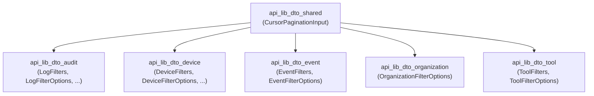
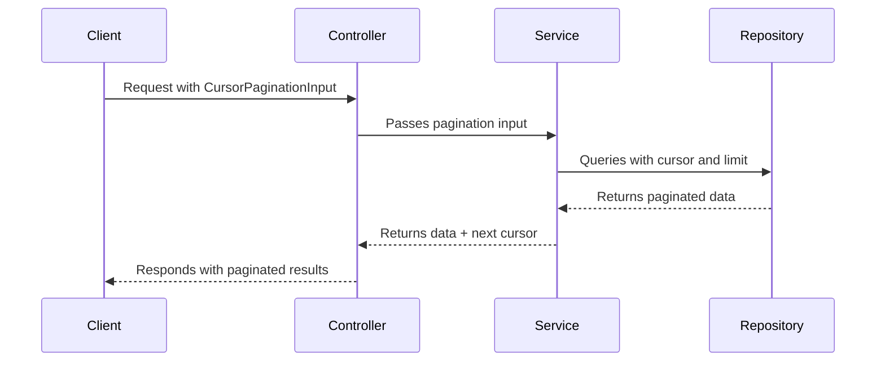

# api_lib_dto_shared Module Documentation

## Introduction

The `api_lib_dto_shared` module provides shared Data Transfer Object (DTO) definitions that are used across multiple API layers and services. Its primary purpose is to standardize common request and response patterns, particularly for features that are reused in different domains, such as pagination. By centralizing these shared DTOs, the module promotes consistency, reduces duplication, and simplifies integration between various API modules.

## Core Component: `CursorPaginationInput`

### Purpose

`CursorPaginationInput` is a DTO designed to support cursor-based pagination in API requests. Cursor-based pagination is a robust and efficient way to navigate large datasets, especially in distributed or real-time systems. This DTO encapsulates the necessary parameters for clients to request paginated data, such as the cursor position and the number of items to fetch.

### Typical Structure

Although the exact code is not provided, a typical `CursorPaginationInput` might look like this:

```python
class CursorPaginationInput:
    cursor: Optional[str]  # The current position in the dataset
    limit: Optional[int]   # The maximum number of items to return
```

- **cursor**: A string token representing the current position in the dataset. Used to fetch the next or previous set of results.
- **limit**: The maximum number of items to return in a single page. Allows clients to control the page size.

### Usage

`CursorPaginationInput` is intended to be used as an input parameter for API endpoints that return large, potentially unbounded lists of resources. It is referenced by various filter and query DTOs in other modules, such as:

- [api_lib_dto_audit.md](api_lib_dto_audit.md)
- [api_lib_dto_device.md](api_lib_dto_device.md)
- [api_lib_dto_event.md](api_lib_dto_event.md)
- [api_lib_dto_organization.md](api_lib_dto_organization.md)
- [api_lib_dto_tool.md](api_lib_dto_tool.md)

These modules define filter options and query objects that often embed `CursorPaginationInput` to enable paginated queries.

## Architecture and Relationships

The `api_lib_dto_shared` module is a foundational building block in the DTO layer. It is referenced by multiple domain-specific DTO modules, which in turn are used by service and controller layers to process API requests and responses.

### Module Dependency Diagram



### Data Flow Example

When a client requests a paginated list of resources (e.g., logs, devices, events, organizations, or tools), the request DTO in the relevant module will include a `CursorPaginationInput` field. The service layer uses the cursor and limit to fetch the appropriate slice of data, and the response typically includes a new cursor for the next page.



## Integration with Other Modules

- **Filter DTOs**: Most filter DTOs in modules like `api_lib_dto_audit`, `api_lib_dto_device`, `api_lib_dto_event`, `api_lib_dto_organization`, and `api_lib_dto_tool` include `CursorPaginationInput` to support pagination.
- **Service Layer**: Service modules such as `api_lib_service` and `api_service_core_service` process these DTOs to implement paginated queries.
- **Controller Layer**: Controllers in `api_service_core_controller` and related modules accept requests containing `CursorPaginationInput` and return paginated responses.
- **Response DTOs**: For the structure of paginated responses, see [core_dto.md](core_dto.md) (`PageResponse`) and [api_service_core_dto.md](api_service_core_dto.md) (`CountedGenericConnection`, `GenericEdge`).

## Related Documentation

- [api_lib_dto_audit.md](api_lib_dto_audit.md)
- [api_lib_dto_device.md](api_lib_dto_device.md)
- [api_lib_dto_event.md](api_lib_dto_event.md)
- [api_lib_dto_organization.md](api_lib_dto_organization.md)
- [api_lib_dto_tool.md](api_lib_dto_tool.md)
- [core_dto.md](core_dto.md) (for `PageResponse`)
- [api_service_core_dto.md](api_service_core_dto.md) (for advanced connection/edge pagination)

## Summary

The `api_lib_dto_shared` module is essential for enabling consistent, efficient, and reusable pagination patterns across the API. By defining `CursorPaginationInput` as a shared DTO, it ensures that all paginated endpoints follow a common contract, simplifying both client and server development.
