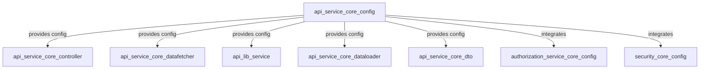
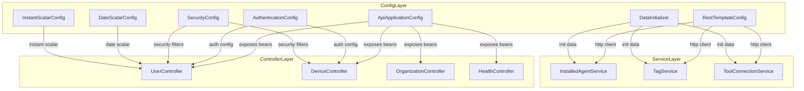
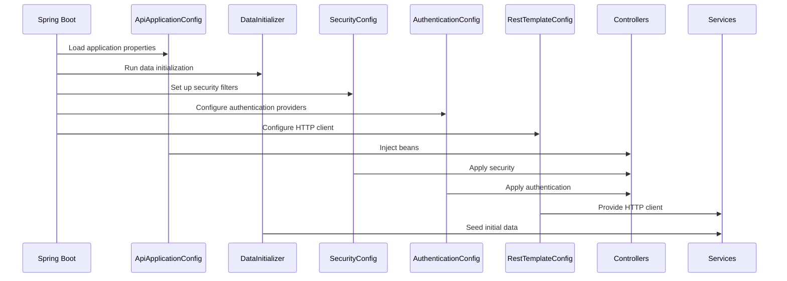

# api_service_core_config Module Documentation

## Introduction

The `api_service_core_config` module provides the foundational configuration for the API service core. It defines the essential beans and settings required for application startup, security, authentication, date/time handling, REST communication, and data initialization. This module acts as the backbone for the API service, ensuring that all core services, controllers, and data fetchers operate within a consistent and secure environment.

## Core Components

- **ApiApplicationConfig**: Central application configuration, typically responsible for loading and exposing application-level properties and beans.
- **AuthenticationConfig**: Handles authentication mechanisms, integrating with security frameworks and managing authentication providers.
- **DataInitializer**: Responsible for initializing core data at application startup, such as seeding default values or performing migrations.
- **DateScalarConfig**: Configures custom date scalar types for GraphQL or REST APIs, ensuring correct serialization and deserialization of date values.
- **InstantScalarConfig**: Similar to `DateScalarConfig`, but for `Instant` (timestamp) types.
- **RestTemplateConfig**: Configures the `RestTemplate` bean for making HTTP requests to external services, including custom interceptors or error handlers.
- **SecurityConfig**: Sets up security filters, access rules, and integrates with authentication and authorization modules.

## Architecture Overview

The `api_service_core_config` module is a central part of the API service's infrastructure layer. It is referenced by most other API service modules, including controllers, data fetchers, and service layers. Its configuration beans are injected throughout the system to provide consistent behavior and security.

## Component Relationships and Data Flow

The following diagram illustrates how the configuration components interact with other modules and the overall data flow:

## Integration with Other Modules

- **Controllers** ([api_service_core_controller.md]): Rely on configuration beans for security, authentication, and data serialization.
- **Data Fetchers** ([api_service_core_datafetcher.md]): Use configuration for date/time handling and security context.
- **Services** ([api_lib_service.md]): Depend on HTTP client configuration and data initialization.
- **Authorization** ([authorization_service_core_config.md]): SecurityConfig and AuthenticationConfig may delegate or integrate with the broader authorization infrastructure.
- **Security** ([security_core_config.md]): SecurityConfig may extend or override base security settings from this module.

## Process Flow Example: Application Startup

## Summary

The `api_service_core_config` module is the foundation for the API service's configuration, security, and initialization. It ensures that all other modules operate within a secure, consistent, and well-initialized environment. For more details on how these configurations are used, refer to the documentation for [api_service_core_controller.md], [api_service_core_datafetcher.md], [api_lib_service.md], [authorization_service_core_config.md], and [security_core_config.md].
