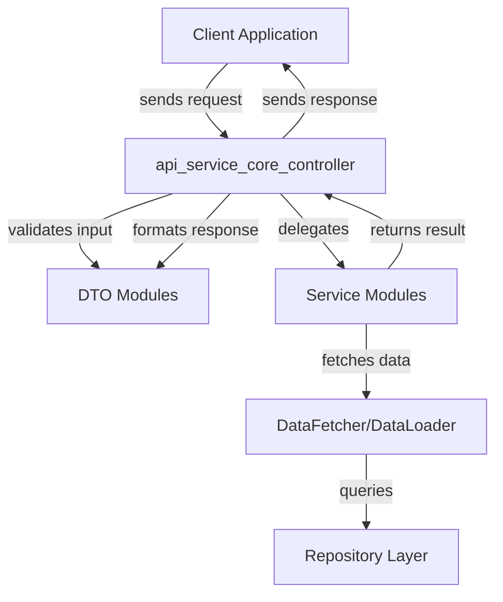
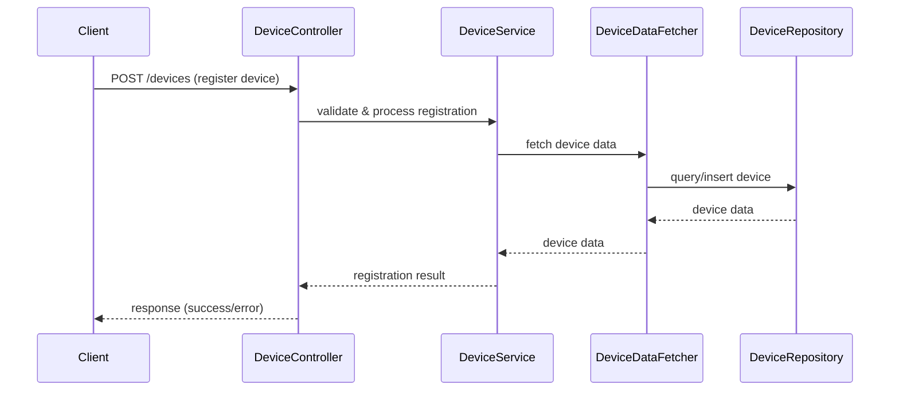
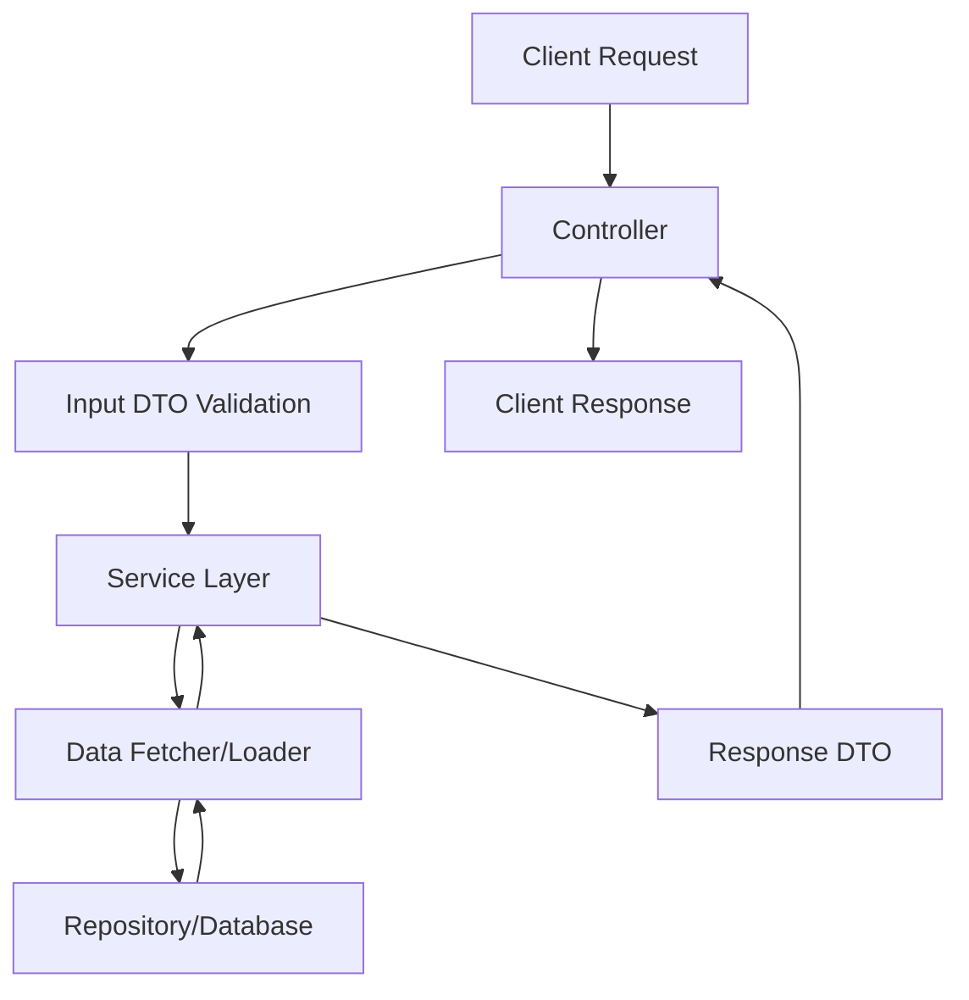
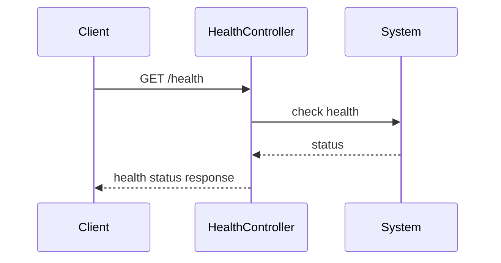

# api_service_core_controller Module Documentation

## Introduction

The `api_service_core_controller` module is a central part of the API service layer, providing REST and/or GraphQL endpoints for core business domains such as agents, devices, users, organizations, authentication, and system health. It acts as the main entry point for client applications and internal services to interact with the platform's core functionalities.

This module orchestrates requests, delegates business logic to service layers, and coordinates data fetching, validation, and response formatting. It is designed to be stateless, secure, and scalable, following best practices for API controller design.

## Core Components

The module exposes the following controllers:

- **AgentRegistrationSecretController**: Manages agent registration secrets for secure onboarding of agents.
- **ApiKeyController**: Handles API key creation, management, and validation for programmatic access.
- **DeviceController**: Provides endpoints for device management, including registration, updates, and querying.
- **ForceAgentController**: Supports forceful updates or actions on agents, such as triggering updates or installations.
- **HealthController**: Exposes health check endpoints for monitoring service status.
- **InvitationController**: Manages user or agent invitations, including creation, status updates, and acceptance.
- **MeController**: Returns information about the currently authenticated user.
- **OpenFrameClientConfigurationController**: Supplies configuration data for OpenFrame clients.
- **OrganizationController**: Handles organization-level operations such as creation, updates, and querying.
- **ReleaseVersionController**: Provides information about the current release version of the service.
- **SSOConfigController**: Manages Single Sign-On (SSO) configuration and status.
- **UserController**: Manages user accounts, including creation, updates, and querying.

## Architecture Overview

The `api_service_core_controller` module is structured to separate concerns between request handling, business logic, and data access. Controllers in this module typically:

1. **Receive HTTP/GraphQL requests** from clients or internal services.
2. **Validate and parse input** using DTOs (Data Transfer Objects) from modules such as `api_service_core_dto`, `api_service_core_dto_user`, `api_service_core_dto_organization`, etc.
3. **Delegate business logic** to service modules (e.g., `api_service_core_service_user.UserService`, `api_lib_service.InstalledAgentService`).
4. **Fetch or mutate data** via data fetchers, data loaders, or repositories.
5. **Format and return responses** using response DTOs.

### High-Level Component Interaction

### Example: Device Management Flow

## Dependencies and Related Modules

The `api_service_core_controller` module depends on several other modules for its operation:

- **DTO Modules**: For input validation and response formatting. See:
  - [api_service_core_dto.md]
  - [api_service_core_dto_user.md]
  - [api_service_core_dto_organization.md]
  - [api_service_core_dto_device.md]
  - [api_service_core_dto_force_request.md]
  - [api_service_core_dto_force_response.md]
  - [api_service_core_dto_invitation.md]
  - [api_service_core_dto_oauth.md]
  - [api_service_core_dto_oidc.md]
  - [api_service_core_dto_tool.md]
- **Service Modules**: For business logic and orchestration. See:
  - [api_service_core_service_user.md]
  - [api_service_core_service.md]
  - [api_lib_service.md]
- **Data Fetchers and Loaders**: For efficient data access and batching. See:
  - [api_service_core_datafetcher.md]
  - [api_service_core_dataloader.md]
- **Configuration and Security**: For application configuration and security context. See:
  - [api_service_core_config.md]

## Component Relationships

Each controller in this module is responsible for a specific domain. They interact with corresponding services and DTOs, ensuring a clean separation of concerns. For example:

- **UserController** interacts with `UserService` ([api_service_core_service_user.md]) and uses `UserResponse`/`UserPageResponse` DTOs ([api_service_core_dto_user.md]).
- **DeviceController** interacts with device services and uses device-related DTOs ([api_service_core_dto_device.md]).
- **OrganizationController** manages organizations using organization DTOs ([api_service_core_dto_organization.md]) and services.
- **SSOConfigController** manages SSO configuration, interacting with SSO services and DTOs ([api_service_core_service.md], [api_service_core_dto.md]).

## Data Flow and Process Flows

### General Request-Response Lifecycle

### Health Check Example

## Integration in the Overall System

The `api_service_core_controller` module is a foundational part of the platform's API layer. It is typically deployed as part of the core API service and is responsible for exposing endpoints that are consumed by:

- Web and mobile client applications
- Internal microservices
- Third-party integrations

It works in concert with other controller modules (e.g., [external_api_service_core_controller.md], [authorization_service_core_controller.md]) to provide a comprehensive API surface for the platform.

## References

- [api_service_core_dto.md]
- [api_service_core_service_user.md]
- [api_service_core_service.md]
- [api_lib_service.md]
- [api_service_core_datafetcher.md]
- [api_service_core_dataloader.md]
- [api_service_core_config.md]
- [external_api_service_core_controller.md]
- [authorization_service_core_controller.md]
