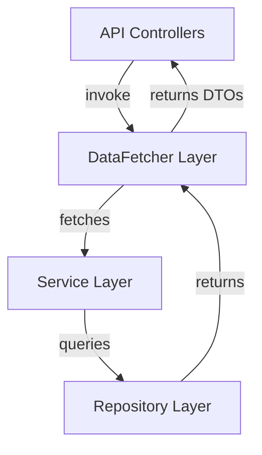
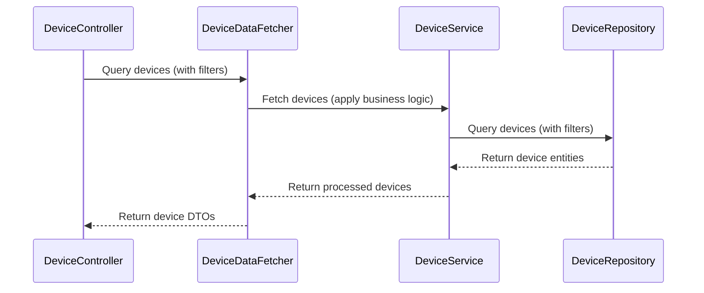

# api_service_core_datafetcher Module Documentation

## Introduction

The `api_service_core_datafetcher` module is a central part of the API service layer, responsible for efficiently retrieving, aggregating, and preparing data for GraphQL and REST API endpoints. It acts as a bridge between the controller layer (see [api_service_core_controller.md]) and the underlying data sources, such as databases and service layers. The module encapsulates the logic for fetching and transforming data related to devices, events, logs, organizations, and tools, ensuring that API responses are consistent, performant, and secure.

## Core Components

- **DeviceDataFetcher**: Handles data retrieval and transformation for device-related queries.
- **EventDataFetcher**: Manages fetching and formatting of event data.
- **LogDataFetcher**: Responsible for retrieving audit and log data, applying filters and pagination.
- **OrganizationDataFetcher**: Fetches organization data, including filtering and pagination.
- **ToolsDataFetcher**: Retrieves tool-related data, supporting filtering and aggregation.

Each DataFetcher is designed to:
- Accept filter and pagination inputs (see [api_service_core_dto.md], [api_service_core_dto_device.md], [api_service_core_dto_event.md], [api_service_core_dto_audit.md], [api_service_core_dto_organization.md], [api_service_core_dto_tool.md])
- Interact with service and repository layers to fetch data (see [api_lib_service.md], [data_mongo_repository_device.md], [data_mongo_repository_event.md], [data_mongo_repository_organization.md], [data_mongo_repository_tool.md])
- Return data in DTOs suitable for API responses

## Architecture Overview

The following diagram illustrates the high-level architecture and data flow for the `api_service_core_datafetcher` module:

### Component Relationships

```mermaid
graph TD
    DeviceDataFetcher -->|uses| DeviceService["Device Service"]
    DeviceDataFetcher -->|uses| DeviceRepository["Device Repository"]
    DeviceDataFetcher -->|uses| DeviceFilterInput["DeviceFilterInput DTO"]
    EventDataFetcher -->|uses| EventService["Event Service"]
    EventDataFetcher -->|uses| EventRepository["Event Repository"]
    EventDataFetcher -->|uses| EventFilterInput["EventFilterInput DTO"]
    LogDataFetcher -->|uses| LogService["Log Service"]
    LogDataFetcher -->|uses| LogRepository["Log Repository"]
    LogDataFetcher -->|uses| LogFilterInput["LogFilterInput DTO"]
    OrganizationDataFetcher -->|uses| OrganizationService["Organization Service"]
    OrganizationDataFetcher -->|uses| OrganizationRepository["Organization Repository"]
    OrganizationDataFetcher -->|uses| OrganizationFilterInput["OrganizationFilterInput DTO"]
    ToolsDataFetcher -->|uses| ToolService["Tool Service"]
    ToolsDataFetcher -->|uses| ToolRepository["Tool Repository"]
    ToolsDataFetcher -->|uses| ToolFilterInput["ToolFilterInput DTO"]
```

## Data Flow Example: Device Query

## Integration with Other Modules

- **Controllers**: The DataFetchers are invoked by controllers in [api_service_core_controller.md], which handle HTTP/GraphQL requests.
- **DTOs**: DataFetchers use DTOs defined in [api_service_core_dto.md] and related modules for input (filters, pagination) and output (response objects).
- **Services and Repositories**: DataFetchers delegate business logic and data access to service and repository layers, such as those in [api_lib_service.md], [data_mongo_repository_device.md], etc.
- **Dataloaders**: For batch loading and caching, DataFetchers may utilize dataloaders from [api_service_core_dataloader.md].

## Responsibilities and Best Practices

- **Separation of Concerns**: DataFetchers isolate data retrieval logic from controllers and services, promoting maintainability.
- **Performance**: By leveraging dataloaders and efficient queries, DataFetchers help minimize N+1 query problems and optimize data access.
- **Consistency**: Centralizing data fetching ensures consistent application of filters, pagination, and security checks across API endpoints.

## Related Documentation

- [api_service_core_controller.md]: API endpoint definitions and request handling
- [api_service_core_dto.md]: Core DTOs for API input/output
- [api_service_core_dataloader.md]: Dataloader utilities for batch loading
- [api_lib_service.md]: Service layer business logic
- [data_mongo_repository_device.md], [data_mongo_repository_event.md], [data_mongo_repository_organization.md], [data_mongo_repository_tool.md]: Data access layer

## Summary

The `api_service_core_datafetcher` module is a foundational component for API data access, ensuring that data is fetched, filtered, and transformed efficiently and consistently for all major API resources. Its design supports scalability, maintainability, and robust API development.
