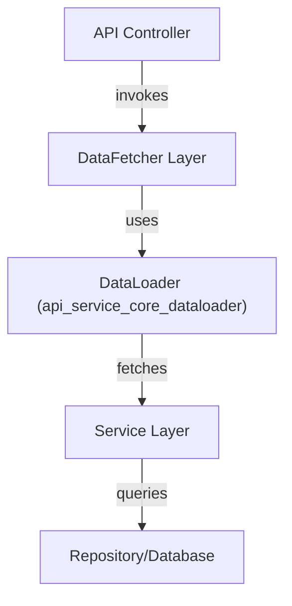
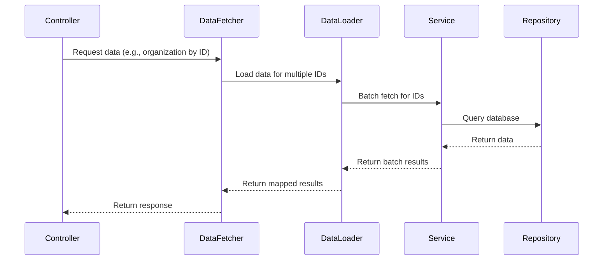

# api_service_core_dataloader

## Introduction

The `api_service_core_dataloader` module provides a set of DataLoader components that optimize and batch data fetching operations for the API service layer. These DataLoaders are essential for efficient GraphQL and REST API implementations, reducing redundant database queries and improving overall system performance. The module is designed to work closely with the data fetcher and service layers, acting as a bridge between controllers and data repositories.

## Core Components

- **InstalledAgentDataLoader**: Batches and caches requests for installed agent data, reducing load on the underlying data source.
- **OrganizationDataLoader**: Efficiently loads organization data, supporting batch operations and minimizing repeated queries.
- **TagDataLoader**: Handles batched loading of tag information, often used for device and tool categorization.
- **ToolConnectionDataLoader**: Optimizes retrieval of tool connection data, supporting batch and cache strategies for tool integrations.

## Architecture Overview

The DataLoader components in this module are typically used by the [api_service_core_datafetcher.md] layer, which in turn is invoked by the [api_service_core_controller.md] layer. Each DataLoader is responsible for batching multiple requests for the same type of data into a single query, leveraging caching to avoid redundant fetches within the same request context.



## Component Relationships and Data Flow

Each DataLoader is constructed with a batch loading function, typically provided by a corresponding service (e.g., `InstalledAgentService`, `TagService`, `ToolConnectionService`). The DataLoader batches incoming requests and calls the service layer with a list of keys, receiving a list of results that are then mapped back to the original requests.



## Integration with Other Modules

- **Data Fetchers**: The [api_service_core_datafetcher.md] module uses these DataLoaders to resolve fields in API responses efficiently.
- **Service Layer**: DataLoaders depend on services such as `InstalledAgentService`, `TagService`, and `ToolConnectionService` (see [api_lib_service.md]) for actual data retrieval and business logic.
- **Repositories**: The service layer interacts with repositories (e.g., `CustomMachineRepositoryImpl`, `CustomOrganizationRepositoryImpl`) for database access.

## Example Usage

A typical usage scenario in the API layer:

```python
# In a DataFetcher or Resolver
organization = organization_data_loader.load(organization_id)
```

The DataLoader will batch multiple `load` calls within the same request and fetch all required organizations in a single query.

## Benefits

- **Performance**: Reduces the number of database queries by batching and caching.
- **Consistency**: Ensures that repeated requests for the same data within a request context return the same object instance.
- **Scalability**: Supports high-throughput API operations by minimizing redundant data access.

## Related Documentation

- [api_service_core_datafetcher.md]: Data fetcher layer that utilizes these DataLoaders
- [api_lib_service.md]: Service layer providing business logic and data access
- [api_service_core_controller.md]: API controllers initiating data fetch operations

## Summary

The `api_service_core_dataloader` module is a critical part of the API service architecture, enabling efficient, batched, and cached data access patterns. By integrating with the data fetcher and service layers, it ensures scalable and performant API responses, especially in data-intensive applications.
