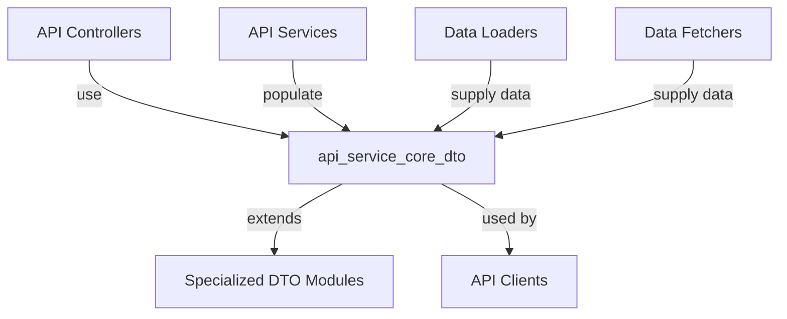
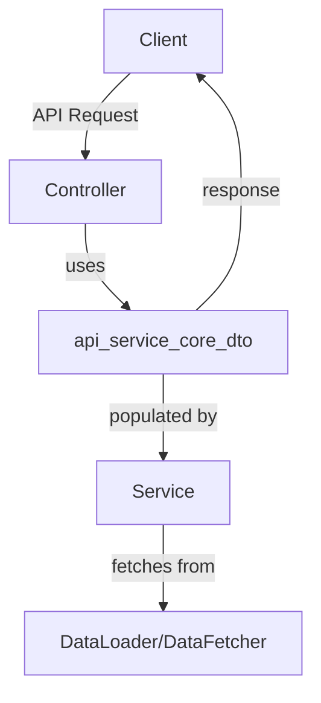
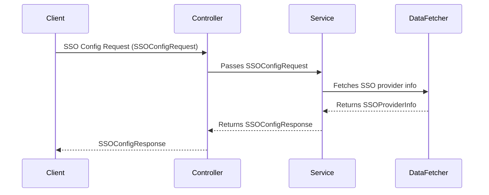

# api_service_core_dto Module Documentation

## Introduction

The `api_service_core_dto` module defines the core Data Transfer Objects (DTOs) used by the API service layer. These DTOs are essential for structuring the data exchanged between the API controllers, services, and clients, especially for authentication, configuration, and generic connection patterns. The module provides a standardized way to represent responses and requests for key API features such as agent registration, API key management, client configuration, and Single Sign-On (SSO) integration.

This module is foundational for the API's contract with both internal and external consumers, ensuring consistency and type safety across the system.

## Core Components

- **AgentRegistrationSecretResponse**: Represents the response structure for agent registration secrets.
- **ApiKeyResponse**: Encapsulates the response data for API key operations.
- **ClientConfigurationResponse**: Contains configuration details returned to API clients.
- **CountedGenericConnection**: A generic connection object with a count, useful for paginated or aggregated results.
- **GenericEdge**: Represents a generic edge in a connection, typically used in cursor-based pagination.
- **SSOConfigRequest**: DTO for SSO configuration requests.
- **SSOConfigResponse**: DTO for SSO configuration responses.
- **SSOConfigStatusResponse**: Provides status information for SSO configuration.
- **SSOProviderInfo**: Contains metadata about available SSO providers.

## Module Architecture and Relationships

The `api_service_core_dto` module is a central part of the API service layer, interacting with multiple other modules for a complete API experience. It is closely related to:

- [api_service_core_controller.md]: Controllers that use these DTOs for request/response payloads.
- [api_service_core_service.md]: Services that process and populate these DTOs.
- [api_service_core_dataloader.md] and [api_service_core_datafetcher.md]: Data loaders and fetchers that supply data to populate DTOs.
- [api_service_core_dto_audit.md], [api_service_core_dto_device.md], [api_service_core_dto_event.md], [api_service_core_dto_invitation.md], [api_service_core_dto_oauth.md], [api_service_core_dto_oidc.md], [api_service_core_dto_organization.md], [api_service_core_dto_tool.md], [api_service_core_dto_update.md], [api_service_core_dto_user.md]: Specialized DTO modules for specific domains.

### High-Level Architecture

### Component Interaction

## Data Flow Example: SSO Configuration

The SSO configuration flow demonstrates how the DTOs are used in a typical API operation:

## Dependencies and Integration

- **Controllers**: The DTOs are the primary contract for all API endpoints, especially in [api_service_core_controller.md].
- **Services**: Business logic in [api_service_core_service.md] and related processors populate and validate these DTOs.
- **Data Loaders/Fetchers**: Modules like [api_service_core_dataloader.md] and [api_service_core_datafetcher.md] provide the data that is mapped into these DTOs.
- **Specialized DTOs**: For domain-specific data, see the respective specialized DTO modules (e.g., [api_service_core_dto_audit.md], [api_service_core_dto_device.md], etc.).

## Extensibility

The design of `api_service_core_dto` allows for easy extension. New DTOs can be added for additional API features, and existing ones can be extended or composed with specialized DTOs from other modules.

## See Also

- [api_service_core_controller.md]
- [api_service_core_service.md]
- [api_service_core_dataloader.md]
- [api_service_core_datafetcher.md]
- [api_service_core_dto_audit.md]
- [api_service_core_dto_device.md]
- [api_service_core_dto_event.md]
- [api_service_core_dto_invitation.md]
- [api_service_core_dto_oauth.md]
- [api_service_core_dto_oidc.md]
- [api_service_core_dto_organization.md]
- [api_service_core_dto_tool.md]
- [api_service_core_dto_update.md]
- [api_service_core_dto_user.md]
