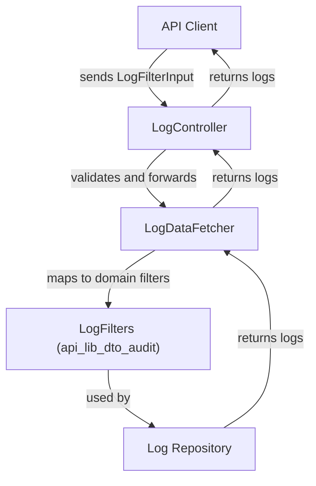
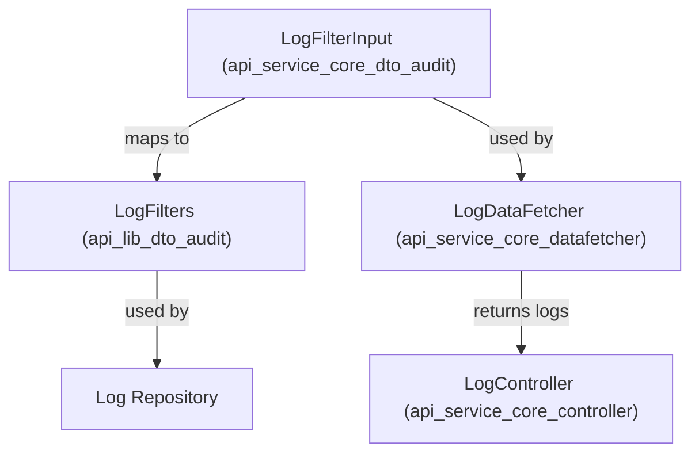
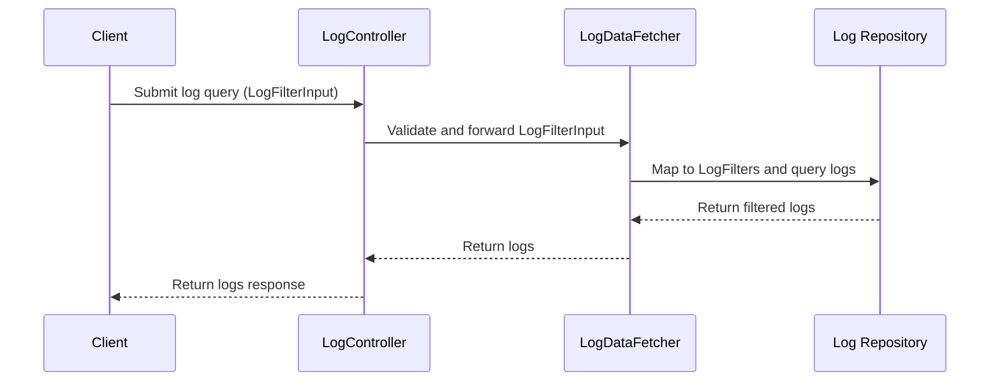

# api_service_core_dto_audit Module Documentation

## Introduction

The `api_service_core_dto_audit` module provides the core Data Transfer Object (DTO) for handling audit log filtering within the API service layer. Its primary responsibility is to define the structure and validation of input data used for querying and filtering audit logs, which are essential for monitoring, compliance, and troubleshooting activities across the system.

This module is a key part of the audit log query pipeline, enabling controllers and data fetchers to receive well-structured filter criteria from API clients. It is designed to work in conjunction with other DTO modules and the audit log domain logic defined in the `api_lib_dto_audit` module.

## Core Component

### LogFilterInput

- **Purpose:**
  - Encapsulates the filter criteria for querying audit logs via API endpoints.
  - Ensures that only valid and well-formed filter parameters are passed to the underlying log data fetchers and repositories.
- **Typical Fields:**
  - Time range (start/end)
  - Log level or severity
  - Event types
  - User or organization identifiers
  - Pagination and sorting options
- **Usage:**
  - Consumed by controllers (see [api_service_core_controller.md]) and data fetchers (see [api_service_core_datafetcher.md]) to process log query requests.
  - Passed to service and repository layers for actual log retrieval and filtering.

## Architecture and Data Flow

The following diagram illustrates how `LogFilterInput` fits into the overall audit log query flow:

- **Client:** Sends a request with `LogFilterInput` as the filter payload.
- **Controller:** Receives and validates the input, then delegates to the data fetcher.
- **DataFetcher:** Translates the input into domain-specific filter objects (see [api_lib_dto_audit.md]) and queries the repository.
- **Repository:** Executes the query and returns the filtered logs.

## Dependencies and Related Modules

- **[api_lib_dto_audit.md]:**
  - Defines the domain-level filter and log DTOs such as `LogFilters`, `LogFilterOptions`, and `LogEvent`.
  - `LogFilterInput` is mapped to these domain objects for actual querying.
- **[api_service_core_datafetcher.md]:**
  - Contains `LogDataFetcher`, which consumes `LogFilterInput` and orchestrates the log retrieval process.
- **[api_service_core_controller.md]:**
  - Contains the API controllers (e.g., `LogController`) that expose log query endpoints and accept `LogFilterInput`.
- **[api_lib_dto_shared.md]:**
  - Provides shared DTOs such as `CursorPaginationInput` for pagination, which may be embedded in `LogFilterInput`.

## Component Interaction Diagram

## Process Flow: Audit Log Query

## How This Module Fits Into the System

- **API Layer:** Defines the contract for log filtering requests from clients.
- **Validation:** Ensures only valid filter criteria are processed.
- **Integration:** Bridges the API request layer and the domain audit log filtering logic.
- **Extensibility:** Can be extended to support new filter fields as audit log requirements evolve.

## See Also

- [api_lib_dto_audit.md] — Domain DTOs for audit logs and filters
- [api_service_core_datafetcher.md] — Data fetchers for log retrieval
- [api_service_core_controller.md] — API controllers for log endpoints
- [api_lib_dto_shared.md] — Shared DTOs (e.g., pagination)
