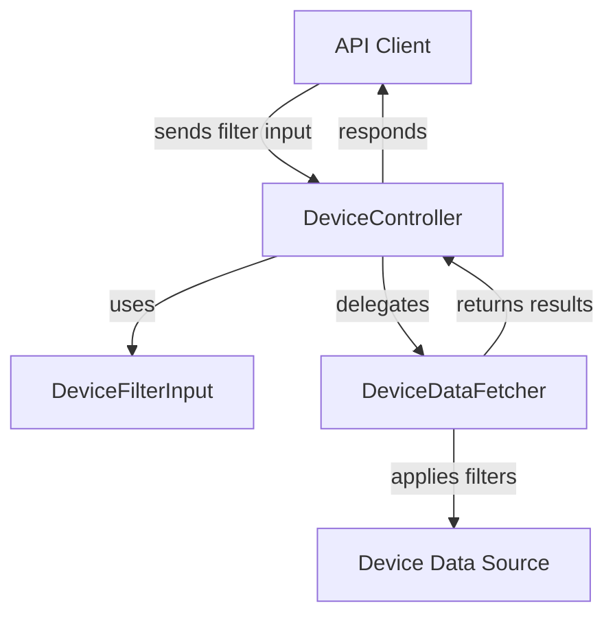
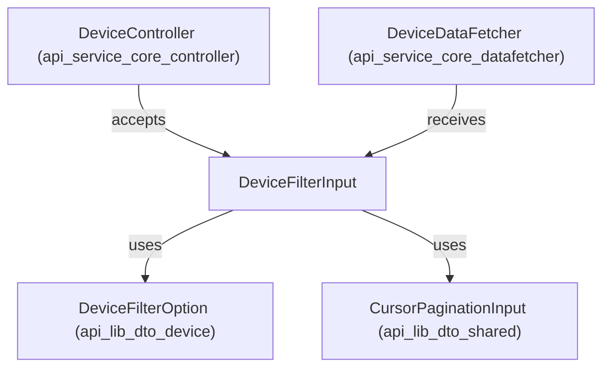

# api_service_core_dto_device Module Documentation

## Introduction

The `api_service_core_dto_device` module defines the core Data Transfer Object (DTO) for device-related filtering operations within the API service core. It provides the structure for device filter input, which is essential for querying, filtering, and managing device data across the system. This module is a foundational part of the device management and querying pipeline, enabling flexible and efficient device data retrieval.

## Core Component

- **DeviceFilterInput**: The primary DTO for specifying device filter criteria in API requests.

## Purpose and Core Functionality

The main purpose of this module is to encapsulate the filter parameters that can be applied when querying devices. This abstraction allows controllers, data fetchers, and services to receive well-structured filter input, ensuring consistency and type safety throughout the device querying process.

Typical use cases include:
- Filtering devices by attributes such as tags, status, organization, or other criteria
- Supporting pagination and advanced search in device listing endpoints
- Enabling extensible and maintainable device query logic

## Architecture and Component Relationships

The `api_service_core_dto_device` module is part of a broader ecosystem of DTO modules, each responsible for a specific domain (e.g., audit, event, organization, tool). It interacts closely with:
- **Controllers** (e.g., `DeviceController` in [api_service_core_controller.md]) that accept filter input from API clients
- **Data Fetchers** (e.g., `DeviceDataFetcher` in [api_service_core_datafetcher.md]) that use the filter input to query data sources
- **DTO Modules** for related filter options and criteria, such as:
  - [api_lib_dto_device.md] (for device filter options and filter sets)
  - [api_lib_dto_shared.md] (for pagination input)

### High-Level Data Flow

### Module Dependency Overview

## Component Details

### DeviceFilterInput

The `DeviceFilterInput` DTO typically includes fields such as:
- **filterOptions**: A set of filter options (see [api_lib_dto_device.md])
- **pagination**: Pagination parameters (see [api_lib_dto_shared.md])
- **search**: Optional search string or advanced query parameters

> **Note:** For the exact field definitions and validation rules, refer to the source code or the [api_lib_dto_device.md] and [api_lib_dto_shared.md] documentation files.

## How This Module Fits Into the Overall System

- **API Layer**: Used by controllers to receive and validate device filter input from clients
- **Service/Data Layer**: Passed to data fetchers and repositories to construct queries
- **Extensibility**: New filter options can be added in the underlying DTOs without breaking the API contract

## Related Modules and Further Reading

- [api_lib_dto_device.md]: Defines device filter options and filter sets
- [api_lib_dto_shared.md]: Defines shared DTOs such as pagination input
- [api_service_core_controller.md]: Contains the `DeviceController` that uses this DTO
- [api_service_core_datafetcher.md]: Contains the `DeviceDataFetcher` that processes this DTO

## Summary

The `api_service_core_dto_device` module is a key part of the device querying infrastructure, providing a robust and extensible way to specify device filter criteria. It acts as a bridge between API clients and the underlying data access logic, ensuring that device queries are consistent, maintainable, and scalable.
