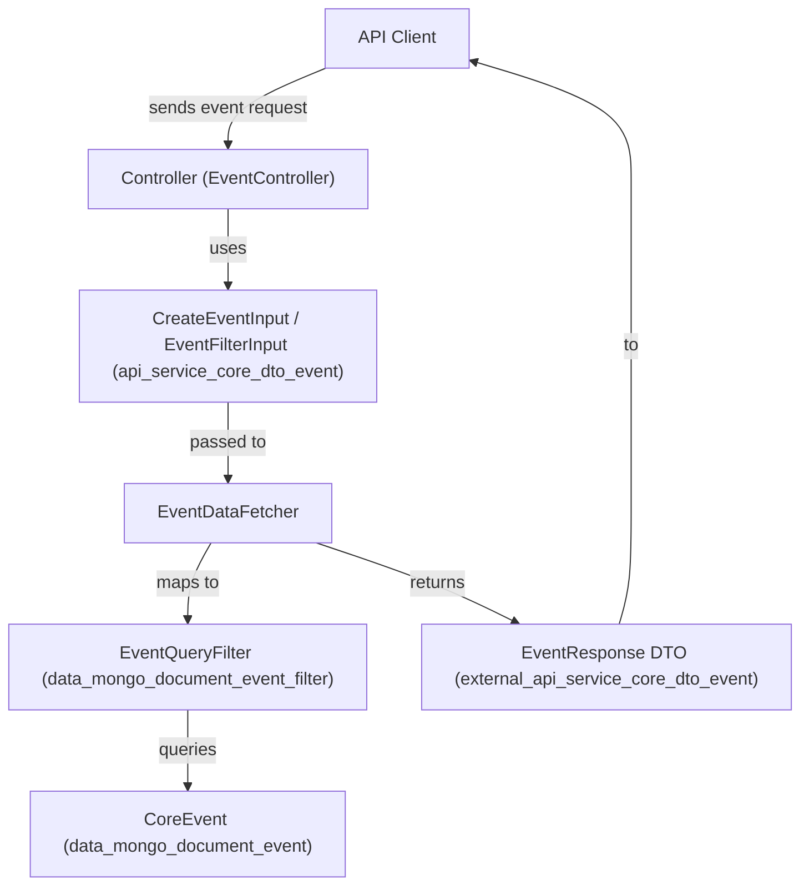
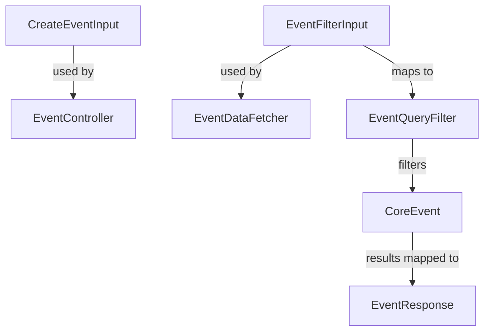

# api_service_core_dto_event Module Documentation

## Introduction

The `api_service_core_dto_event` module defines the core Data Transfer Objects (DTOs) for event-related operations within the API service core. These DTOs are used to structure and validate data for creating events and filtering event queries, serving as the contract between the API layer and the underlying event management logic. This module is essential for ensuring consistent, type-safe communication of event data across the system.

## Core Components

- **CreateEventInput**: DTO for creating a new event. Encapsulates all required and optional fields needed to register an event in the system.
- **EventFilterInput**: DTO for specifying filtering criteria when querying events. Supports various filter options to enable flexible event searches.

## Module Purpose and Functionality

The primary purpose of `api_service_core_dto_event` is to:

- Provide a standardized schema for event creation requests.
- Enable robust and flexible event filtering for queries and reporting.
- Serve as a bridge between the API controllers, data fetchers, and the event storage/retrieval layers.

This module is typically used by controllers (see [api_service_core_controller.md]) and data fetchers (see [api_service_core_datafetcher.md]) to process incoming API requests related to events.

## Architecture and Component Relationships

The `api_service_core_dto_event` module is part of a broader DTO layer, which includes similar modules for devices, organizations, tools, and audit logs. It interacts with:

- **Controllers**: Such as `EventController` (see [external_api_service_core_controller.md]), which receive API requests and use these DTOs for input validation and data transfer.
- **Data Fetchers**: Such as `EventDataFetcher` (see [api_service_core_datafetcher.md]), which use filter DTOs to query the underlying data sources.
- **Data Models**: The DTOs are mapped to and from persistent data models like `CoreEvent` (see [data_mongo_document_event.md]) and query filters like `EventQueryFilter` (see [data_mongo_document_event_filter.md]).
- **Other DTO Modules**: For cross-entity filtering and pagination, such as `CursorPaginationInput` ([api_lib_dto_shared.md]) and `EventFilters` ([api_lib_dto_event.md]).

### High-Level Architecture



### Component Interaction



## Data Flow: Event Creation and Query

### Event Creation
1. **API Client** submits a request to create an event.
2. **EventController** receives the request and deserializes it into a `CreateEventInput` DTO.
3. The controller validates the input and passes it to the event service/data fetcher.
4. The event is persisted as a `CoreEvent` document in the database.

### Event Query (Filtering)
1. **API Client** submits a query with filter parameters.
2. **EventController** receives the request and deserializes it into an `EventFilterInput` DTO.
3. The controller passes the filter DTO to the `EventDataFetcher`.
4. The fetcher maps the filter DTO to an `EventQueryFilter` and queries the event data store.
5. Results are mapped to response DTOs and returned to the client.

## Dependencies and Related Modules

- **[api_lib_dto_event.md]**: Defines shared event filter options and filter sets used by this module.
- **[data_mongo_document_event.md]**: Contains the persistent event data model (`CoreEvent`).
- **[data_mongo_document_event_filter.md]**: Defines the query filter structure for events.
- **[external_api_service_core_dto_event.md]**: Defines the response DTOs for event queries.
- **[api_service_core_datafetcher.md]**: Implements the logic for fetching and filtering events using these DTOs.
- **[api_lib_dto_shared.md]**: Provides shared DTOs such as pagination input.

## Example Usage

### Creating an Event
```json
{
  "title": "System Update",
  "description": "A system update was performed.",
  "timestamp": "2024-06-01T12:00:00Z",
  "type": "UPDATE",
  "metadata": {
    "user": "admin"
  }
}
```

### Filtering Events
```json
{
  "type": "ALERT",
  "startDate": "2024-05-01T00:00:00Z",
  "endDate": "2024-06-01T00:00:00Z",
  "pagination": {
    "cursor": "abc123",
    "limit": 50
  }
}
```

## How This Module Fits Into the Overall System

The `api_service_core_dto_event` module is a foundational part of the event management pipeline. It ensures that all event-related data entering or leaving the API is well-structured, validated, and consistent. By separating DTOs from persistence models and business logic, the system achieves:

- **Loose coupling** between API, business logic, and storage layers
- **Reusability** of DTOs across controllers and services
- **Consistency** in data validation and transfer

For more details on related modules, see:
- [api_lib_dto_event.md]
- [data_mongo_document_event.md]
- [data_mongo_document_event_filter.md]
- [external_api_service_core_dto_event.md]
- [api_service_core_datafetcher.md]

---
