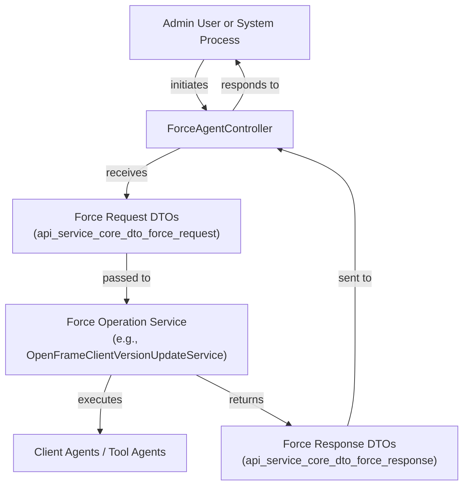
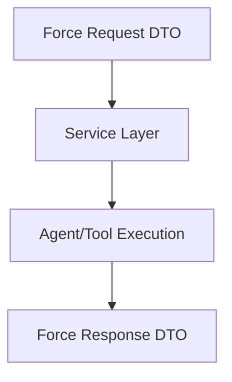

# api_service_core_dto_force_request Module Documentation

## Introduction

The `api_service_core_dto_force_request` module defines a set of Data Transfer Objects (DTOs) used for forceful operations within the API service core, such as triggering client updates, tool installations, re-installations, and updates. These DTOs are essential for orchestrating and managing remote actions on clients and tools, typically initiated by administrators or automated system processes.

This module is a key part of the system's remote management and orchestration capabilities, enabling controlled, auditable, and secure force operations across distributed agents and tools.

## Core Components

The module provides the following DTOs:

- **ForceClientUpdateRequest**: Represents a request to force an update on a client agent.
- **ForceToolInstallationAllRequest**: Represents a request to force the installation of a tool on all applicable agents or clients.
- **ForceToolReinstallationRequest**: Represents a request to force the reinstallation of a tool on a specific agent or set of agents.
- **ForceToolUpdateRequest**: Represents a request to force an update of a tool on a specific agent or set of agents.

These DTOs are typically used by controllers (see [api_service_core_controller.md]) and processed by service layers responsible for executing the requested operations.

## Architecture and Component Relationships

The force request DTOs are part of a broader orchestration and remote management workflow. The following diagram illustrates their role and relationships within the system:

### Component Interaction Flow

1. **Initiation**: An admin user or automated process triggers a force operation (e.g., update, install, reinstall) via an API endpoint.
2. **Controller Layer**: The relevant controller (typically `ForceAgentController`) receives the request and constructs the appropriate DTO from this module.
3. **Service Layer**: The DTO is passed to a service (e.g., `OpenFrameClientVersionUpdateService`) that implements the business logic for the force operation.
4. **Execution**: The service interacts with the relevant agents or tools to perform the requested operation.
5. **Response**: The outcome is encapsulated in a response DTO (see [api_service_core_dto_force_response.md]) and returned to the controller, which then responds to the user or process.

## Data Flow Diagram

## Dependencies and Related Modules

- **Controllers**: See [api_service_core_controller.md] for controllers that utilize these DTOs, especially `ForceAgentController`.
- **Service Layer**: See [management_service_core_service.md] for services like `OpenFrameClientVersionUpdateService` that process force requests.
- **Response DTOs**: See [api_service_core_dto_force_response.md] for the structure of responses to force operations.
- **Agent and Tool Models**: For details on agent and tool entities, see [data_mongo_document_toolagent.md] and [data_mongo_document_device.md].

## How This Module Fits Into the System

The `api_service_core_dto_force_request` module is a foundational part of the system's remote orchestration capabilities. It provides the standardized request formats for forceful operations, ensuring:

- **Consistency**: All force operations use a common set of DTOs, simplifying validation and processing.
- **Security**: DTOs can be validated and audited, supporting secure remote actions.
- **Extensibility**: New force operations can be added by introducing new DTOs in this module.

This module works in concert with controllers, service layers, and response DTOs to provide a robust, auditable, and secure mechanism for remote management of clients and tools.

## References

- [api_service_core_controller.md]
- [api_service_core_dto_force_response.md]
- [management_service_core_service.md]
- [data_mongo_document_toolagent.md]
- [data_mongo_document_device.md]
