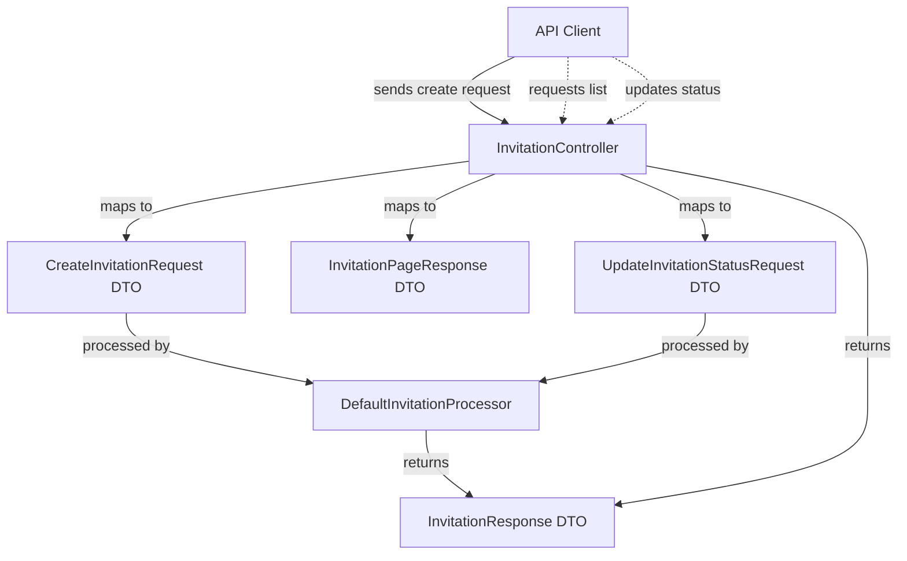
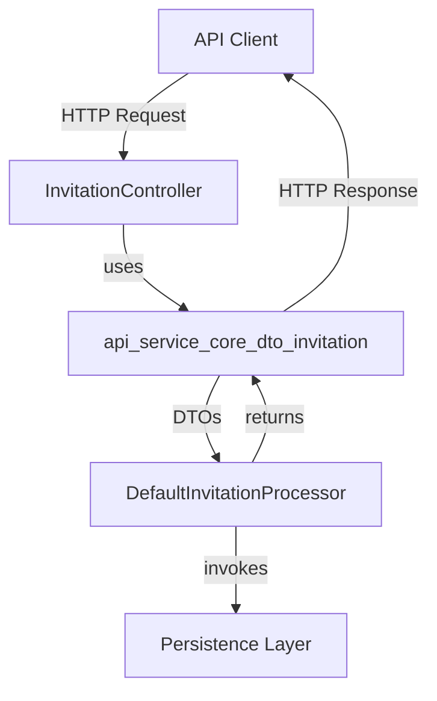
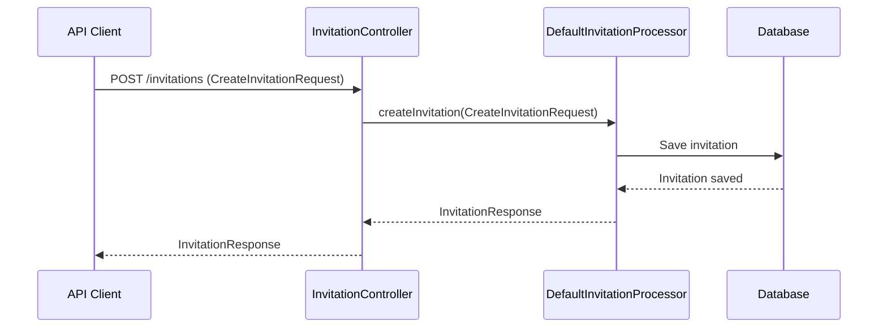

# api_service_core_dto_invitation Module Documentation

## Introduction

The `api_service_core_dto_invitation` module defines the core Data Transfer Objects (DTOs) used for managing invitation-related operations within the API service core. These DTOs are essential for the creation, retrieval, updating, and pagination of invitation records, and serve as the contract between the API layer and the underlying business logic or persistence layers.

This module is a foundational part of the invitation management subsystem, enabling features such as user onboarding, organization invitations, and status tracking for invitations.

---

## Core Functionality

The module provides DTOs for the following invitation operations:
- **Creating invitations** (e.g., inviting users to an organization)
- **Representing invitation details and status**
- **Paginated responses for listing invitations**
- **Updating the status of existing invitations**

These DTOs are typically used by controllers (see [api_service_core_controller.md]) and processors (see [api_service_core_service_processor.md]) to facilitate invitation workflows.

---

## Core Components

### 1. `CreateInvitationRequest`
Represents the payload required to create a new invitation. This typically includes information such as the invitee's email, the organization or resource to which they are being invited, and any relevant metadata.

### 2. `InvitationResponse`
Encapsulates the details of a single invitation, including its status, creation time, invitee information, and any associated organization or resource references.

### 3. `InvitationPageResponse`
Provides a paginated list of invitations, supporting efficient retrieval and navigation of large invitation datasets. Pagination is typically handled using cursor or offset-based mechanisms (see [core_dto.md] for `PageResponse`).

### 4. `UpdateInvitationStatusRequest`
Defines the payload for updating the status of an existing invitation (e.g., accepting, declining, or revoking an invitation).

---

## Architecture & Data Flow

The invitation DTOs are used throughout the API service core, especially in the following flow:

- **Controllers** (see [api_service_core_controller.md]) handle HTTP requests and map them to DTOs.
- **Processors** (see [api_service_core_service_processor.md]) implement the business logic for invitation management.
- **DTOs** in this module define the structure of data exchanged between layers.

---

## Dependencies & Related Modules

- **Pagination**: Uses patterns compatible with [core_dto.md] (`PageResponse`) and [api_service_core_dto_shared.md] (`CursorPaginationInput`).
- **Organization**: Invitations are often linked to organizations (see [api_service_core_dto_organization.md]).
- **User**: Invitation flows may interact with user DTOs (see [api_service_core_dto_user.md]).
- **Controllers & Processors**: See [api_service_core_controller.md] and [api_service_core_service_processor.md] for how these DTOs are used in endpoints and business logic.

---

## Component Interaction Diagram

---

## Process Flow Example: Creating an Invitation

---

## Summary

The `api_service_core_dto_invitation` module is a key part of the API service's invitation management system, providing the data structures necessary for robust, scalable, and maintainable invitation workflows. For implementation details and endpoint definitions, refer to the [api_service_core_controller.md] and [api_service_core_service_processor.md] documentation.
