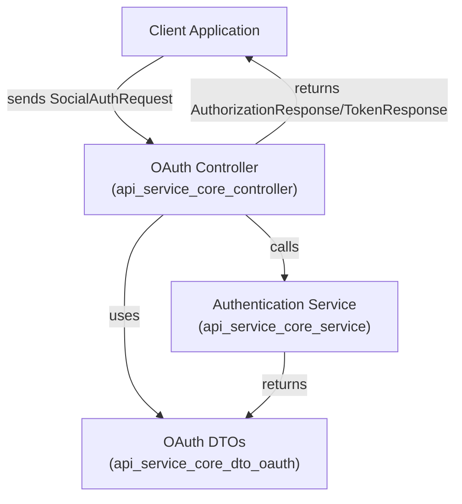
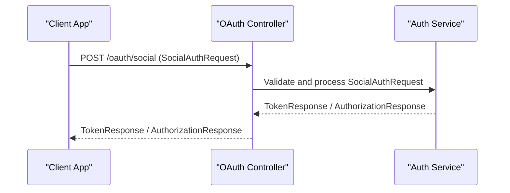

# api_service_core_dto_oauth Module Documentation

## Introduction

The `api_service_core_dto_oauth` module defines the core Data Transfer Objects (DTOs) used for OAuth and social authentication flows within the API service. These DTOs are essential for structuring requests and responses related to authorization, token exchange, and social login integrations (such as Google). The module is a foundational part of the authentication and authorization subsystem, enabling secure and standardized communication between clients and the backend during OAuth-based authentication processes.

## Core Functionality

This module provides DTOs for:
- Exchanging authorization codes for tokens
- Handling social authentication requests
- Structuring responses for OAuth token and authorization operations

It is typically used by controllers and services that implement OAuth and social login endpoints, and interacts closely with modules responsible for user management, SSO, and security configuration.

## Core Components

- **AuthorizationResponse**: Represents the response returned after a successful OAuth authorization, typically containing authorization codes or tokens.
- **GoogleTokenRequest**: Encapsulates the request payload for exchanging a Google OAuth authorization code for an access token.
- **SocialAuthRequest**: Generalized request object for initiating social authentication flows (e.g., Google, Microsoft, etc.).
- **TokenResponse**: Standardized response object for returning OAuth tokens (access, refresh, etc.) to the client.

## Architecture & Component Relationships

The `api_service_core_dto_oauth` module is part of a broader authentication and authorization architecture. It is used by controllers (see [api_service_core_controller.md]) and services (see [api_service_core_service.md]) that implement OAuth endpoints. The DTOs defined here are also consumed by frontend clients and other backend services that need to interact with OAuth flows.

### High-Level Architecture



### Data Flow: Social Authentication



## Component Interactions

- **Controllers**: Use these DTOs to parse incoming requests and structure outgoing responses for OAuth endpoints.
- **Services**: Implement the business logic for authentication, token issuance, and social login, using these DTOs for data exchange.
- **Frontend/Clients**: Construct requests using these DTOs and parse responses for authentication flows.

## Dependencies & Integration

- **api_service_core_controller**: Implements endpoints that use these DTOs. See [api_service_core_controller.md].
- **api_service_core_service**: Contains authentication logic that consumes and produces these DTOs. See [api_service_core_service.md].
- **api_service_core_dto_oidc**: For OpenID Connect-specific DTOs, see [api_service_core_dto_oidc.md].
- **data_mongo_document_oauth**: For persistence of OAuth tokens and registered clients.
- **security_core_oauth**: For security constants and OAuth-specific logic.

## Example Usage

### Example: Social Authentication Request/Response

```json
{
  "provider": "google",
  "code": "4/0AX4XfW...",
  "redirectUri": "https://yourapp.com/oauth/callback"
}
```

**Response:**
```json
{
  "accessToken": "ya29.a0AfH6SM...",
  "refreshToken": "1//0gL...",
  "expiresIn": 3600,
  "tokenType": "Bearer"
}
```

## Related Modules

- [api_service_core_controller.md]: Controllers for OAuth endpoints
- [api_service_core_service.md]: Authentication and SSO services
- [api_service_core_dto_oidc.md]: OpenID Connect DTOs
- [data_mongo_document_oauth.md]: MongoDB documents for OAuth
- [security_core_oauth.md]: OAuth security constants and utilities

## Summary

The `api_service_core_dto_oauth` module is a key part of the authentication infrastructure, providing standardized DTOs for OAuth and social login flows. It enables secure, maintainable, and interoperable authentication processes across the API service.
