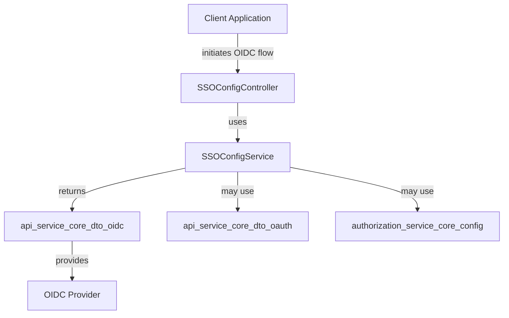
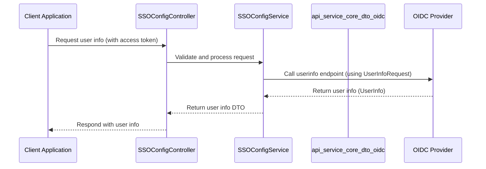

# api_service_core_dto_oidc Module Documentation

## Introduction

The `api_service_core_dto_oidc` module provides Data Transfer Objects (DTOs) for handling OpenID Connect (OIDC) related operations within the API service core. These DTOs are essential for representing OIDC configuration, user information, and user info requests, enabling secure and standards-compliant authentication and authorization flows. The module is a key part of the authentication infrastructure, facilitating integration with OIDC providers and supporting user identity management.

## Core Components

- **OpenIDConfiguration**: Represents the OIDC provider's configuration metadata, such as endpoints and supported features.
- **UserInfo**: Encapsulates user identity information as returned by the OIDC userinfo endpoint.
- **UserInfoRequest**: Represents a request to retrieve user information from an OIDC provider.

These DTOs are typically used in conjunction with authentication and SSO (Single Sign-On) flows, and are consumed by controllers and services that manage user authentication and identity federation.

## Module Architecture and Relationships

The `api_service_core_dto_oidc` module is part of a broader authentication and identity management system. It interacts with several other modules, including:

- [api_service_core_service](api_service_core_service.md): Provides SSO configuration and OIDC service logic.
- [api_service_core_controller](api_service_core_controller.md): Exposes endpoints for SSO and OIDC operations.
- [api_service_core_dto_oauth](api_service_core_dto_oauth.md): Contains DTOs for OAuth2 and social authentication, which are often used alongside OIDC.
- [authorization_service_core_config](authorization_service_core_config.md): Manages authorization server configuration, including OIDC provider registration.
- [authorization_service_core_service_sso](authorization_service_core_service_sso.md): Supplies default provider configurations for OIDC integrations.

### High-Level Architecture

- **Client Application**: Initiates authentication via OIDC.
- **SSOConfigController**: Handles API requests for SSO/OIDC configuration.
- **SSOConfigService**: Implements business logic for SSO/OIDC.
- **api_service_core_dto_oidc**: Supplies DTOs for OIDC configuration and user info.
- **OIDC Provider**: External identity provider (e.g., Google, Microsoft).
- **api_service_core_dto_oauth**: Used for OAuth2 flows, often in parallel with OIDC.
- **authorization_service_core_config**: Supplies configuration for OIDC providers.

## Data Flow: OIDC User Info Retrieval

## Component Interactions

- **OpenIDConfiguration** is typically populated by fetching the OIDC provider's discovery document (e.g., `/.well-known/openid-configuration`).
- **UserInfoRequest** is constructed by the service layer to query the OIDC provider's userinfo endpoint.
- **UserInfo** is returned by the OIDC provider and mapped to the internal DTO for downstream consumption.

## Integration with Other Modules

- For OAuth2 and social login DTOs, see [api_service_core_dto_oauth.md](api_service_core_dto_oauth.md).
- For SSO configuration and service logic, see [api_service_core_service.md](api_service_core_service.md).
- For controller endpoints handling OIDC, see [api_service_core_controller.md](api_service_core_controller.md).
- For authorization server configuration, see [authorization_service_core_config.md](authorization_service_core_config.md).

## Summary

The `api_service_core_dto_oidc` module is a foundational part of the authentication and identity management system, providing the necessary DTOs for OIDC integration. It enables secure, standards-based authentication flows and seamless user identity management across the platform.
