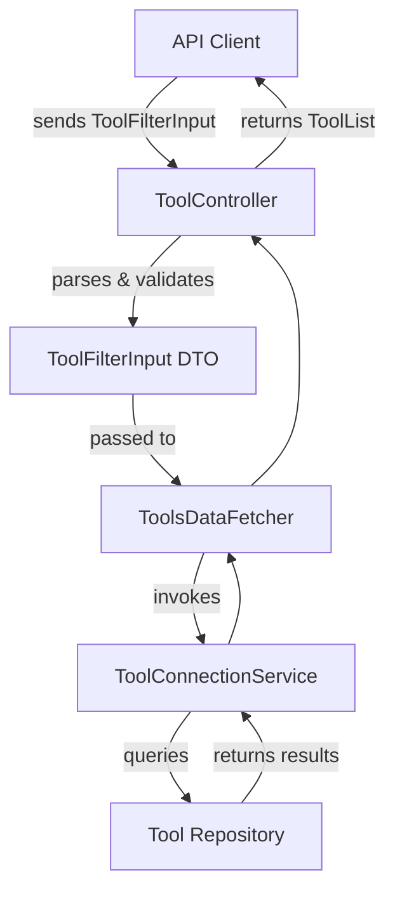

# api_service_core_dto_tool Module Documentation

## Introduction

The `api_service_core_dto_tool` module defines the core Data Transfer Object (DTO) for tool-related filtering operations within the API service layer. It provides a standardized input structure for filtering and querying tool entities, supporting the backend's ability to process complex tool queries in a consistent and type-safe manner. This module is a key part of the DTO layer, facilitating communication between controllers, data fetchers, and service layers that handle tool data.

## Core Functionality

- **Purpose:**
  - To encapsulate the input parameters required for filtering tool entities in API requests.
  - To ensure type safety and validation for tool filter operations.
  - To serve as a contract between the API layer and the underlying service/data layers for tool-related queries.

- **Primary Component:**
  - `ToolFilterInput`: The main DTO class representing the filter criteria for querying tools.

## Component Overview

### ToolFilterInput

- **Description:**
  - Represents the input structure for filtering tools based on various criteria (e.g., name, type, tags, status).
  - Used by controllers and data fetchers to receive and process tool filter requests from clients.
  - Ensures that only valid and expected filter parameters are passed to the service and repository layers.

- **Typical Fields:**
  - `name`: (optional) Filter by tool name.
  - `type`: (optional) Filter by tool type/category.
  - `tags`: (optional) Filter by associated tags.
  - `status`: (optional) Filter by tool status (e.g., active, inactive).
  - `pagination`: (optional) Pagination input for result set control (see [`api_lib_dto_shared`](api_lib_dto_shared.md)).

> **Note:** The exact fields may vary depending on implementation, but the above are typical for filter DTOs in this context.

## Architecture and Data Flow

The `ToolFilterInput` DTO is a central part of the tool querying process. It is used by API controllers to accept filter parameters from clients, which are then passed to data fetchers and service layers for processing. The results are typically returned as paginated lists of tool entities or summaries.

### High-Level Data Flow



### Component Relationships

- **Controllers:** Accept `ToolFilterInput` as part of API requests (see [`api_service_core_controller`](api_service_core_controller.md)).
- **Data Fetchers:** Use the DTO to fetch and filter tool data (see [`api_service_core_datafetcher`](api_service_core_datafetcher.md)).
- **Services:** Process the filter input and interact with repositories (see [`api_lib_service`](api_lib_service.md)).
- **Repositories:** Execute database queries based on filter criteria (see [`data_mongo_repository_tool`](data_mongo_repository_tool.md)).
- **DTO Layer:** Shares filter input structure with other DTOs for consistency (see [`api_lib_dto_tool`](api_lib_dto_tool.md)).

## Dependencies and Integration

- **Upstream:**
  - Consumed by API controllers and GraphQL data fetchers.
- **Downstream:**
  - Passed to service and repository layers for query execution.
- **Related DTOs:**
  - [`ToolFilterOptions`, `ToolFilters`, `ToolList`](api_lib_dto_tool.md): Used for filter options and result representation.
  - [`CursorPaginationInput`](api_lib_dto_shared.md): Used for pagination support.

## Example Usage

A typical API request to filter tools might look like:

```json
{
  "name": "Antivirus",
  "type": "security",
  "tags": ["endpoint", "protection"],
  "status": "active",
  "pagination": {
    "cursor": "abc123",
    "limit": 20
  }
}
```

This request would be mapped to a `ToolFilterInput` instance and processed through the flow described above.

## Related Documentation

- [api_lib_dto_tool.md](api_lib_dto_tool.md) — Tool filter options and result DTOs
- [api_service_core_controller.md](api_service_core_controller.md) — API controllers handling tool endpoints
- [api_service_core_datafetcher.md](api_service_core_datafetcher.md) — Data fetchers for tool queries
- [api_lib_service.md](api_lib_service.md) — Tool service layer
- [data_mongo_repository_tool.md](data_mongo_repository_tool.md) — Tool repository implementation
- [api_lib_dto_shared.md](api_lib_dto_shared.md) — Shared DTOs (e.g., pagination)

## Summary

The `api_service_core_dto_tool` module provides the essential DTO for tool filtering in the API service layer, enabling robust, type-safe, and consistent querying of tool entities. It acts as a bridge between client requests and backend data operations, ensuring that tool queries are handled efficiently and reliably.
