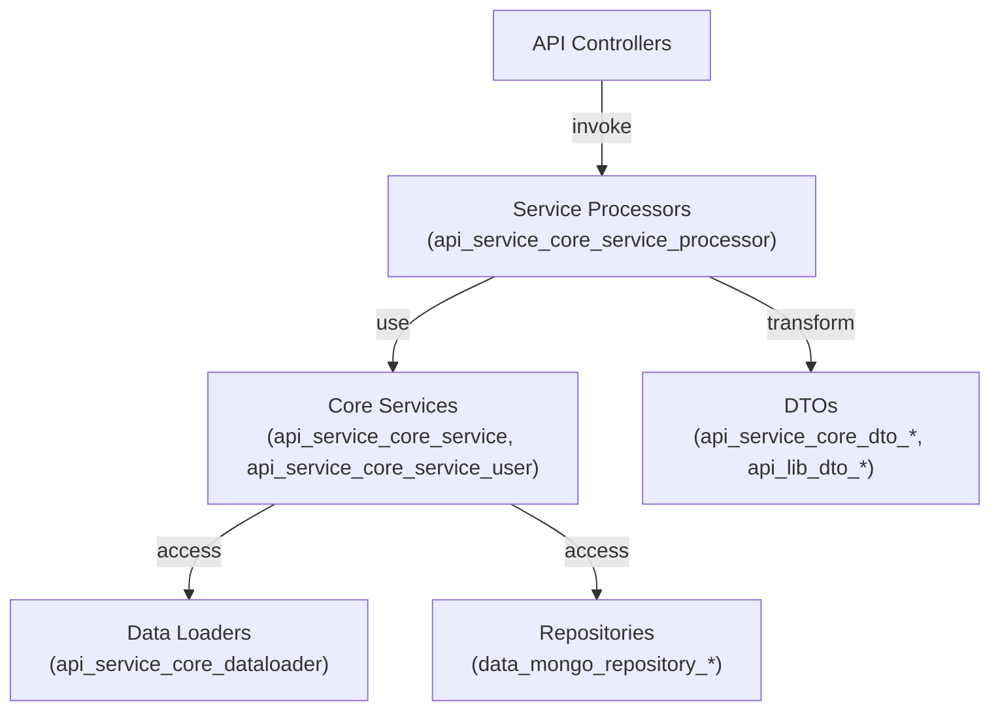
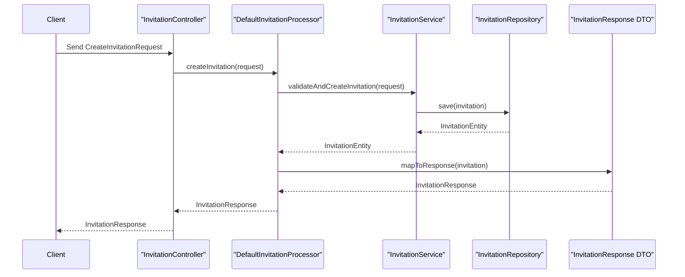
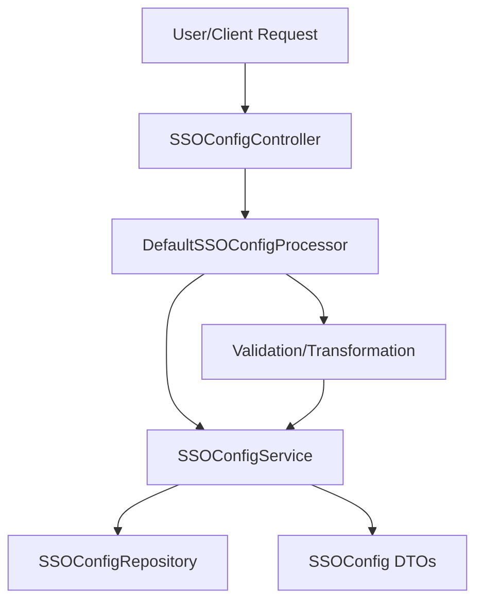

# api_service_core_service_processor Module Documentation

## Introduction

The `api_service_core_service_processor` module provides core processing logic for user, invitation, and SSO (Single Sign-On) configuration management within the API service layer. It acts as a bridge between service classes and higher-level controllers, encapsulating business logic for user operations, invitation workflows, and SSO configuration processing. This module is essential for orchestrating complex flows that involve validation, transformation, and coordination between multiple service and data access layers.

## Core Components

- **DefaultInvitationProcessor**: Handles the processing of invitation-related workflows, such as creating, updating, and validating invitations.
- **DefaultSSOConfigProcessor**: Manages the processing of SSO configuration, including validation, transformation, and persistence of SSO settings.
- **DefaultUserProcessor**: Orchestrates user-related business logic, such as user creation, update, deactivation, and validation.

## Architecture Overview

The processors in this module are designed to:
- Encapsulate business logic that spans multiple services or repositories
- Provide a clear separation between controller/request handling and lower-level service/data access
- Coordinate with other modules such as service, data loader, and DTO modules

### High-Level Architecture

- **Controllers**: Handle HTTP/GraphQL requests and delegate to processors
- **Processors**: Implement business logic, validation, and orchestration
- **Services**: Provide domain-specific operations and data access
- **Data Loaders/Repositories**: Efficiently fetch and persist data
- **DTOs**: Used for data transfer between layers

## Component Interactions

### DefaultInvitationProcessor
- Coordinates with invitation-related DTOs (see [api_service_core_dto_invitation.md])
- Utilizes services for invitation persistence and validation
- May interact with organization/user services for cross-entity validation

### DefaultSSOConfigProcessor
- Works with SSO configuration DTOs (see [api_service_core_dto_oauth.md], [api_service_core_dto_oidc.md])
- Relies on SSOConfigService ([api_service_core_service.md]) for SSO configuration management
- Handles validation and transformation of SSO settings

### DefaultUserProcessor
- Orchestrates user management logic
- Interacts with UserService ([api_service_core_service_user.md]) for user CRUD operations
- Utilizes user-related DTOs (see [api_service_core_dto_user.md])

## Data Flow Example: User Invitation

## Dependencies

This module depends on the following modules for its operation:
- [api_service_core_service.md]: Core business services (e.g., SSOConfigService)
- [api_service_core_service_user.md]: User management services
- [api_service_core_dto_invitation.md], [api_service_core_dto_user.md], [api_service_core_dto_oauth.md], [api_service_core_dto_oidc.md]: Data transfer objects for requests and responses
- [api_service_core_dataloader.md]: Efficient data loading
- [data_mongo_repository_user.md], [data_mongo_repository_organization.md]: Data persistence

## Process Flow: SSO Configuration Update

## How This Module Fits Into the System

The `api_service_core_service_processor` module is a central part of the API service layer, providing the glue between request handling (controllers) and the core business/domain logic (services). By encapsulating orchestration and validation logic, it ensures that controllers remain thin and focused on request/response handling, while services remain reusable and focused on domain operations. This design promotes maintainability, testability, and clear separation of concerns.

## References

- [api_service_core_service.md]: Core business services
- [api_service_core_service_user.md]: User management services
- [api_service_core_dto_invitation.md]: Invitation DTOs
- [api_service_core_dto_user.md]: User DTOs
- [api_service_core_dto_oauth.md]: OAuth/SSO DTOs
- [api_service_core_dto_oidc.md]: OIDC DTOs
- [api_service_core_dataloader.md]: Data loaders
- [data_mongo_repository_user.md]: User repository
- [data_mongo_repository_organization.md]: Organization repository
