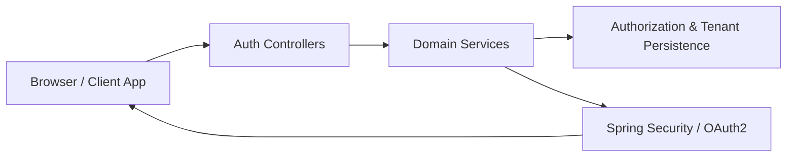
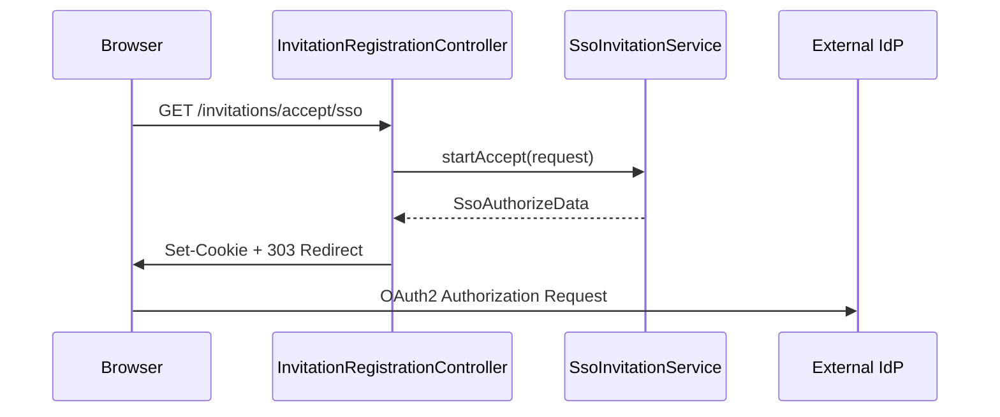
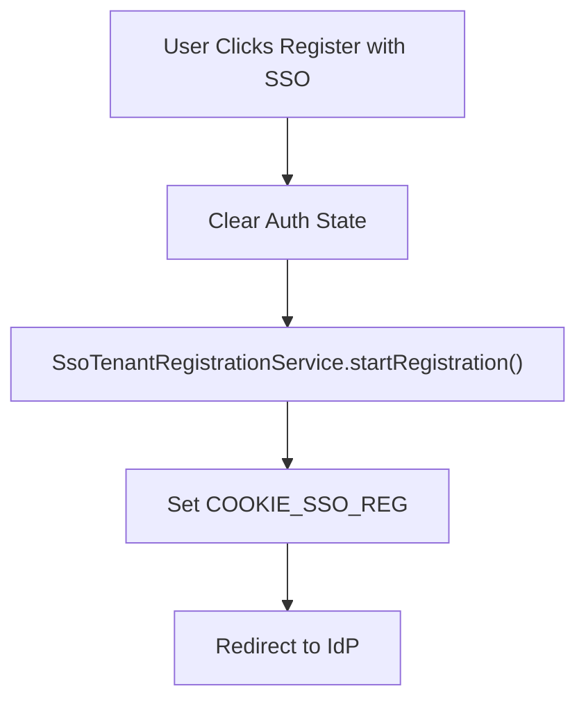
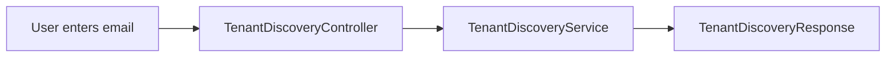
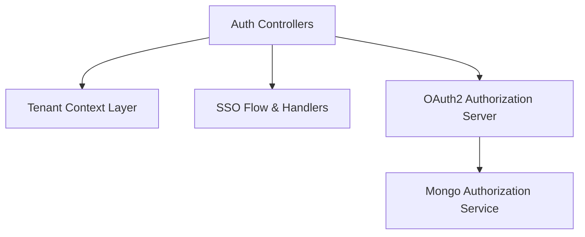

# Authorization Service Core Auth Controllers And Dtos

## Overview

The **Authorization Service Core Auth Controllers And Dtos** module exposes the public HTTP interface for tenant onboarding, login, invitation acceptance, password reset, SSO discovery, and tenant discovery within the OpenFrame multi-tenant authorization system.

It acts as the **edge layer** of the Authorization Service Core, translating HTTP requests into domain-level service calls and orchestrating redirects, cookies, and validation logic.

This module is tightly integrated with:

- The authorization server and tenant context layer:  
  [Authorization Service Core Server And Tenant](../authorization-service-core-server-and-tenant/authorization-service-core-server-and-tenant.md)
- The SSO flow and security utilities layer (redirect helpers, auth state utilities, registration constants)
- The persistence and key management layer (Mongo authorization service, client repositories, tenant keys)

---

## Architectural Role

This module sits at the boundary between:

- 🌐 External clients (browser, SPA, CLI, third-party tools)
- 🔐 Spring Security & OAuth2 Authorization Server
- 🏢 Multi-tenant domain services

It contains:

- REST controllers
- MVC login controller
- Request/response DTOs
- Validation annotations

### High-Level Request Flow



The controllers remain intentionally thin. All business logic is delegated to service-layer components such as:

- `InvitationRegistrationService`
- `SsoInvitationService`
- `TenantRegistrationService`
- `TenantDiscoveryService`
- `PasswordResetService`

---

# Controllers

## 1. InvitationRegistrationController

**Base path:** `/invitations`

Handles invitation-based onboarding, both standard and SSO-based.

### Endpoints

#### `POST /invitations/accept`
Registers a user using an invitation token.

- Input: `InvitationRegistrationRequest`
- Output: `AuthUser`
- Delegates to: `InvitationRegistrationService`

#### `GET /invitations/accept/sso`
Initiates SSO-based invitation acceptance.

Flow:



Key behaviors:

- Clears previous auth state using `AuthStateUtils`
- Sets secure, HTTP-only SSO invitation cookie
- Performs 303 redirect using `Redirects.seeOther`
- Encodes error message and redirects to configured `openframe.auth.error-url` on failure

---

## 2. TenantRegistrationController

**Base path:** `/oauth`

Responsible for creating new tenants via:

- Password-based registration
- SSO-based registration

### `POST /oauth/register`

Registers a new tenant and initial user.

- Input: `TenantRegistrationRequest`
- Output: `Tenant`
- Delegates to: `TenantRegistrationService`

### `GET /oauth/register/sso`

Initiates SSO tenant registration.



Security properties:

- Secure cookies
- HTTP-only flags
- Tenant-scoped redirect path
- Centralized error handling

---

## 3. LoginController

MVC controller (not REST).

### Endpoints

- `GET /login` → renders login page
- `GET /` → renders index page

Responsibilities:

- Inject error message when `?error` query param is present
- Expose optional password reset URL from configuration

This controller integrates with Spring Security login processing.

---

## 4. PasswordResetController

**Base path:** `/password-reset`

Handles password recovery flows.

### `POST /password-reset/request`

- Input: `ResetRequest`
- Normalizes email to lowercase
- Delegates to `PasswordResetService.createResetToken`
- Returns HTTP 202 (Accepted)

### `POST /password-reset/confirm`

- Input: `ResetConfirm`
- Enforces strong password pattern validation
- Delegates to `PasswordResetService.resetPassword`
- Returns HTTP 204 (No Content)

Password validation rules:

- Minimum 8 characters
- At least one uppercase
- At least one lowercase
- At least one digit
- At least one special character

---

## 5. SsoDiscoveryController

**Base path:** `/sso/providers`

Used by frontend before redirecting to SSO provider.

### `GET /sso/providers/invite`

- Requires `invitationId`
- Loads invitation via `InvitationValidator`
- Returns effective providers for tenant

### `GET /sso/providers/registration`

- Returns system default SSO providers
- Delegates to `SSOConfigService`

Response model:

```text
{
  "providers": ["google", "microsoft"]
}
```

---

## 6. TenantDiscoveryController

**Base path:** `/tenant`

Supports multi-tenant login UX.

### `GET /tenant/discover?email=`

Returns:

- Whether accounts exist
- Associated tenant ID
- Available authentication providers

Flow:



Used to determine:

- Password login vs SSO
- Redirect to tenant-specific issuer

---

# DTO Layer

The DTOs define the external API contract and enforce validation constraints.

## InvitationRegistrationRequest

Extends `CoreUserRequest`.

Fields:

- `invitationId` (required)
- `switchTenant` (optional)

---

## TenantRegistrationRequest

Extends `CoreUserRequest`.

Fields:

- `email`
- `tenantName`
- `tenantDomain`
- `accessCode`

Validation ensures:

- Proper tenant domain format
- Organization name pattern restrictions

---

## SsoTenantRegistrationInitRequest

Used before redirecting to IdP.

Fields:

- `email`
- `tenantName`
- `tenantDomain`
- `provider`
- `redirectTo`

This ensures the system has enough context to:

- Create tenant if needed
- Attach SSO configuration
- Prepare OAuth2 client registration

---

## SsoInvitationAcceptRequest

Fields:

- `invitationId`
- `provider`
- `switchTenant`
- `redirectTo`

Used to bootstrap SSO flow for invited users.

---

## PasswordResetDtos

Two nested DTOs:

- `ResetRequest`
- `ResetConfirm`

Encapsulates strict password validation rules.

---

## TenantDiscoveryResponse

```text
{
  "email": "user@example.com",
  "has_existing_accounts": true,
  "tenant_id": "tenant123",
  "auth_providers": ["password", "google"]
}
```

---

## TenantAvailabilityResponse

Indicates whether a tenant domain is available and suggests alternatives.

---

# Multi-Tenant & Security Integration

This module works in conjunction with:

- Tenant context resolution
- OAuth2 authorization server
- SSO provider strategies (Google, Microsoft)
- Registration processors
- Token generation and persistence

### Cross-Module Interaction



The controllers do not directly manipulate:

- JWT generation
- Key pairs
- OAuth token storage
- Client registration persistence

These responsibilities are delegated to the lower layers of the Authorization Service Core.

---

# Design Principles

✅ Thin controllers  
✅ Strong DTO validation  
✅ Clear separation of concerns  
✅ Secure cookie handling  
✅ Explicit redirect logic  
✅ Multi-tenant aware flows  
✅ SSO-provider abstraction  

---

# Summary

The **Authorization Service Core Auth Controllers And Dtos** module defines the complete public-facing contract of the OpenFrame Authorization Service.

It:

- Exposes login, registration, invitation, and password reset APIs
- Coordinates SSO bootstrap and redirect logic
- Enforces strict validation rules
- Supports multi-tenant discovery and onboarding
- Bridges HTTP requests to secure, tenant-aware domain services

This module is the entry point into the OpenFrame multi-tenant identity and authorization infrastructure.