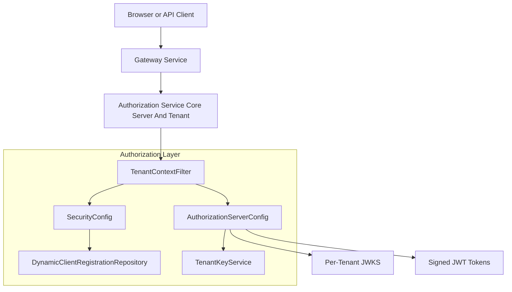
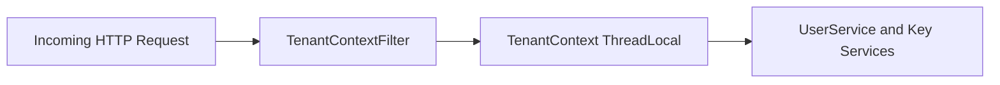
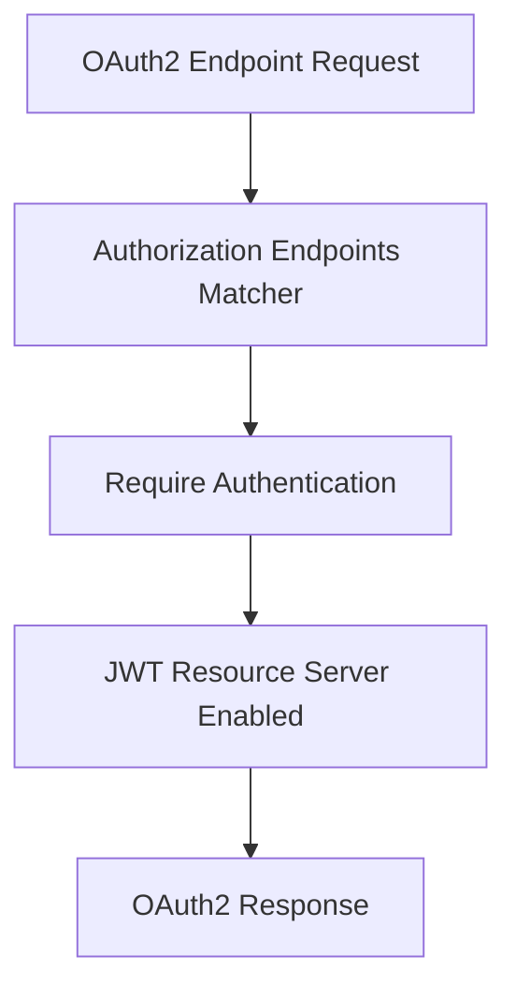
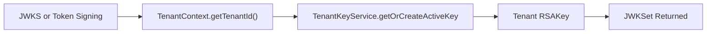
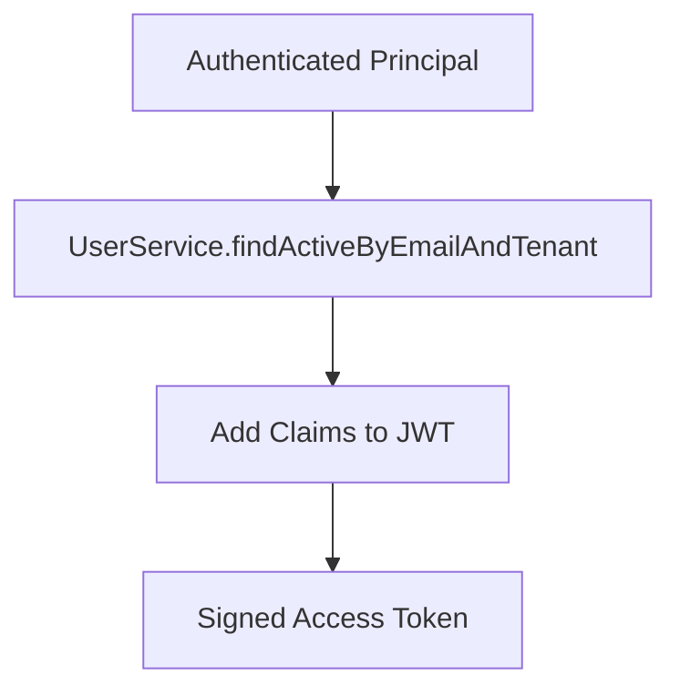
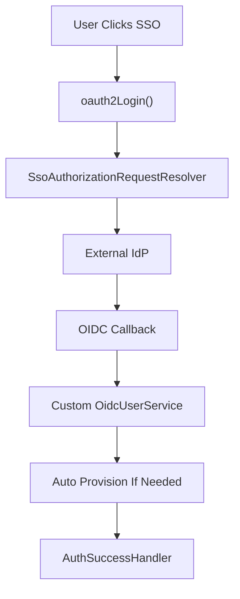
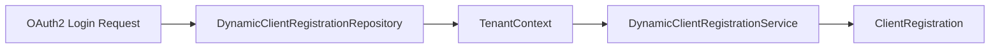
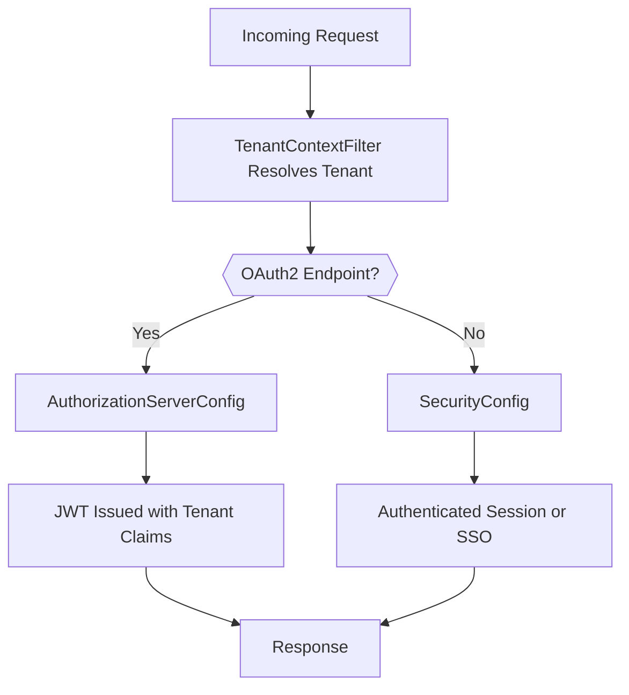

# Authorization Service Core Server And Tenant

## Overview

The **Authorization Service Core Server And Tenant** module is the heart of OpenFrame's multi-tenant identity and OAuth2 infrastructure. It implements a fully multi-tenant OAuth2 Authorization Server using Spring Authorization Server, with per-tenant key material, dynamic client registration, and tenant-aware authentication flows.

This module is responsible for:

- Acting as the OAuth2 / OIDC Authorization Server
- Issuing tenant-scoped JWT access tokens and refresh tokens
- Managing per-tenant signing keys (JWKS)
- Resolving tenant context for every request
- Integrating with SSO and dynamic OAuth2 clients
- Enforcing tenant isolation at the authentication and token layers

It works closely with:

- Data Mongo Domain Model (users, OAuth clients, tokens)
- Security Core And OAuth BFF (shared security constants and utilities)
- Gateway Service Core Security And Routing (JWT validation and issuer routing)
- Authorization Service Core SSO Flow And Utils (SSO login, provider strategies)

---

## High-Level Architecture

The module is composed of five core building blocks:

- Authorization Server Configuration
- Default Security Configuration
- Dynamic Client Registration
- Tenant Context Management
- Tenant-Aware Key Infrastructure

---

## Multi-Tenant Design Principles

The Authorization Service Core Server And Tenant module is built around strict tenant isolation:

1. Every request must resolve a tenant identifier.
2. Every JWT contains a `tenant_id` claim.
3. Every tenant has its own RSA key pair.
4. OAuth2 client registrations are resolved dynamically per tenant.
5. User authentication always queries tenant-scoped user records.

Tenant identity flows through the entire request lifecycle using a thread-local context.

---

## Tenant Context Management

### TenantContext

Component:
- `openframe-oss-lib.openframe-authorization-service-core.src.main.java.com.openframe.authz.config.tenant.TenantContext.TenantContext`

A lightweight `ThreadLocal` holder storing the current tenant ID for the duration of a request.

Responsibilities:

- Store tenant ID per thread
- Provide `setTenantId`, `getTenantId`, and `clear`
- Ensure isolation between concurrent requests

---

### TenantContextFilter

Component:
- `openframe-oss-lib.openframe-authorization-service-core.src.main.java.com.openframe.authz.config.tenant.TenantContextFilter.TenantContextFilter`

This filter executes early in the filter chain and resolves the tenant ID using:

- URL path prefix (for example `/tenantId/oauth2/authorize`)
- Query parameter `tenant`
- Existing HTTP session attribute

Key behaviors:

- Stores tenant ID in both session and `TenantContext`
- Prevents unsafe cross-tenant session reuse
- Allows special onboarding tenant switching
- Clears context after request completion

Tenant resolution directly influences:

- JWT signing key selection
- OAuth2 client registration
- User lookup and authentication

---

## Authorization Server Configuration

### AuthorizationServerConfig

Component:
- `openframe-oss-lib.openframe-authorization-service-core.src.main.java.com.openframe.authz.config.AuthorizationServerConfig.AuthorizationServerConfig`

This class configures Spring Authorization Server with multi-issuer support.

### Key Responsibilities

- Enables OIDC support
- Allows multiple issuers (`multipleIssuersAllowed(true)`)
- Configures OAuth2 endpoints
- Sets up JWT encoder and decoder
- Defines token customization logic
- Registers tenant-aware JWK source

### Security Filter Chain (Order 1)

This chain applies only to Authorization Server endpoints.

---

## Per-Tenant Key Infrastructure

### JWKSource and TenantKeyService Integration

The `jwkSource` bean dynamically selects the RSA key based on the current tenant:

Important properties:

- Each tenant has its own active RSA key
- Key ID (`kid`) is logged and exposed via JWKS
- If tenant ID is missing, the request fails

This guarantees:

- Cryptographic tenant isolation
- Independent key rotation per tenant
- Safe multi-issuer JWT validation

---

## JWT Token Customization

The module injects tenant and user metadata into access tokens.

### Custom Claims Added

When issuing an `access_token`, the following claims are added:

- `tenant_id`
- `userId`
- `roles`

Role logic:

- If user has `OWNER`, `ADMIN` is implicitly included
- Roles are emitted as string names

Additionally:

- Refresh token grants update `lastLogin`
- Claims are derived from tenant-scoped `AuthUser`

This ensures that downstream services (Gateway, API Service) can enforce tenant and role-based authorization purely from JWT claims.

---

## User Authentication Integration

### UserDetailsService

Provides tenant-aware authentication:

- Looks up users by email + tenant ID
- Converts roles into `ROLE_*` authorities
- Uses BCrypt for password hashing

### AuthenticationManager

Uses a `DaoAuthenticationProvider` wired with:

- Tenant-aware `UserDetailsService`
- BCrypt `PasswordEncoder`

This enables:

- Form login
- Programmatic authentication
- Password-based fallback for SSO users

---

## Default Security Configuration

### SecurityConfig

Component:
- `openframe-oss-lib.openframe-authorization-service-core.src.main.java.com.openframe.authz.config.SecurityConfig.SecurityConfig`

This filter chain handles **non-Authorization Server endpoints** (Order 2).

Responsibilities:

- Form login configuration
- OAuth2 login configuration
- SSO failure handling
- Auto-provisioning of users
- Microsoft multi-tenant issuer validation

---

### OAuth2 Login and SSO Integration

Key integrations:

- `SsoAuthorizationRequestResolver`
- `AuthSuccessHandler`
- Custom `JwtDecoderFactory`
- Auto-provisioning logic

---

## Auto-Provisioning Logic

When a user logs in via OIDC:

1. Resolve tenant from context
2. Extract email and provider
3. Load per-tenant SSO configuration
4. Validate allowed domains
5. Register or reactivate user if necessary
6. Assign ADMIN role during SSO registration

Safeguards:

- Does not block login if provisioning fails
- Honors global domain policy fallback
- Avoids duplicate image sync

This tightly integrates identity provider flows with OpenFrame's tenant-based user model.

---

## Dynamic Client Registration

### DynamicClientRegistrationRepository

Component:
- `openframe-oss-lib.openframe-authorization-service-core.src.main.java.com.openframe.authz.config.DynamicClientRegistrationRepository.DynamicClientRegistrationRepository`

Implements `ClientRegistrationRepository` dynamically per tenant.

Behavior:

- Resolves tenant ID from:
  - `TenantContext`
  - HTTP session
- Delegates to `DynamicClientRegistrationService`
- Returns null if tenant is unresolved

This allows:

- Per-tenant SSO provider configuration
- Dynamic Google and Microsoft client resolution
- Runtime onboarding of new tenants

---

## Multi-Issuer and Gateway Compatibility

The Authorization Service Core Server And Tenant module is designed for compatibility with the Gateway Service:

- Each tenant may have its own issuer URL
- JWT includes `tenant_id`
- JWKS endpoint is tenant-aware
- Gateway validates JWT using issuer-specific configuration

This ensures horizontal scalability and safe routing across multiple tenants.

---

## Security Characteristics

- Per-tenant RSA key pairs
- BCrypt password hashing
- OIDC ID token validation
- Microsoft multi-tenant issuer pattern validation
- Session invalidation on unsafe tenant switch
- Strict JWT claim injection
- CSRF disabled for OAuth endpoints only

---

## Request Lifecycle Summary

---

## How This Module Fits Into OpenFrame

Within the broader OpenFrame architecture:

- It is the authoritative identity provider.
- It enforces tenant boundaries at authentication time.
- It supplies signed JWTs used by:
  - API Service Core
  - Gateway Service Core
  - External API Service Core
- It integrates with Mongo repositories for user and OAuth persistence.

Without this module, the multi-tenant trust boundary would not exist.

---

## Conclusion

The **Authorization Service Core Server And Tenant** module provides:

- Multi-tenant OAuth2 Authorization Server
- Tenant-aware JWT issuance
- Per-tenant RSA key management
- Dynamic client registration
- SSO auto-provisioning
- Strict tenant isolation guarantees

It forms the cryptographic and identity backbone of OpenFrame, enabling secure, scalable, and tenant-isolated authentication across the entire platform.