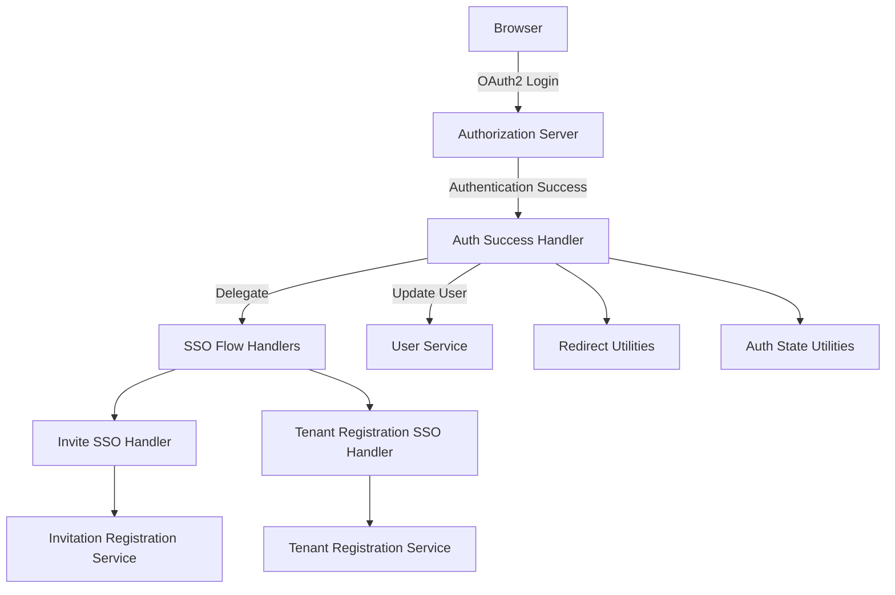
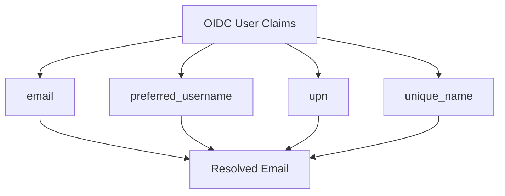
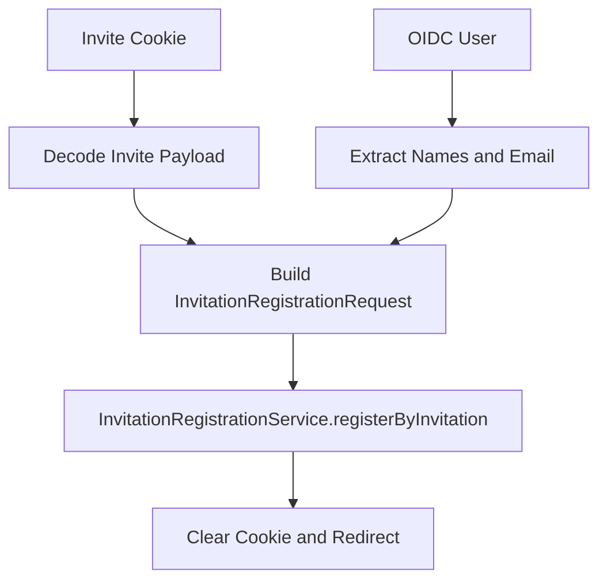
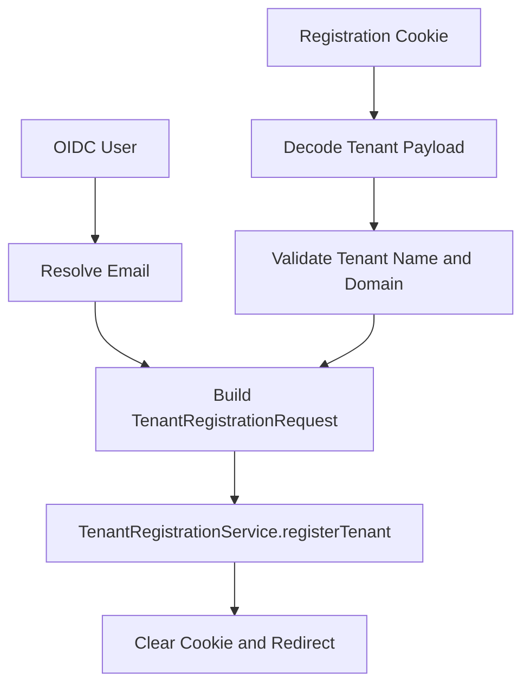
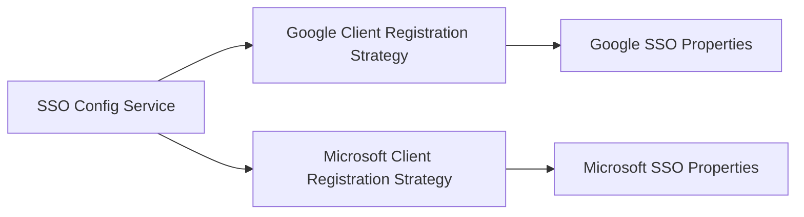
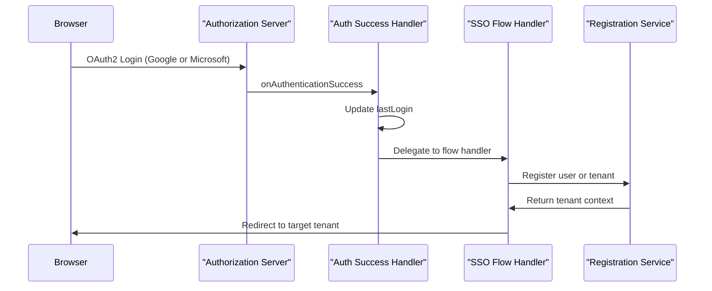

# Authorization Service Core Sso Flow And Utils

## Overview

The **Authorization Service Core Sso Flow And Utils** module encapsulates the Single Sign-On (SSO) flow orchestration, post-authentication handling, provider registration strategies, extensibility processors, and supporting web/security utilities for the OpenFrame Authorization Server.

It sits on top of the core authorization server and tenant infrastructure and focuses on:

- Handling OAuth2/OIDC authentication success
- Driving SSO-based tenant registration and invitation flows
- Dynamically configuring Google and Microsoft OIDC providers
- Providing extensibility hooks for registration and user lifecycle events
- Offering security and redirect utilities for clean session handling

This module is a critical bridge between:

- The **Authorization Server Core** (multi-tenant, OAuth2, client registration)
- The **User and Tenant Services**
- External OIDC providers (Google, Microsoft)

---

## Architectural Context

At a high level, the module enhances the OAuth2 login pipeline and injects SSO-specific behaviors.

The flow can be summarized as:

1. User authenticates via OAuth2 (Google or Microsoft).
2. `AuthSuccessHandler` updates user metadata and delegates to SSO flow handlers.
3. Based on SSO cookies, the appropriate handler executes:
   - Invitation-based onboarding
   - Tenant self-registration
4. Registration services create or update tenant/user entities.
5. Cookies are cleared and user is redirected to the correct tenant context.

---

## Authentication Success Orchestration

### AuthSuccessHandler

**Responsibility:** Central post-authentication entry point.

Key behaviors:

- Extracts tenant ID from `TenantContext`
- Resolves email from `Authentication` (OIDC or standard login)
- Updates `lastLogin` via `UserService`
- Optionally marks email as verified for trusted providers
- Delegates to SSO tenant registration success handler

### Email Resolution Strategy

Email resolution is provider-aware and handled via `OidcUserUtils`:

Order of precedence:

1. `email`
2. `preferred_username`
3. `upn`
4. `unique_name`

This ensures compatibility with Google and Azure AD organizational accounts.

---

## SSO Flow Handling

The module supports two primary SSO-driven flows using cookie-based state management.

### SsoRegistrationConstants

Defines cookie names and special onboarding tenant identifiers:

- `of_sso_reg` → Tenant self-registration flow
- `of_sso_invite` → Invitation-based onboarding
- `sso-onboarding` → Temporary tenant context

---

### InviteSsoHandler

**Use Case:** User accepts an invitation and authenticates via SSO.

Flow:

Key characteristics:

- Validates SSO session via `SsoCookieCodec`
- Generates a random password (UUID-based)
- Uses provider picture (if available)
- Optionally switches tenant
- Clears SSO cookie while preserving OAuth session continuity

---

### TenantRegSsoHandler

**Use Case:** New tenant self-registration via SSO.

Flow:

Key behaviors:

- Requires tenant name and domain
- Normalizes domain to lowercase
- Generates secure random password
- Associates authenticated email with tenant

---

## OIDC Provider Strategies

The module uses a strategy pattern for dynamic client registration.

### GoogleClientRegistrationStrategy

- Provider ID: `google`
- Uses `GoogleSSOProperties`
- Extends base OIDC registration strategy
- Integrates with `SSOConfigService`

### MicrosoftClientRegistrationStrategy

- Provider ID: `microsoft`
- Uses `MicrosoftSSOProperties`
- Supports Azure AD OIDC configuration

This design enables:

- Per-tenant provider configuration
- Default provider fallbacks
- Clean extension for additional IdPs

---

## Default Provider Configuration

### GoogleDefaultProviderConfig
### MicrosoftDefaultProviderConfig

Provide default client ID and secret values when no tenant-specific configuration exists.

This ensures:

- Zero-config local development
- Sensible fallback for multi-tenant environments

---

## Domain Policy Lookup

### NoopGlobalDomainPolicyLookup

Fallback implementation for domain-based auto-provisioning.

- Returns empty result by default
- Activated only if no custom `GlobalDomainPolicyLookup` bean exists
- Enables domain-to-tenant auto-binding customization

This is a key extensibility point for enterprise auto-provisioning.

---

## Registration and User Lifecycle Processors

The module defines multiple processor extension points with default no-op implementations.

### DefaultRegistrationProcessor

Hooks:

- `preProcessTenantRegistration`
- `postProcessTenantRegistration`
- `postProcessInvitationRegistration`
- `postProcessAutoProvision`

Allows custom logic such as:

- Audit logging
- License provisioning
- External system synchronization

### DefaultUserDeactivationProcessor

Triggered after user deactivation.

### DefaultUserEmailVerifiedProcessor

Triggered when user email is marked verified.

These processors follow a conditional bean pattern:

- If no custom bean exists → default implementation is used
- If custom bean exists → default is ignored

This enables safe override without modifying core logic.

---

## Security and Web Utilities

### OidcUserUtils

Provides claim resolution helpers:

- Email resolution across providers
- Picture URL extraction
- Safe string claim parsing

Ensures provider inconsistencies do not leak into business logic.

---

### ResetTokenUtil

Generates secure password reset tokens:

- 32 random bytes
- URL-safe Base64 encoding without padding
- Uses `SecureRandom`

This provides cryptographically strong reset tokens.

---

### AuthStateUtils

Handles authentication state cleanup:

- Invalidates session
- Clears `JSESSIONID`
- Removes cookies at root and context path

Used during logout or auth reset scenarios.

---

### Redirects

Utility for safe HTTP redirects:

- 302 Found
- 303 See Other
- Root-based redirect support
- Context-aware URL construction

Ensures:

- Clean redirect semantics
- No manual URL concatenation
- Context-path safety

---

## Complete SSO Registration Sequence

---

## Key Design Principles

1. **Separation of concerns** – Authentication success handling is isolated from registration logic.
2. **Cookie-driven flow state** – SSO flow intent is persisted safely across OAuth redirects.
3. **Strategy pattern for IdPs** – Enables clean addition of new providers.
4. **Extensibility via processors** – Business-specific logic can be injected without modifying core.
5. **Provider-agnostic claim resolution** – Normalizes Google and Microsoft differences.
6. **Secure defaults** – Strong random token generation and strict cookie clearing.

---

## Summary

The **Authorization Service Core Sso Flow And Utils** module is the orchestration layer that transforms raw OAuth2/OIDC authentication into:

- Tenant-aware onboarding
- Invitation-driven account activation
- Secure and extensible registration flows
- Clean post-authentication lifecycle updates

It acts as the glue between authentication, tenant management, and user lifecycle processing, ensuring a secure, extensible, and multi-tenant-ready SSO experience across OpenFrame.