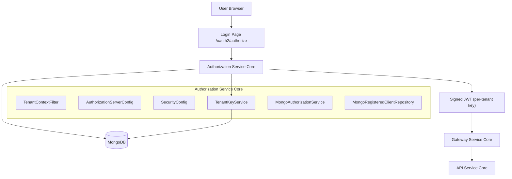
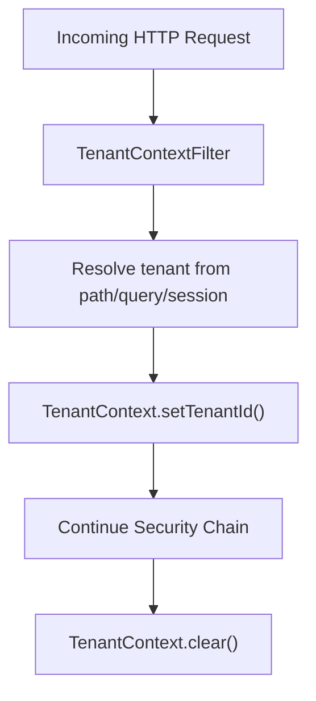
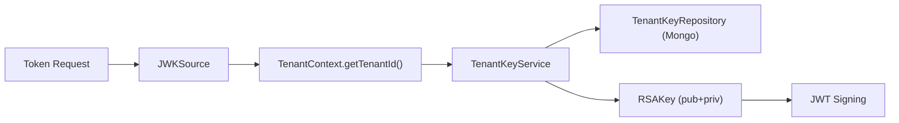
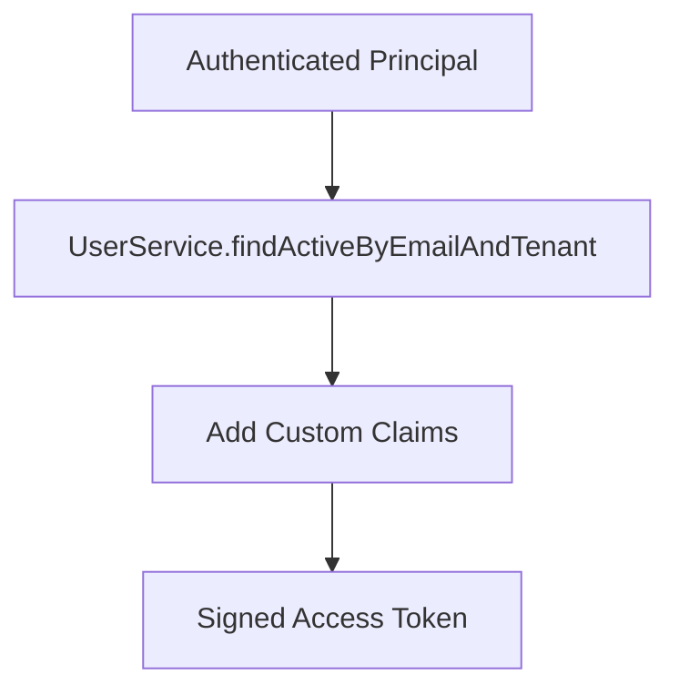
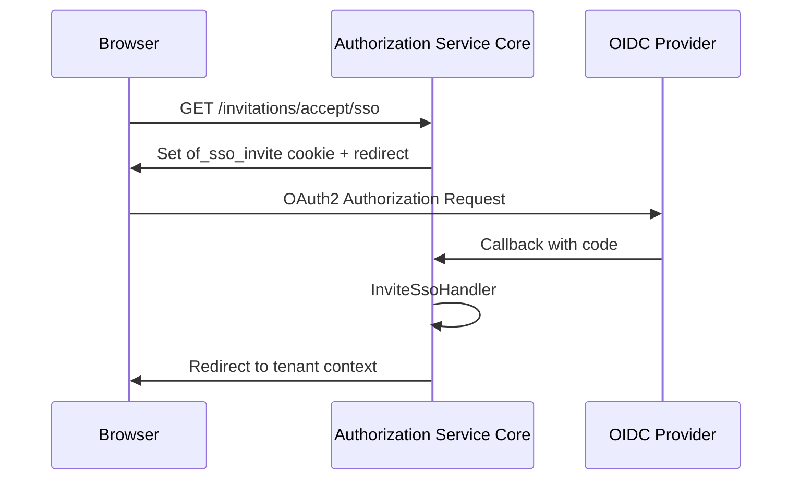
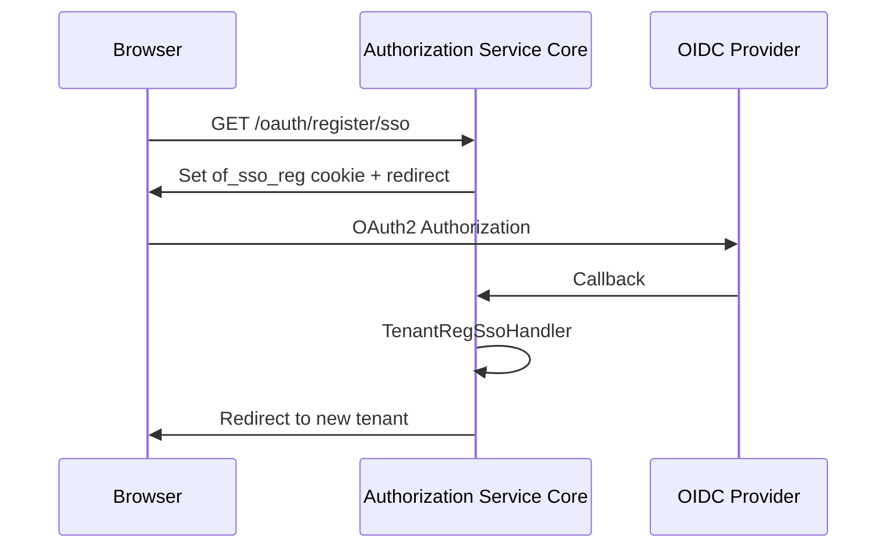

# Authorization Service Core

The **Authorization Service Core** module is the multi-tenant OAuth2 and OpenID Connect (OIDC) authorization server for the OpenFrame platform. It is responsible for:

- Issuing and validating OAuth2 access and refresh tokens
- Acting as an OpenID Connect identity provider (IdP)
- Managing multi-tenant authentication contexts
- Supporting local username/password and SSO (Google, Microsoft)
- Handling tenant onboarding, invitation-based registration, and password reset
- Persisting authorizations, clients, and signing keys in MongoDB

This module is the identity backbone of OpenFrame and integrates with:

- Mongo Persistence Layer (users, tenants, OAuth data)
- Security Core and OAuth BFF (JWT validation and OAuth flows)
- Gateway Service Core (JWT validation at the edge)
- API Service Core Controllers and GraphQL (resource server using issued JWTs)

---

## 1. High-Level Architecture



### Core Responsibilities

1. **Multi-Tenant Resolution** – Extract tenant ID from path/query/session.
2. **OAuth2 Authorization Server** – Provide `/oauth2/authorize`, `/oauth2/token`, JWKS, OIDC metadata.
3. **JWT Issuance** – Sign tokens with per-tenant RSA keys.
4. **SSO Integration** – Dynamic OIDC client registration per tenant.
5. **Persistence** – Store authorizations and registered clients in MongoDB.

---

## 2. Multi-Tenant Context Model

Multi-tenancy is implemented using a thread-local context and HTTP filters.

### 2.1 Tenant Context

- `TenantContext` – ThreadLocal storage for the current tenant ID.
- `TenantContextFilter` – Extracts tenant ID from:
  - URL path (e.g., `/{tenant}/oauth2/authorize`)
  - `tenant` query parameter
  - HTTP session attribute



### 2.2 Onboarding Tenant

`SsoRegistrationConstants.ONBOARDING_TENANT_ID` (`"sso-onboarding"`) is a pseudo-tenant used during SSO-based tenant creation before the real tenant is finalized.

---

## 3. Authorization Server Configuration

### 3.1 AuthorizationServerConfig

`AuthorizationServerConfig` enables Spring Authorization Server with:

- OIDC support
- Multiple issuers (`multipleIssuersAllowed(true)`)
- JWT resource server support
- Custom `OAuth2TokenCustomizer`

Key beans:

- `SecurityFilterChain` (order 1) – Secures OAuth2 endpoints
- `JWKSource` – Per-tenant RSA key resolution
- `JwtEncoder` / `JwtDecoder`
- `UserDetailsService`
- `AuthenticationManager`

### 3.2 Per-Tenant JWKS

`TenantKeyService`:

- Loads or generates RSA key pairs per tenant
- Stores encrypted private keys in MongoDB
- Returns `RSAKey` for JWT signing



If no active key exists for a tenant, a new 2048-bit RSA key pair is generated and persisted.

---

## 4. JWT Customization and Claims

The `OAuth2TokenCustomizer` enriches access tokens with tenant-aware claims.

### Added Claims

- `tenant_id`
- `userId`
- `roles` (OWNER implies ADMIN)



On refresh token flows, `lastLogin` is updated.

---

## 5. Security Configuration (Non-AS Endpoints)

`SecurityConfig` (order 2) secures all non-authorization-server endpoints.

### Features

- Custom login page (`/login`)
- Form login + OAuth2 login
- OIDC user service with auto-provisioning
- Microsoft-specific issuer validation
- Custom authentication failure handling

### Microsoft Multi-Tenant Validation

A custom `JwtDecoderFactory` validates issuer URIs against:

```text
^https://login\.microsoftonline\.com/[^/]+/v2\.0/?$
```

This enables Azure AD multi-tenant support.

---

## 6. SSO and Dynamic Client Registration

### 6.1 DynamicClientRegistrationRepository

Loads OIDC `ClientRegistration` dynamically per tenant using:

- `DynamicClientRegistrationService`
- Tenant-specific SSO configuration

If tenant context is missing, resolution fails early.

### 6.2 Provider Strategies

- `GoogleClientRegistrationStrategy`
- `MicrosoftClientRegistrationStrategy`

Each strategy:

- Uses provider-specific properties
- Integrates with `SSOConfigService`

### 6.3 Default Provider Configs

- `GoogleDefaultProviderConfig`
- `MicrosoftDefaultProviderConfig`

Provide fallback client IDs and secrets when tenant-level overrides are not configured.

---

## 7. SSO Flows

Two primary SSO-driven flows are supported:

1. Invitation acceptance
2. Tenant registration (onboarding)

### 7.1 Invitation SSO Flow



Handled by:

- `InvitationRegistrationController`
- `InviteSsoHandler`
- `SsoCookieCodec`

### 7.2 Tenant Registration SSO Flow



---

## 8. Mongo-Based Authorization Persistence

### 8.1 MongoAuthorizationService

Implements `OAuth2AuthorizationService` and persists:

- Authorization codes
- Access tokens
- Refresh tokens
- PKCE parameters

### 8.2 MongoAuthorizationMapper

Maps between:

- `OAuth2Authorization`
- `MongoOAuth2Authorization`

Special care is taken to:

- Preserve `code_challenge` and `code_challenge_method`
- Rehydrate `OAuth2AuthorizationRequest`
- Restore metadata on load

### 8.3 MongoRegisteredClientRepository

Implements `RegisteredClientRepository` and persists:

- Client ID / secret
- Grant types
- Redirect URIs
- Scopes
- Token TTLs

---

## 9. Registration and User Lifecycle Hooks

Extension points via conditional beans:

- `RegistrationProcessor`
- `UserDeactivationProcessor`
- `UserEmailVerifiedProcessor`
- `GlobalDomainPolicyLookup`

Default implementations are no-op and can be overridden.

This allows platform-specific customizations without modifying core logic.

---

## 10. Password Reset

`PasswordResetController`:

- `POST /password-reset/request`
- `POST /password-reset/confirm`

`ResetTokenUtil` generates secure URL-safe tokens using 32 bytes of randomness.

Password validation enforces:

- Minimum 8 characters
- Uppercase, lowercase, digit, special character

---

## 11. Integration with Other Modules

The Authorization Service Core integrates with:

- **Mongo Persistence Layer** – Users, tenants, OAuth documents
- **Security Core and OAuth BFF** – JWT validation, PKCE utilities
- **Gateway Service Core** – Edge validation of issued JWTs
- **API Service Core Controllers and GraphQL** – Resource server using `tenant_id` and `roles` claims

The issued JWT becomes the trust boundary token across the platform.

---

# Conclusion

The **Authorization Service Core** is a fully multi-tenant OAuth2 + OIDC authorization server built on Spring Authorization Server with:

- Per-tenant RSA signing keys
- Mongo-backed token and client persistence
- Dynamic SSO provider registration
- Auto-provisioning and onboarding flows
- Extensible registration and lifecycle processors

It forms the security foundation of OpenFrame, enabling secure identity, tenant isolation, and standards-compliant OAuth2/OIDC flows across the entire platform.