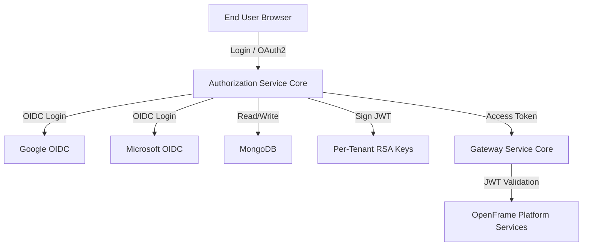
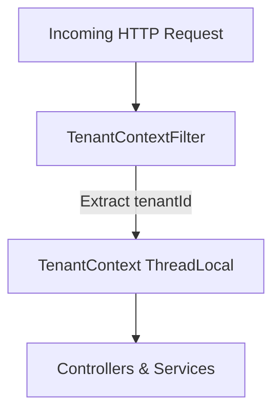
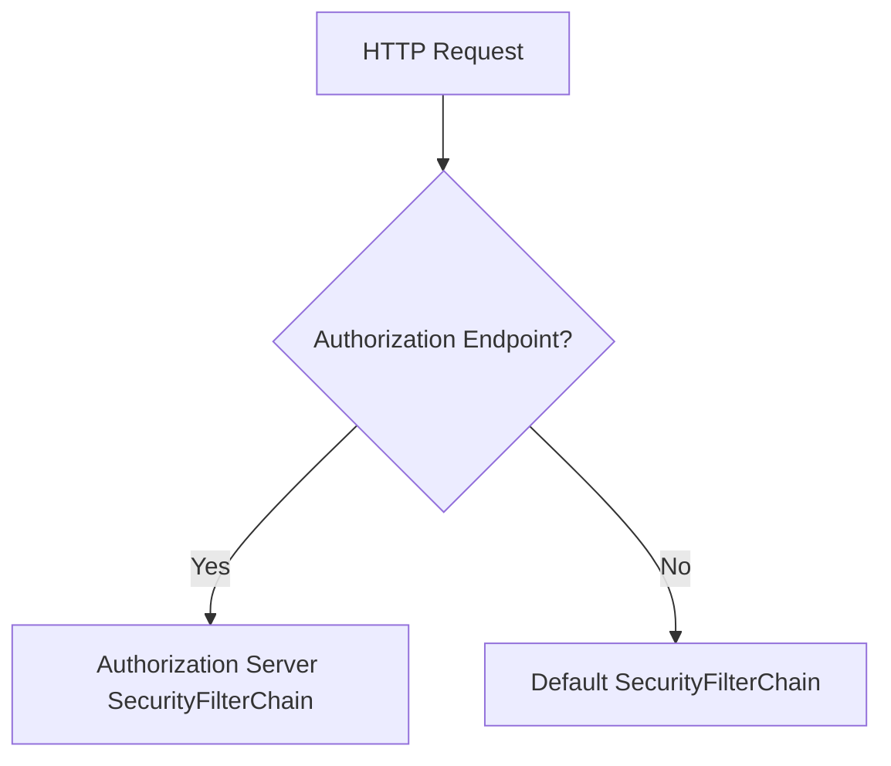
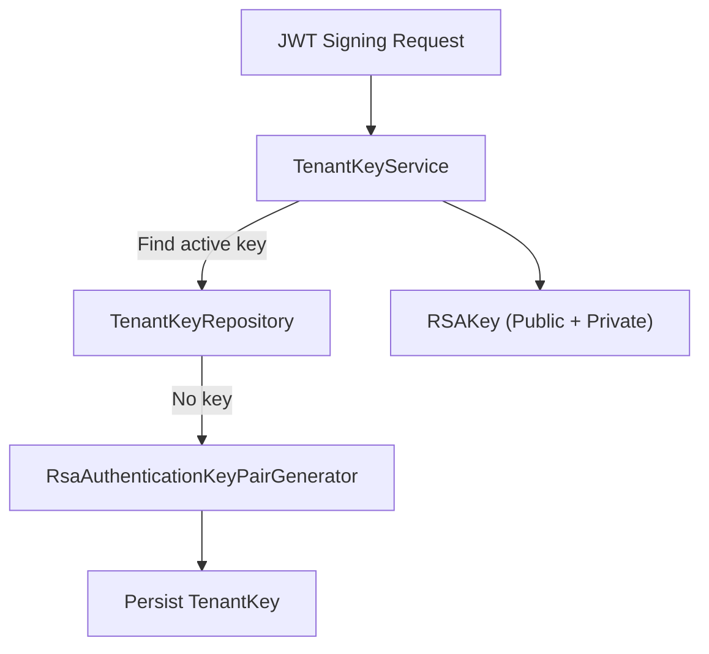
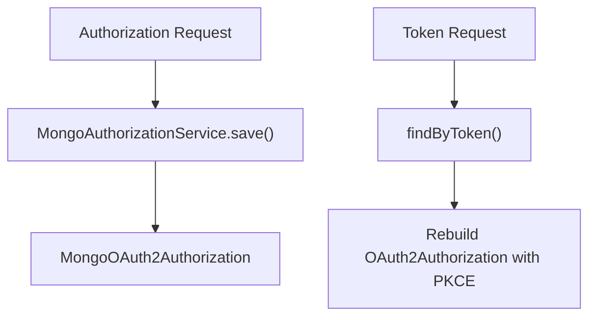
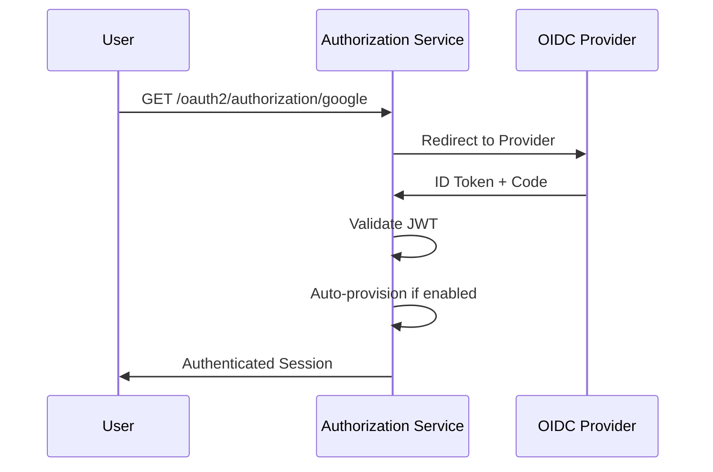
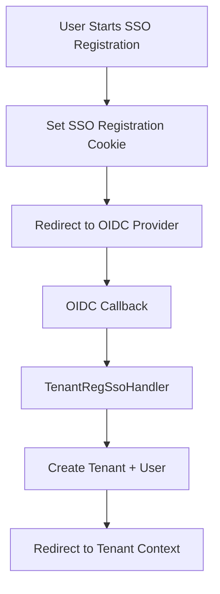

# Authorization Service Core

The **Authorization Service Core** module is the central identity, authentication, and OAuth2 authorization server for the OpenFrame multi-tenant platform.

It provides:

- Multi-tenant OAuth2 Authorization Server
- OpenID Connect (OIDC) support
- Dynamic SSO provider integration (Google, Microsoft)
- Invitation-based onboarding
- Tenant registration and discovery
- JWT issuance with per-tenant signing keys
- MongoDB-backed OAuth2 authorization persistence
- Password reset and email verification support

This module is designed to operate as a **multi-issuer, multi-tenant authorization server**, where each tenant has isolated keys, user space, and SSO configuration.

---

## 1. High-Level Architecture

At a high level, the Authorization Service Core sits between end users, SSO providers, and the rest of the OpenFrame platform.



### Core Responsibilities

| Area | Responsibility |
|------|----------------|
| OAuth2 | Authorization Code, Refresh Token, PKCE |
| OIDC | ID Token issuance, UserInfo endpoint |
| Multi-tenancy | Tenant isolation via `TenantContext` |
| Key Management | Per-tenant RSA signing keys |
| Persistence | Mongo-backed clients and authorizations |
| SSO | Google & Microsoft integration |
| Onboarding | Tenant registration and invitation flows |

---

## 2. Multi-Tenant Model

Multi-tenancy is a first-class design principle.

### 2.1 Tenant Context Resolution

`TenantContextFilter` extracts the tenant ID from:

- URL path (e.g. `/sas/{tenantId}/oauth2/authorize`)
- Query parameter (`tenant`)
- HTTP session

It sets the tenant ID in a thread-local container:



`TenantContext` ensures all downstream components (JWT, user lookup, key service, SSO config) operate within the correct tenant boundary.

---

## 3. Authorization Server Configuration

The `AuthorizationServerConfig` class configures:

- OAuth2 Authorization Server
- OIDC support
- JWT encoder and decoder
- Per-tenant JWK resolution
- Token customization

### 3.1 Security Filter Chains

Two ordered filter chains exist:

1. **Authorization Server Chain (Order 1)**
2. **Default Security Chain (Order 2)**



The Authorization Server chain enables:

- OIDC support
- JWT resource server support
- Custom authentication entry point

---

## 4. Per-Tenant Key Management

Each tenant has its own RSA signing key.

### 4.1 TenantKeyService

`TenantKeyService`:

- Looks up active key in MongoDB
- Generates a new RSA key pair if none exists
- Encrypts private key at rest
- Returns a `RSAKey` for JWT signing



### 4.2 JWT Claims Customization

The `OAuth2TokenCustomizer` injects:

- `tenant_id`
- `userId`
- `roles`

Role escalation rule:

- If user has `OWNER`, they automatically get `ADMIN` in the token.

---

## 5. Mongo-Based OAuth2 Persistence

Spring Authorization Server uses:

- `MongoRegisteredClientRepository`
- `MongoAuthorizationService`
- `MongoAuthorizationMapper`

### 5.1 Registered Clients

Clients are stored as `MongoRegisteredClient` documents and mapped to Spring `RegisteredClient`.

Supports:

- Authorization Code
- Refresh Token
- PKCE
- Custom token TTL

### 5.2 PKCE Preservation

`MongoAuthorizationMapper` ensures PKCE parameters:

- `code_challenge`
- `code_challenge_method`

are preserved across:

- Authorization Request
- Authorization Code
- Token Exchange



---

## 6. Authentication Flows

### 6.1 Username/Password Login

Handled by:

- `UserDetailsService`
- `AuthenticationManager`
- `BCryptPasswordEncoder`

User lookup is tenant-aware:

```text
findActiveByEmailAndTenant(email, tenantId)
```

On success:

- `AuthSuccessHandler` updates `lastLogin`
- May mark email verified (Google/Microsoft)

---

### 6.2 OIDC / SSO Login

Configured in `SecurityConfig`.

Supports:

- Google
- Microsoft (multi-tenant issuer validation)



### 6.3 Auto-Provisioning Logic

When SSO login occurs:

1. Load tenant SSO config
2. Check `autoProvisionUsers`
3. Validate allowed domains
4. Create user if not present
5. Assign default role (ADMIN)

If no tenant config matches, a `GlobalDomainPolicyLookup` may allow automatic mapping.

---

## 7. Tenant Registration

### 7.1 Standard Registration

`TenantRegistrationController` handles:

```text
POST /oauth/register
```

Creates:

- Tenant
- Initial user

### 7.2 SSO-Based Tenant Registration

Flow:

1. Start registration (`/oauth/register/sso`)
2. Store short-lived signed cookie
3. Redirect to OIDC provider
4. On success, `TenantRegSsoHandler`:
   - Creates tenant
   - Registers user
   - Redirects into real tenant context



---

## 8. Invitation-Based Onboarding

### 8.1 Standard Invitation

Endpoint:

```text
POST /invitations/accept
```

Creates user under existing tenant.

### 8.2 SSO Invitation Flow

`InviteSsoHandler`:

1. Validates invitation
2. Stores signed cookie
3. Redirects to OIDC provider
4. Creates user after callback

---

## 9. Password Reset

`PasswordResetController` exposes:

- `POST /password-reset/request`
- `POST /password-reset/confirm`

`ResetTokenUtil`:

- Generates 32-byte secure random token
- Encodes as URL-safe Base64

Password validation enforces:

- Minimum 8 characters
- Uppercase
- Lowercase
- Digit
- Special character

---

## 10. SSO Provider Abstraction

The module uses strategy-based registration:

- `GoogleClientRegistrationStrategy`
- `MicrosoftClientRegistrationStrategy`

Each strategy:

- Loads per-tenant config
- Falls back to default provider config

Default providers:

- `GoogleDefaultProviderConfig`
- `MicrosoftDefaultProviderConfig`

This enables:

- Tenant-specific credentials
- System-wide fallback credentials

---

## 11. Success and Flow Handlers

### 11.1 AuthSuccessHandler

On successful login:

- Update `lastLogin`
- Optionally mark email verified
- Delegate to SSO success handler

### 11.2 SSO Flow Handlers

Two main implementations:

- `InviteSsoHandler`
- `TenantRegSsoHandler`

They:

- Decode signed cookies
- Extract user identity from OIDC claims
- Complete domain-specific registration logic

---

## 12. Security Considerations

| Concern | Mitigation |
|----------|------------|
| Tenant isolation | ThreadLocal `TenantContext` |
| Token signing | Per-tenant RSA keys |
| Private key storage | Encrypted at rest |
| PKCE | Persisted and validated |
| Session switching | Session invalidation on tenant change |
| Email verification | Provider-validated claims |

---

## 13. Integration with Other Modules

The Authorization Service Core integrates with:

- **Data Mongo Core** for persistence
- **Security and OAuth Core** for shared JWT utilities
- **Gateway Service Core** for downstream JWT validation
- **API Service Core** for user and SSO configuration services

It acts as the identity backbone for the entire OpenFrame platform.

---

# Summary

The **Authorization Service Core** is a fully multi-tenant OAuth2 and OIDC authorization server that provides:

- Tenant-aware authentication
- Dynamic SSO provider integration
- Secure per-tenant JWT signing
- Mongo-based authorization persistence
- Flexible onboarding and invitation workflows

It is designed for scalability, extensibility, and strict tenant isolation — forming the secure foundation of the OpenFrame ecosystem.
