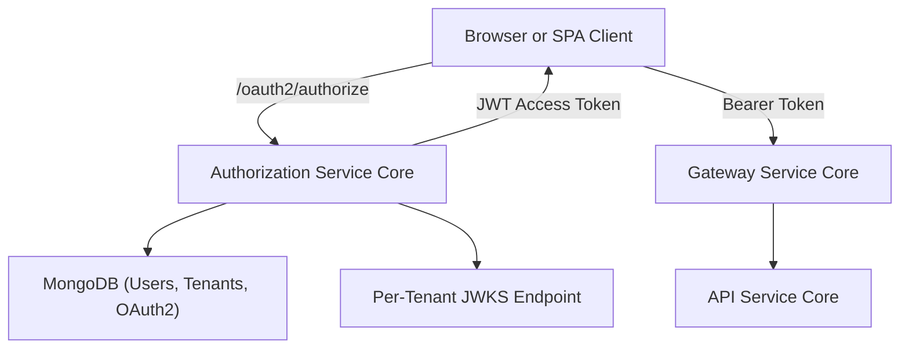
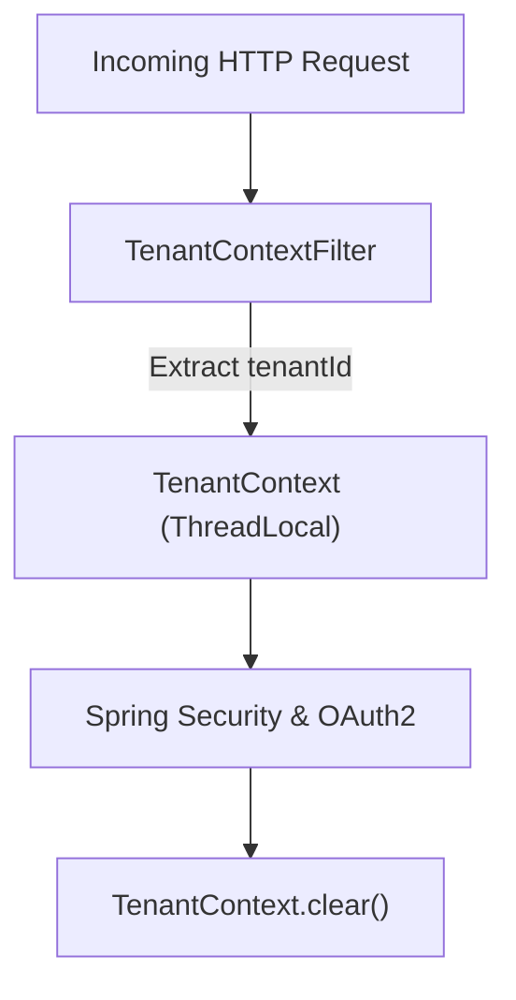
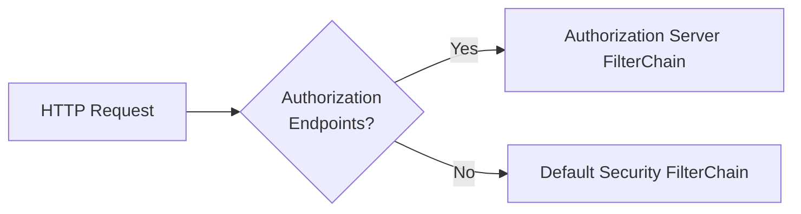
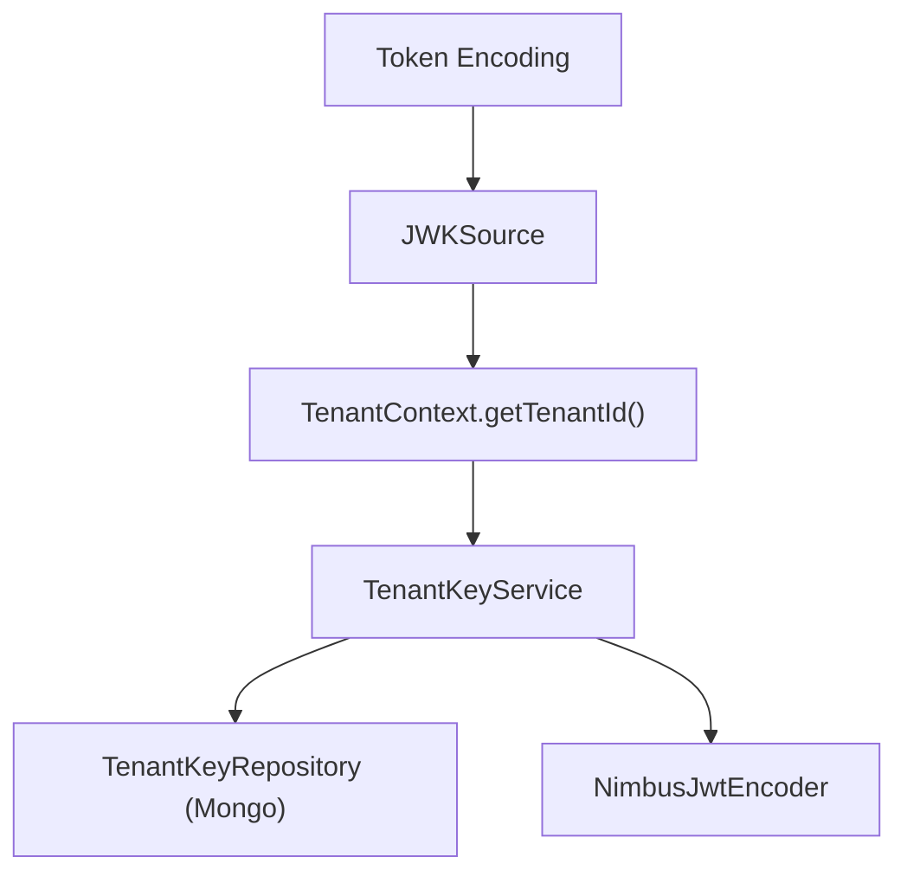
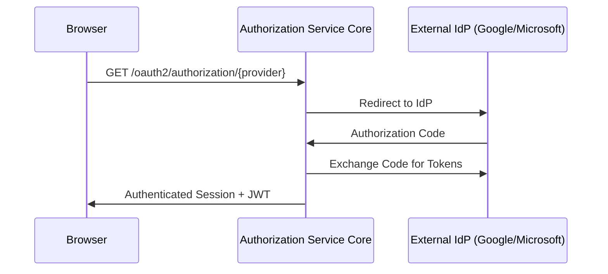
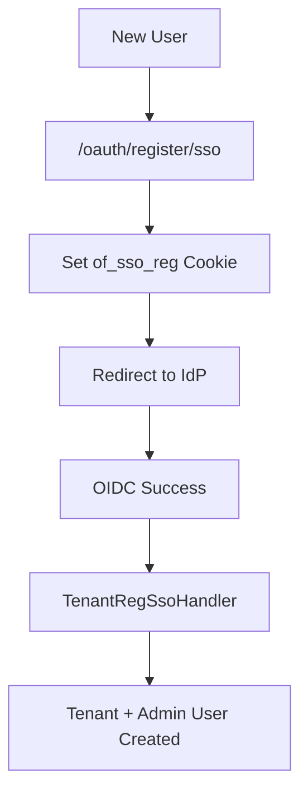
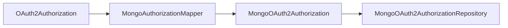
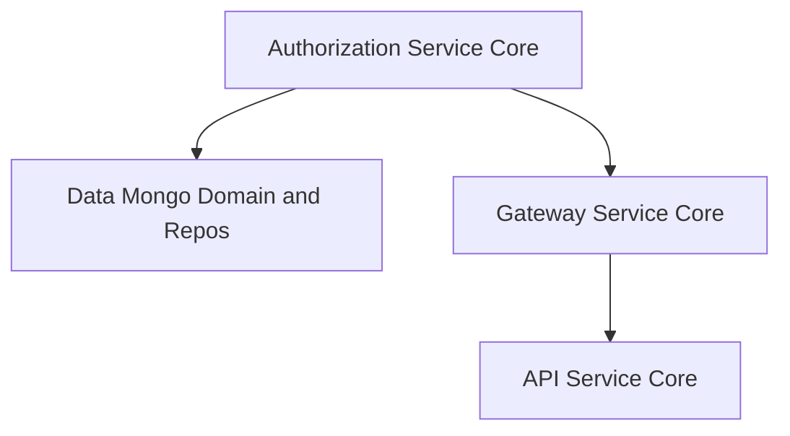

# Authorization Service Core

The **Authorization Service Core** module is the heart of OpenFrame’s multi-tenant identity and access management layer. It implements a fully fledged OAuth2 / OpenID Connect (OIDC) Authorization Server with:

- Multi-tenant issuer support
- Per-tenant signing keys (JWKS)
- Form-based and SSO-based authentication (Google, Microsoft)
- Invitation-based onboarding
- Tenant self-registration
- Password reset and email verification hooks
- Persistent OAuth2 authorizations (MongoDB-backed)

This module is responsible for issuing JWT access tokens that are later validated by downstream services such as the Gateway Service Core and API services.

---

## 1. Architectural Overview

At a high level, the Authorization Service Core sits between clients (browser, SPA, integrations) and the rest of the OpenFrame backend.

### Key Responsibilities

1. Authenticate users (password or SSO).
2. Resolve tenant context from request path or parameters.
3. Issue OAuth2 authorization codes, access tokens, and refresh tokens.
4. Sign tokens with tenant-specific RSA keys.
5. Persist authorizations and clients in MongoDB.
6. Support onboarding flows (tenant registration, invitation acceptance).

---

## 2. Multi-Tenant Model

Multi-tenancy is a first-class concern in this module.

### 2.1 Tenant Context Resolution

`TenantContextFilter` extracts the tenant identifier from:

- URL path (e.g. `/sas/{tenantId}/oauth2/authorize`)
- Query parameter `tenant`
- HTTP session

It stores the tenant in a thread-local holder via `TenantContext`.

This ensures:

- Every authentication and token issuance is scoped to a specific tenant.
- Per-tenant signing keys and SSO configuration are used correctly.

---

## 3. OAuth2 Authorization Server Configuration

The `AuthorizationServerConfig` class enables Spring Authorization Server with:

- OIDC support
- Multiple issuers allowed
- JWT encoding/decoding using per-tenant keys
- Custom token claims

### 3.1 Security Filter Chains

Two filter chains are defined:

1. **Authorization Server Chain** (Order 1)
   - Applies to `/oauth2/**`, `/connect/**`, OIDC endpoints
   - Requires authentication
   - Configures JWT resource server

2. **Default Security Chain** (Order 2)
   - Handles login page, SSO, invitations, password reset
   - Configures form login and OAuth2 login

---

## 4. Per-Tenant JWT Signing (JWKS)

Each tenant has its own RSA key pair.

### 4.1 TenantKeyService

`TenantKeyService`:

- Retrieves active key for a tenant
- Generates new RSA key pair if none exists
- Encrypts private key before storing
- Returns Nimbus `RSAKey` for JWT signing

### 4.2 Token Customization

`OAuth2TokenCustomizer<JwtEncodingContext>` adds tenant-aware claims:

- `tenant_id`
- `userId`
- `roles`

If a user has role `OWNER`, `ADMIN` is automatically added to the effective role set.

This ensures downstream services can perform tenant-scoped authorization without additional lookups.

---

## 5. Authentication Flows

### 5.1 Username & Password

- `UserDetailsService` loads `AuthUser` per tenant.
- Passwords are encoded using `BCryptPasswordEncoder`.
- `AuthenticationManager` uses `DaoAuthenticationProvider`.

On successful authentication:

- `AuthSuccessHandler` updates `lastLogin`.
- Email may be marked verified if asserted by trusted SSO provider.

---

### 5.2 OAuth2 / OIDC SSO Login

The `SecurityConfig` configures `oauth2Login()` with:

- Dynamic client resolution per tenant
- Microsoft-specific issuer validation
- Custom `OidcUserService` for auto-provisioning

### 5.3 Dynamic Client Registration

`DynamicClientRegistrationRepository`:

- Resolves tenant from `TenantContext` or session
- Delegates to `DynamicClientRegistrationService`
- Enables per-tenant OAuth2 client configuration

This allows each tenant to configure its own SSO credentials.

---

## 6. Tenant Onboarding & Registration

### 6.1 Tenant Self-Registration

`TenantRegistrationController` supports:

- JSON-based tenant registration
- SSO-based registration

SSO flow:

1. Clear authentication state.
2. Store short-lived HMAC cookie (`of_sso_reg`).
3. Redirect to IdP under onboarding tenant context.
4. On success, `TenantRegSsoHandler`:
   - Creates tenant
   - Creates admin user
   - Clears SSO cookie
   - Redirects to final target

---

### 6.2 Invitation-Based Registration

`InvitationRegistrationController` supports:

- Direct invitation acceptance (JSON)
- SSO-based invitation acceptance

SSO invitation flow uses:

- Cookie `of_sso_invite`
- `InviteSsoHandler` to finalize registration
- Optional tenant switching logic

---

## 7. Password Reset

`PasswordResetController` exposes:

- `POST /password-reset/request`
- `POST /password-reset/confirm`

`ResetTokenUtil` generates secure, URL-safe tokens.

Password constraints enforce:

- Minimum length
- Uppercase + lowercase
- Digit
- Special character

---

## 8. Authorization Persistence (MongoDB)

### 8.1 Registered Clients

`MongoRegisteredClientRepository`:

- Persists `RegisteredClient`
- Stores grant types, redirect URIs, scopes
- Configures token TTL and PKCE requirements

### 8.2 OAuth2 Authorizations

`MongoAuthorizationService` + `MongoAuthorizationMapper`:

- Persist authorization codes, access tokens, refresh tokens
- Store PKCE parameters (`code_challenge`, `code_challenge_method`)
- Rehydrate `OAuth2AuthorizationRequest` correctly

This ensures full support for:

- Authorization Code flow with PKCE
- Refresh token rotation
- Token revocation

---

## 9. SSO Provider Configuration

Default provider configurations:

- `GoogleDefaultProviderConfig`
- `MicrosoftDefaultProviderConfig`

Client registration strategies:

- `GoogleClientRegistrationStrategy`
- `MicrosoftClientRegistrationStrategy`

Microsoft-specific JWT validation uses a custom issuer pattern validator to support multi-tenant Azure AD.

---

## 10. Extension Points

The module is designed to be extensible.

### Registration Hooks

- `RegistrationProcessor`
- `UserDeactivationProcessor`
- `UserEmailVerifiedProcessor`

Default implementations are no-ops, allowing platform-specific overrides.

### Global Domain Policy

`GlobalDomainPolicyLookup`:

- Maps email domains to tenants for auto-provisioning.
- Default is `NoopGlobalDomainPolicyLookup`.

---

## 11. Integration with Other Modules

The Authorization Service Core integrates with:

- **Data Mongo Domain and Repos**: Users, tenants, OAuth documents.
- **Gateway Service Core**: Validates JWTs issued here.
- **Security Core and OAuth BFF**: Shared JWT and PKCE utilities.
- **API Service Core**: Uses JWT claims (`tenant_id`, `roles`).

---

# Summary

The **Authorization Service Core** provides:

- A multi-tenant OAuth2 Authorization Server
- Per-tenant key management and JWT signing
- Password and SSO authentication
- Tenant onboarding and invitation workflows
- Secure token persistence with PKCE support
- Extensible hooks for domain-specific customization

It forms the security backbone of OpenFrame, ensuring that every request across the platform is tenant-aware, cryptographically verifiable, and policy-driven.