# Authorization Service Core

The Authorization Service Core module is the security backbone of OpenFrame. It implements a **multi-tenant OAuth2 Authorization Server**, supports **OIDC-based Single Sign-On (SSO)** (Google and Microsoft), and manages **tenant-scoped authentication, token issuance, and user lifecycle events**.

This module is responsible for:

- Acting as an OAuth2 / OpenID Connect Authorization Server
- Issuing JWT access and refresh tokens
- Managing tenant-aware signing keys
- Supporting dynamic OIDC client registration per tenant
- Handling SSO onboarding and invitation flows
- Managing password resets and user authentication
- Persisting OAuth2 authorizations in MongoDB

It integrates tightly with the data layer (MongoDB repositories), the Gateway Service Core (JWT validation), and the API Service Core (resource protection).

---

## High-Level Architecture

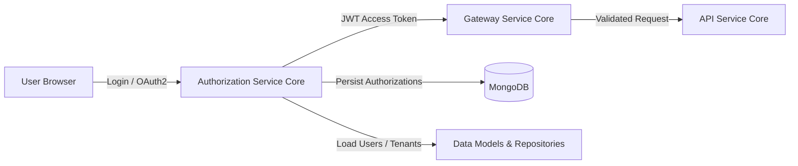
```mermaid
flowchart LR
    Browser["User Browser"] -->|"Login / OAuth2"| AuthServer["Authorization Service Core"]
    AuthServer -->|"JWT Access Token"| Gateway["Gateway Service Core"]
    Gateway -->|"Validated Request"| ApiService["API Service Core"]

    AuthServer -->|"Persist Authorizations"| Mongo[("MongoDB")]
    AuthServer -->|"Load Users / Tenants"| DataLayer["Data Models & Repositories"]
```

### Responsibilities by Boundary

| Layer | Responsibility |
|--------|---------------|
| Authorization Server | OAuth2, OIDC, JWT issuance |
| Security Layer | Form login, SSO login, JWT validation |
| Tenant Context | Multi-tenant request isolation |
| Key Management | Per-tenant RSA signing keys |
| Persistence | Mongo-based token + client storage |

---

# Core Architectural Concepts

## 1. Multi-Tenant Isolation

Each request is bound to a **Tenant Context** stored in a `ThreadLocal`.

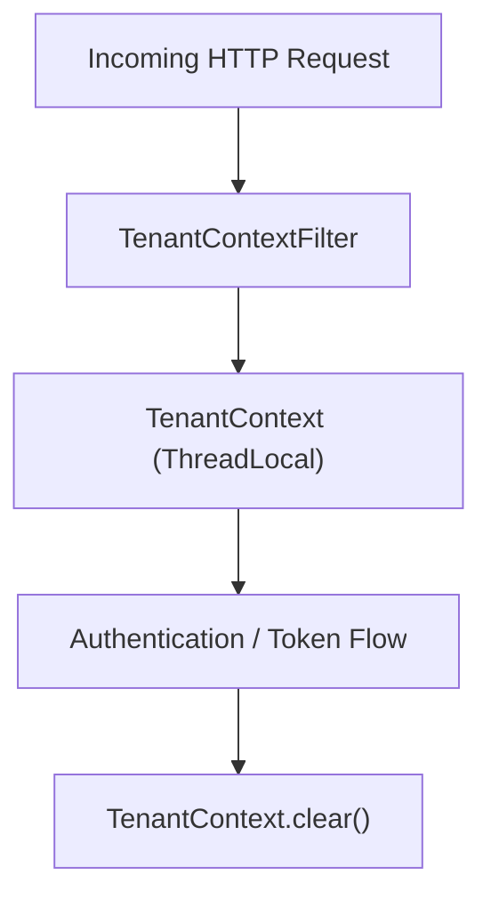
```mermaid
flowchart TD
    Request["Incoming HTTP Request"] --> Filter["TenantContextFilter"]
    Filter --> Context["TenantContext (ThreadLocal)"]
    Context --> AuthFlow["Authentication / Token Flow"]
    AuthFlow --> Clear["TenantContext.clear()"]
```

### Key Components

- `TenantContext` – Thread-local storage of current tenant ID
- `TenantContextFilter` – Extracts tenant ID from:
  - URL path (e.g. `/sas/{tenant}/oauth2/...`)
  - Query parameter `tenant`
  - Existing HTTP session
- Session switching logic for SSO onboarding flows

This ensures:

- Tokens are tenant-scoped
- Keys are tenant-scoped
- Users are tenant-scoped

---

## 2. OAuth2 Authorization Server Configuration

The module uses Spring Authorization Server via `AuthorizationServerConfig`.

### Capabilities

- Multiple issuers allowed (multi-tenant support)
- OIDC enabled
- JWT resource server configuration
- Custom authentication entry point
- Tenant-aware JWK source

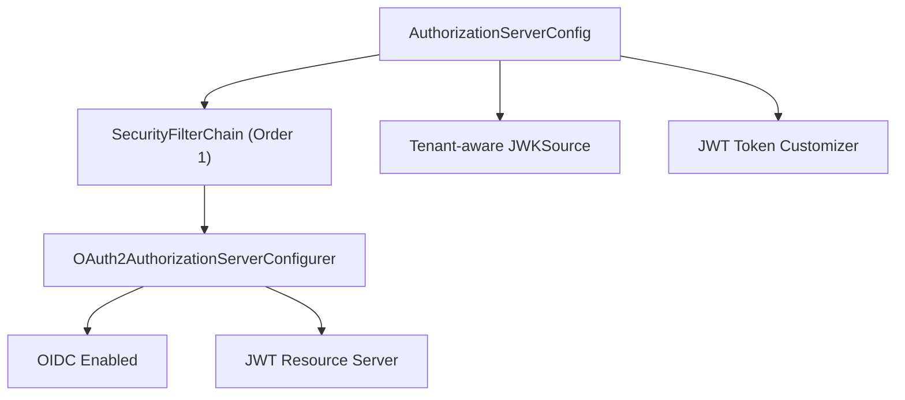
```mermaid
flowchart TD
    Config["AuthorizationServerConfig"] --> SecurityChain["SecurityFilterChain (Order 1)"]
    SecurityChain --> OAuth2["OAuth2AuthorizationServerConfigurer"]
    OAuth2 --> OIDC["OIDC Enabled"]
    OAuth2 --> JWT["JWT Resource Server"]
    Config --> JWKSource["Tenant-aware JWKSource"]
    Config --> TokenCustomizer["JWT Token Customizer"]
```

---

## 3. Tenant-Aware JWT Signing

Each tenant has its own RSA key pair.

### Flow

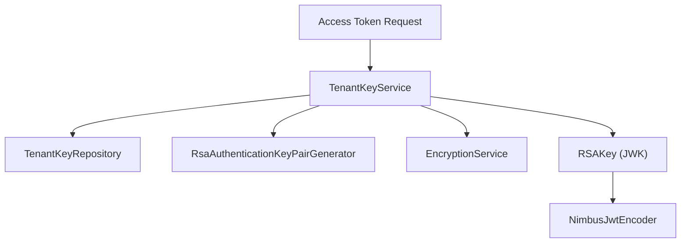
```mermaid
flowchart TD
    TokenRequest["Access Token Request"] --> KeyService["TenantKeyService"]
    KeyService --> Repo["TenantKeyRepository"]
    KeyService --> Generator["RsaAuthenticationKeyPairGenerator"]
    KeyService --> Encrypt["EncryptionService"]
    KeyService --> JWT["RSAKey (JWK)"]
    JWT --> Encoder["NimbusJwtEncoder"]
```

### Key Management Components

- `TenantKeyService`
  - Retrieves active key
  - Generates key if missing
  - Encrypts private key before storage
- `RsaAuthenticationKeyPairGenerator`
  - Generates RSA key pair
  - Assigns unique `kid`
- `PemUtil`
  - Converts RSA keys to/from PEM

This guarantees:

- Token isolation between tenants
- Independent key rotation
- JWK endpoint serves tenant-specific key

---

## 4. JWT Customization

Access tokens are enriched via `OAuth2TokenCustomizer`.

### Custom Claims Added

- `tenant_id`
- `userId`
- `roles`

Role logic:

- `OWNER` automatically implies `ADMIN`
- Roles are emitted as strings

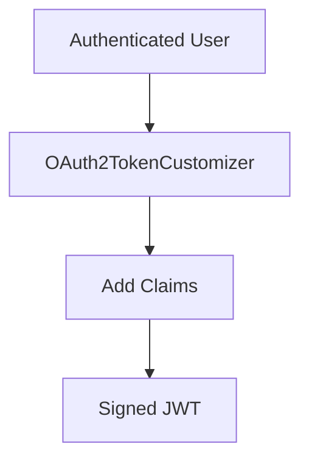
```mermaid
flowchart TD
    Principal["Authenticated User"] --> Customizer["OAuth2TokenCustomizer"]
    Customizer --> Claims["Add Claims"]
    Claims --> JWT["Signed JWT"]
```

---

# Security Configuration

The `SecurityConfig` handles all **non-authorization-server endpoints**.

## Responsibilities

- Form login
- OAuth2 login (SSO)
- Microsoft issuer validation
- Auto-provisioning SSO users
- Authentication failure handling

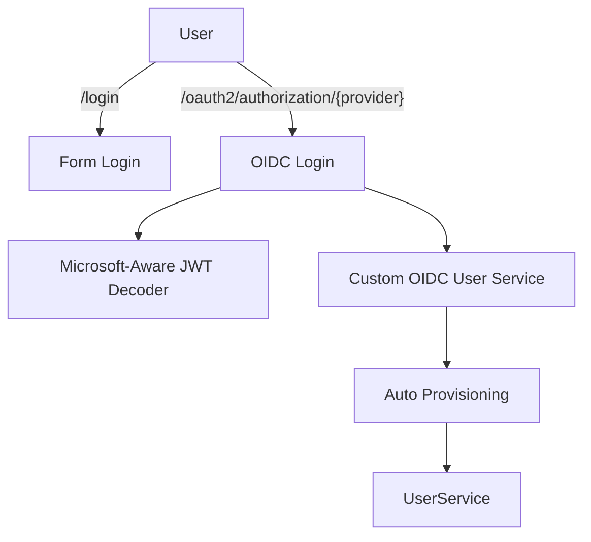
```mermaid
flowchart TD
    User["User"] -->|"/login"| FormLogin["Form Login"]
    User -->|"/oauth2/authorization/{provider}"| OAuthLogin["OIDC Login"]

    OAuthLogin --> DecoderFactory["Microsoft-Aware JWT Decoder"]
    OAuthLogin --> OidcUserService["Custom OIDC User Service"]
    OidcUserService --> AutoProvision["Auto Provisioning"]
    AutoProvision --> UserService["UserService"]
```

---

# Single Sign-On (SSO)

## Supported Providers

- Google
- Microsoft

Provider configuration includes:

- Tenant-specific credentials
- Default system-level credentials
- Dynamic client registration

### Dynamic Client Registration

`DynamicClientRegistrationRepository` resolves clients at runtime using:

- Current tenant
- Session fallback

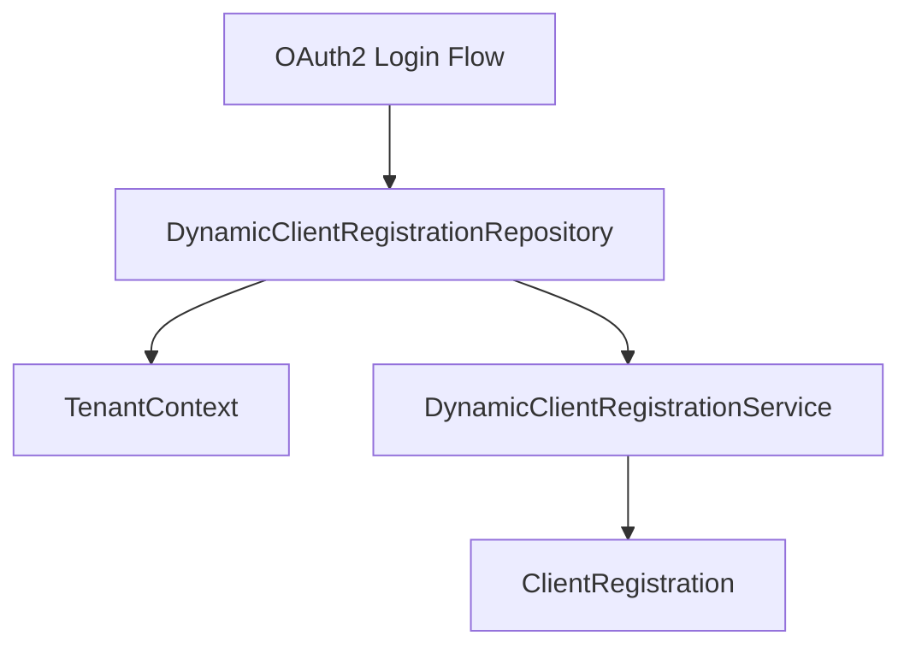
```mermaid
flowchart TD
    OAuthFlow["OAuth2 Login Flow"] --> Repo["DynamicClientRegistrationRepository"]
    Repo --> Context["TenantContext"]
    Repo --> DynamicService["DynamicClientRegistrationService"]
    DynamicService --> Client["ClientRegistration"]
```

---

# SSO Flows

## 1. Tenant Registration via SSO

Handled by:

- `TenantRegistrationController`
- `TenantRegSsoHandler`

Flow:

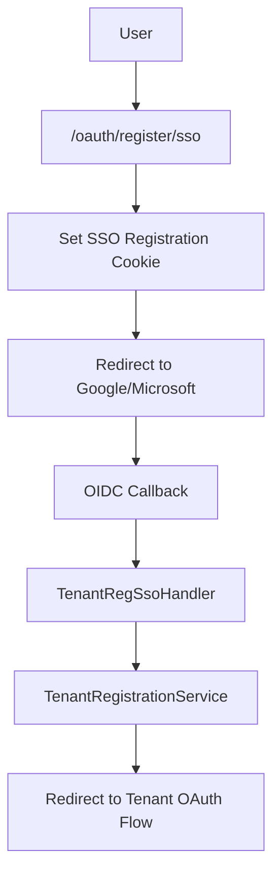
```mermaid
flowchart TD
    User --> Init["/oauth/register/sso"]
    Init --> Cookie["Set SSO Registration Cookie"]
    Cookie --> Provider["Redirect to Google/Microsoft"]
    Provider --> Callback["OIDC Callback"]
    Callback --> Handler["TenantRegSsoHandler"]
    Handler --> TenantService["TenantRegistrationService"]
    TenantService --> Redirect["Redirect to Tenant OAuth Flow"]
```

---

## 2. Invitation Acceptance via SSO

Handled by:

- `InvitationRegistrationController`
- `InviteSsoHandler`

Flow:

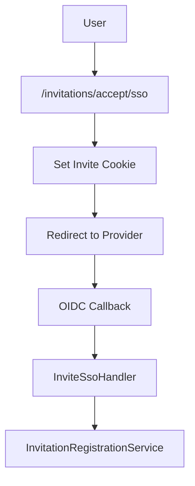
```mermaid
flowchart TD
    User --> Accept["/invitations/accept/sso"]
    Accept --> Cookie["Set Invite Cookie"]
    Cookie --> Provider["Redirect to Provider"]
    Provider --> Callback["OIDC Callback"]
    Callback --> InviteHandler["InviteSsoHandler"]
    InviteHandler --> InviteService["InvitationRegistrationService"]
```

---

# Password Reset Flow

Implemented via `PasswordResetController`.

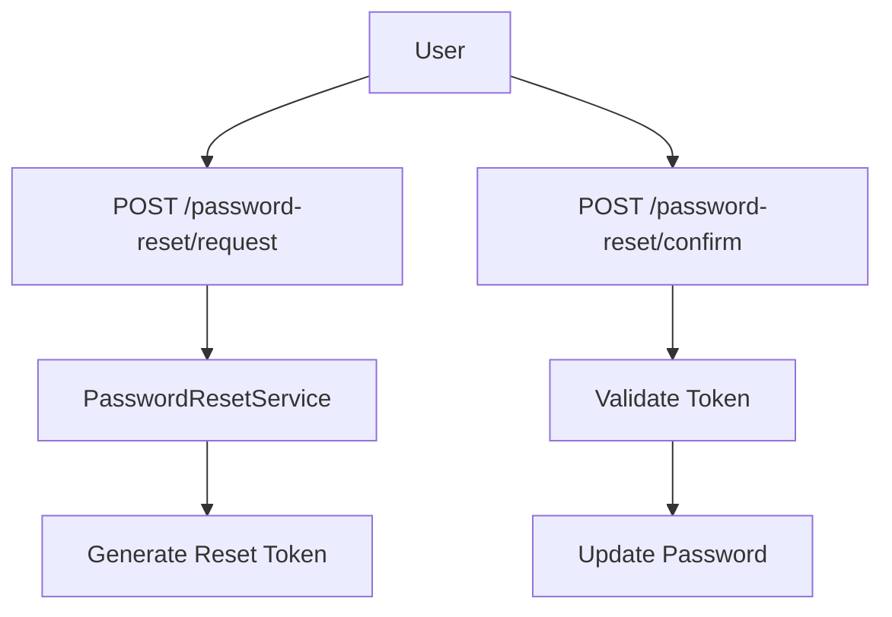
```mermaid
flowchart TD
    User --> Request["POST /password-reset/request"]
    Request --> Service["PasswordResetService"]
    Service --> Token["Generate Reset Token"]

    User --> Confirm["POST /password-reset/confirm"]
    Confirm --> Validate["Validate Token"]
    Validate --> Update["Update Password"]
```

Reset tokens are generated using secure random Base64 URL encoding.

---

# Mongo-Based Authorization Persistence

OAuth2 authorizations are stored in MongoDB.

## Components

- `MongoAuthorizationService`
- `MongoAuthorizationMapper`
- `MongoRegisteredClientRepository`

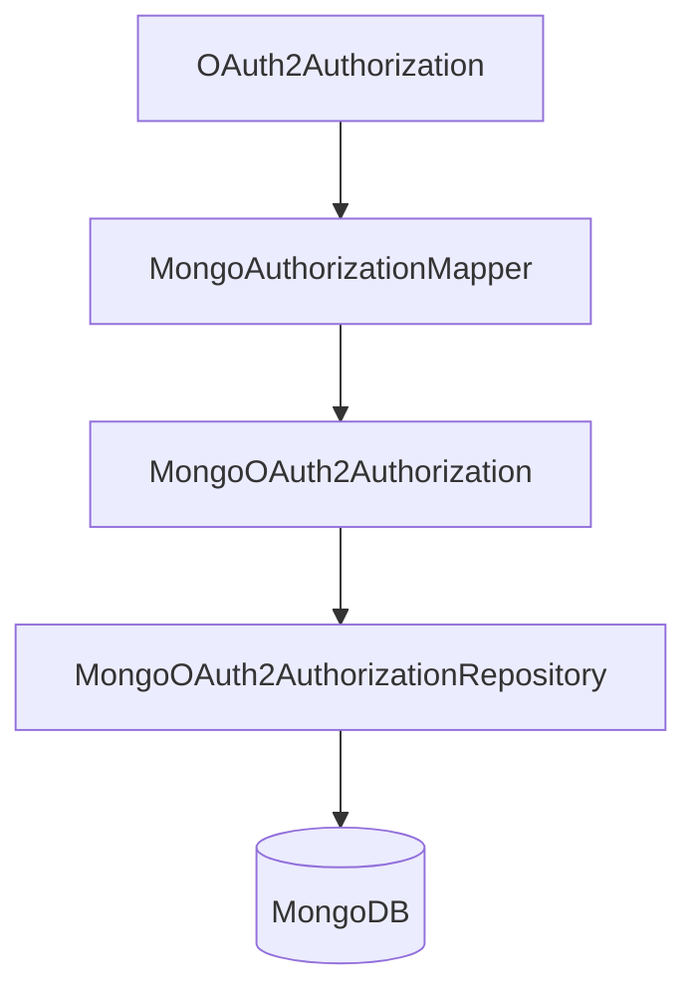
```mermaid
flowchart TD
    AuthServer["OAuth2Authorization"] --> Mapper["MongoAuthorizationMapper"]
    Mapper --> Entity["MongoOAuth2Authorization"]
    Entity --> Repo["MongoOAuth2AuthorizationRepository"]
    Repo --> Mongo[("MongoDB")]
```

### Stored Artifacts

- Authorization codes
- Access tokens
- Refresh tokens
- PKCE parameters
- Client settings

PKCE parameters are preserved across serialization/deserialization.

---

# Authentication Success Handling

`AuthSuccessHandler` performs:

- Update `lastLogin`
- Mark email verified when appropriate
- Delegate to SSO flow continuation handler

This ensures login success does not disrupt SSO onboarding flows.

---

# Default Extension Points

The module provides default no-op processors:

- `DefaultRegistrationProcessor`
- `DefaultUserDeactivationProcessor`
- `DefaultUserEmailVerifiedProcessor`

These allow customization without modifying core logic.

---

# How It Fits Into OpenFrame

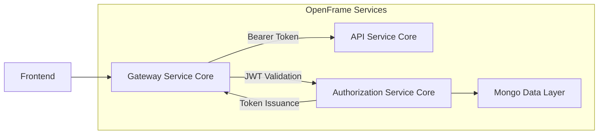
```mermaid
flowchart LR
    Frontend["Frontend"] --> Gateway
    Gateway -->|"Bearer Token"| Api
    Gateway -->|"JWT Validation"| Authorization
    Authorization -->|"Token Issuance"| Gateway

    Authorization --> Data

    subgraph Services["OpenFrame Services"]
        Authorization["Authorization Service Core"]
        Api["API Service Core"]
        Gateway["Gateway Service Core"]
        Data["Mongo Data Layer"]
    end
```

### Summary of Role

The Authorization Service Core:

- Issues tenant-scoped JWTs
- Validates and manages OAuth2 flows
- Handles SSO onboarding and invitations
- Provides secure multi-tenant isolation
- Supplies JWK endpoints for downstream verification
- Persists token state in MongoDB

It is the **identity and trust authority** for the entire OpenFrame platform.

---

# Key Design Principles

1. Tenant-first architecture
2. Stateless JWT with tenant-aware signing
3. Secure default flows
4. Extensible processors
5. Provider-aware OIDC validation
6. PKCE-first OAuth2 implementation

---

# Conclusion

The Authorization Service Core is a production-grade, multi-tenant identity provider tailored for OpenFrame. It integrates OAuth2, OIDC, tenant isolation, Mongo persistence, and extensible SSO flows into a cohesive authentication backbone.

All other services in the platform rely on it for trust, token validation, and identity enforcement.