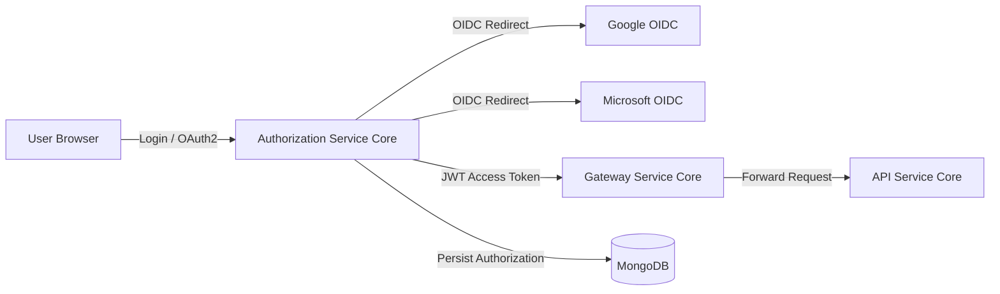
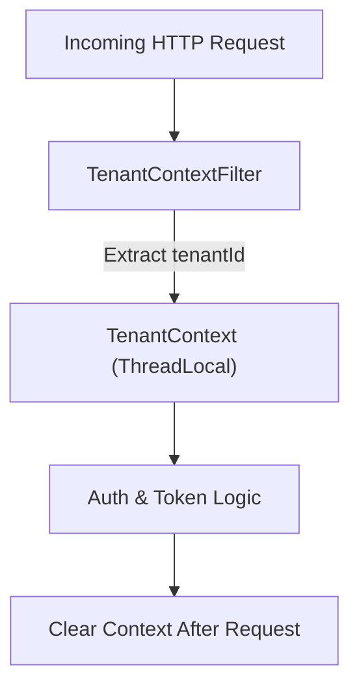
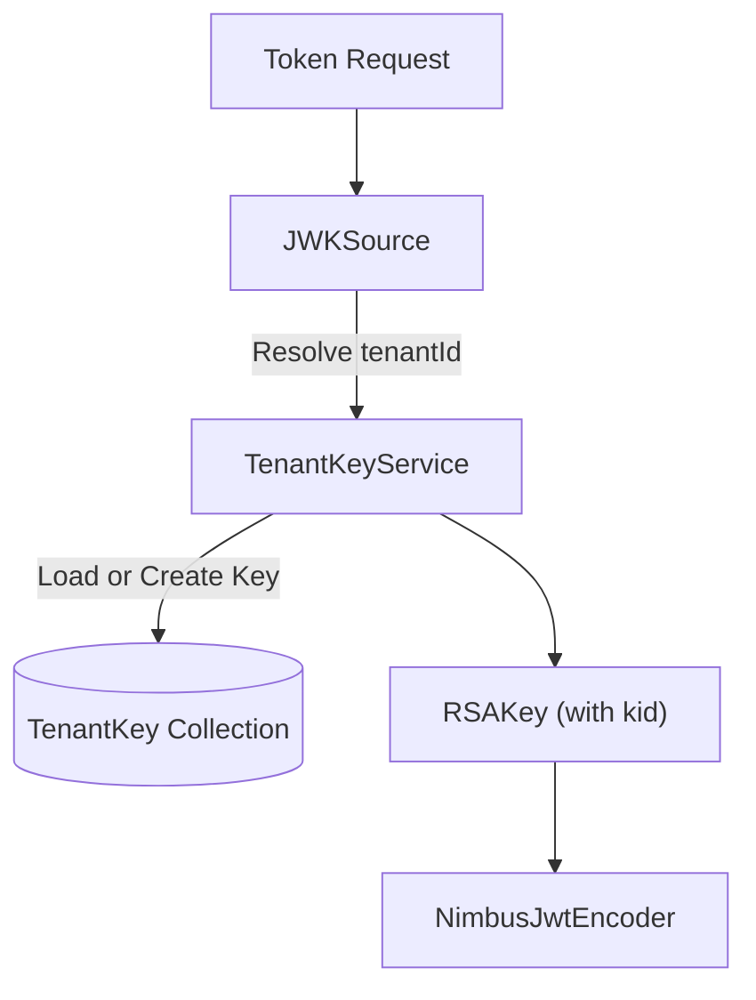
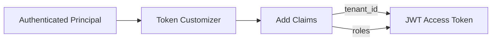
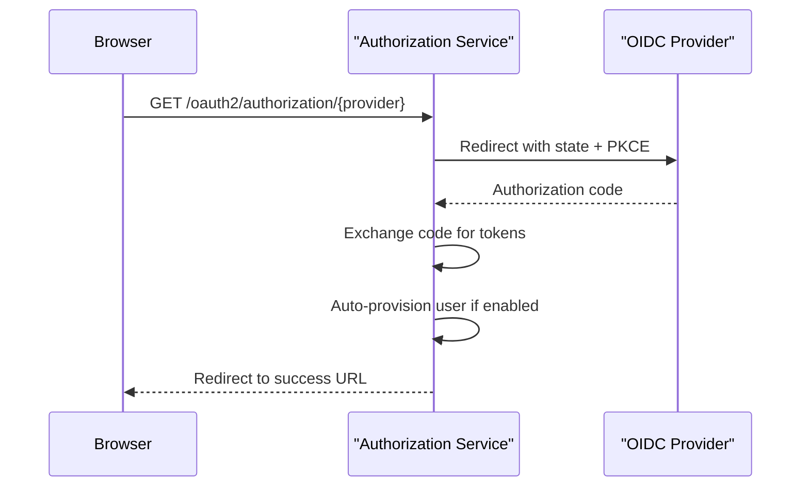
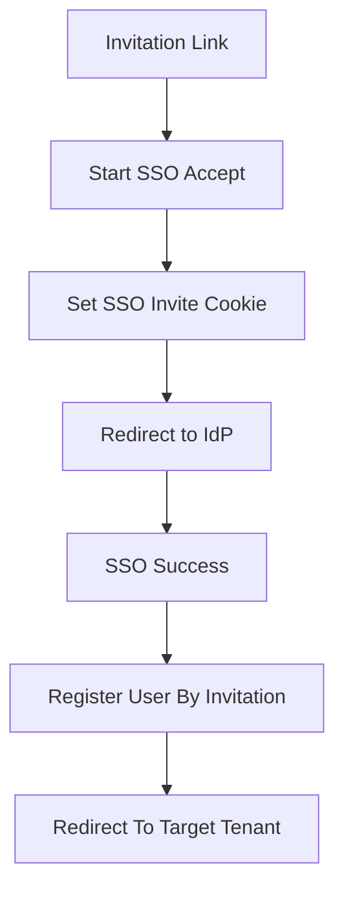
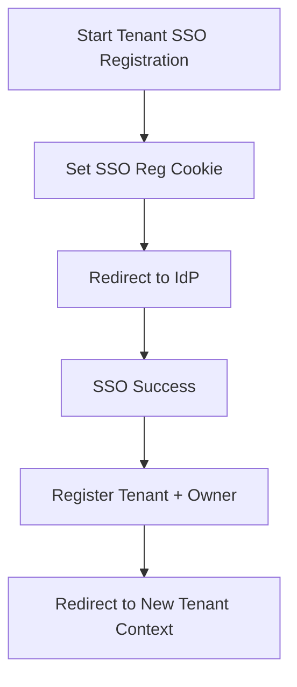
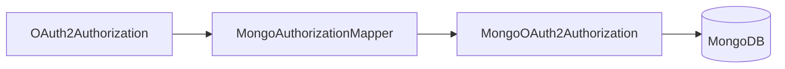

# Authorization Service Core

The Authorization Service Core module is the central identity and access management (IAM) component of the OpenFrame platform. It provides:

- OAuth2 Authorization Server (Spring Authorization Server)
- OpenID Connect (OIDC) support
- Multi-tenant authentication and issuer isolation
- Dynamic SSO provider registration (Google, Microsoft)
- Tenant onboarding and invitation flows
- JWT issuance with tenant-scoped signing keys
- Persistent authorization storage (MongoDB)

It acts as the trust anchor for all other services such as the Gateway Service Core and API services, issuing and validating tokens that secure platform APIs.

---

## 1. High-Level Architecture

The Authorization Service Core sits between end users (browser / SPA), external identity providers, and internal OpenFrame services.

```mermaid
flowchart LR
    User["User Browser"] -->|"Login / OAuth2"| AuthServer["Authorization Service Core"]
    AuthServer -->|"OIDC Redirect"| Google["Google OIDC"]
    AuthServer -->|"OIDC Redirect"| Microsoft["Microsoft OIDC"]
    AuthServer -->|"JWT Access Token"| Gateway["Gateway Service Core"]
    Gateway -->|"Forward Request"| ApiService["API Service Core"]
    AuthServer -->|"Persist Authorization"| Mongo[("MongoDB")]
```

Core responsibilities:

- Issue JWT access and refresh tokens
- Expose `.well-known` OIDC metadata
- Manage per-tenant signing keys
- Resolve tenant context from request path/session
- Support SSO-based onboarding and invitation acceptance
- Persist OAuth2 authorizations and registered clients

---

## 2. Multi-Tenancy Model

Multi-tenancy is enforced at the authentication and token layer.

### 2.1 Tenant Context Resolution

`TenantContextFilter` extracts the tenant identifier from:

- URL path segment (e.g. `/tenantA/oauth2/authorize`)
- Query parameter (`tenant=`)
- HTTP session

It stores the tenant in a `ThreadLocal` via `TenantContext`.

```mermaid
flowchart TD
    Request["Incoming HTTP Request"] --> Filter["TenantContextFilter"]
    Filter -->|"Extract tenantId"| Context["TenantContext (ThreadLocal)"]
    Context --> AuthLogic["Auth & Token Logic"]
    AuthLogic --> Clear["Clear Context After Request"]
```

Key classes:

- `TenantContext`
- `TenantContextFilter`

This design ensures that:

- Every JWT is issued with the correct tenant context.
- Signing keys and user lookups are tenant-scoped.

---

## 3. Authorization Server Configuration

The `AuthorizationServerConfig` configures Spring Authorization Server with:

- Multiple issuers enabled (`multipleIssuersAllowed(true)`)
- OIDC support
- Custom JWT encoder/decoder
- Token customization
- Per-tenant JWK resolution

### 3.1 Per-Tenant JWK Source

JWT signing keys are resolved dynamically using `TenantKeyService`.

```mermaid
flowchart TD
    TokenRequest["Token Request"] --> JwkSource["JWKSource"]
    JwkSource -->|"Resolve tenantId"| TenantKeyService
    TenantKeyService -->|"Load or Create Key"| MongoKeys[("TenantKey Collection")]
    TenantKeyService --> RSAKey["RSAKey (with kid)"]
    RSAKey --> JwtEncoder["NimbusJwtEncoder"]
```

If no active key exists for a tenant:

- `RsaAuthenticationKeyPairGenerator` generates a new RSA key pair.
- The private key is encrypted.
- The public key is stored for JWKS exposure.

Key classes:

- `TenantKeyService`
- `RsaAuthenticationKeyPairGenerator`
- `PemUtil`

---

## 4. JWT Customization

`OAuth2TokenCustomizer` enriches access tokens with:

- `tenant_id`
- `userId`
- `roles`

```mermaid
flowchart LR
    Auth["Authenticated Principal"] --> Customizer["Token Customizer"]
    Customizer --> Claims["Add Claims"]
    Claims -->|"tenant_id"| Jwt["JWT Access Token"]
    Claims -->|"roles"| Jwt
```

Special logic:

- OWNER role implicitly includes ADMIN.
- On refresh token flow, `lastLogin` is updated.

This ensures downstream services can enforce RBAC using token claims without additional DB lookups.

---

## 5. Security Configuration (Non-Authorization Endpoints)

`SecurityConfig` handles:

- Form login (`/login`)
- OAuth2 login (Google, Microsoft)
- SSO auto-provisioning
- Microsoft-specific issuer validation

### 5.1 OAuth2 Login Flow

```mermaid
sequenceDiagram
    participant Browser
    participant AuthServer as "Authorization Service"
    participant IdP as "OIDC Provider"

    Browser->>AuthServer: GET /oauth2/authorization/{provider}
    AuthServer->>IdP: Redirect with state + PKCE
    IdP-->>AuthServer: Authorization code
    AuthServer->>AuthServer: Exchange code for tokens
    AuthServer->>AuthServer: Auto-provision user if enabled
    AuthServer-->>Browser: Redirect to success URL
```

Features:

- Microsoft issuer pattern validation
- Dynamic client resolution via `DynamicClientRegistrationRepository`
- Auto-provision users based on tenant SSO configuration
- Domain-based tenant mapping via `GlobalDomainPolicyLookup`

---

## 6. SSO & Onboarding Flows

The module supports two major SSO-driven flows:

1. Invitation acceptance via SSO
2. Tenant registration via SSO

### 6.1 Invitation Acceptance via SSO

Controller: `InvitationRegistrationController`
Handler: `InviteSsoHandler`

Flow:

```mermaid
flowchart TD
    InviteLink["Invitation Link"] --> Start["Start SSO Accept"]
    Start --> Cookie["Set SSO Invite Cookie"]
    Cookie --> IdP["Redirect to IdP"]
    IdP --> Callback["SSO Success"]
    Callback --> Register["Register User By Invitation"]
    Register --> Redirect["Redirect To Target Tenant"]
```

Key components:

- `SsoCookieCodec`
- `SsoRegistrationConstants`
- `InvitationRegistrationService`

### 6.2 Tenant Registration via SSO

Controller: `TenantRegistrationController`
Handler: `TenantRegSsoHandler`

Flow:

```mermaid
flowchart TD
    StartReg["Start Tenant SSO Registration"] --> CookieReg["Set SSO Reg Cookie"]
    CookieReg --> IdPReg["Redirect to IdP"]
    IdPReg --> CallbackReg["SSO Success"]
    CallbackReg --> CreateTenant["Register Tenant + Owner"]
    CreateTenant --> RedirectTenant["Redirect to New Tenant Context"]
```

The onboarding pseudo-tenant (`sso-onboarding`) allows seamless transition to the newly created tenant without losing authentication context.

---

## 7. OAuth2 Persistence Layer

### 7.1 Authorization Persistence

`MongoAuthorizationService` stores:

- Authorization codes
- Access tokens
- Refresh tokens
- PKCE parameters
- Authorization request metadata

```mermaid
flowchart LR
    OAuthAuth["OAuth2Authorization"] --> Mapper["MongoAuthorizationMapper"]
    Mapper --> MongoEntity["MongoOAuth2Authorization"]
    MongoEntity --> Mongo[("MongoDB")]
```

PKCE parameters are carefully preserved and restored during:

- Code issuance
- Token exchange
- Refresh token usage

### 7.2 Registered Clients

`MongoRegisteredClientRepository` stores OAuth clients with:

- Grant types
- Redirect URIs
- Scopes
- Token TTL settings
- PKCE enforcement flags

---

## 8. Password Reset & Email Verification

### Password Reset

Controller: `PasswordResetController`
Utility: `ResetTokenUtil`

- Generates secure base64 URL-safe tokens
- Enforces strong password pattern

### Email Verification via SSO

`AuthSuccessHandler`:

- Updates `lastLogin`
- Marks email as verified for trusted providers (Google, Microsoft)

Extensible processors:

- `DefaultUserEmailVerifiedProcessor`
- `DefaultUserDeactivationProcessor`

---

## 9. Integration with Other Modules

The Authorization Service Core is tightly integrated with:

- [Gateway Service Core](../gateway-service-core/gateway-service-core.md)
  - Validates JWTs
  - Enforces route-level security

- [Security OAuth and JWT](../security-oauth-and-jwt/security-oauth-and-jwt.md)
  - Shared JWT and PKCE utilities

- [Data Model and Repositories Mongo](../data-model-and-repositories-mongo/data-model-and-repositories-mongo.md)
  - Persists users, tenants, keys, and authorizations

It acts as the identity provider for:

- API Service Core
- External API Service Core
- Management Service Core

---

## 10. Extension Points

The module is designed for extensibility:

- `RegistrationProcessor` (pre/post registration hooks)
- `UserDeactivationProcessor`
- `UserEmailVerifiedProcessor`
- `GlobalDomainPolicyLookup`
- Default provider configs (`GoogleDefaultProviderConfig`, `MicrosoftDefaultProviderConfig`)

Custom implementations can override default no-op beans via Spring conditional configuration.

---

## 11. Security Highlights

- Per-tenant signing keys (isolated JWKS)
- Encrypted private key storage
- PKCE enforcement support
- Microsoft multi-tenant issuer validation
- Strict password policy enforcement
- Session isolation when tenant changes

---

# Summary

The Authorization Service Core module provides a fully multi-tenant, extensible OAuth2 + OIDC authorization server tailored for OpenFrame. It:

- Isolates tenants cryptographically and logically
- Supports dynamic SSO providers
- Enables seamless onboarding and invitation flows
- Persists complete OAuth2 state in MongoDB
- Issues enriched JWTs for downstream microservices

It forms the identity backbone of the OpenFrame platform and underpins all authenticated communication across services.
