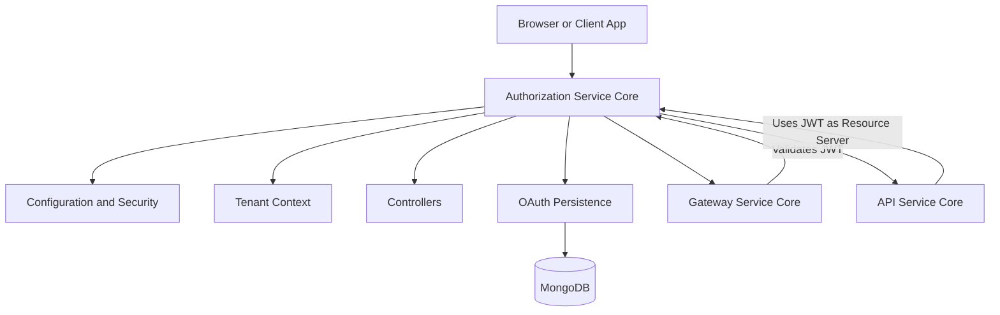
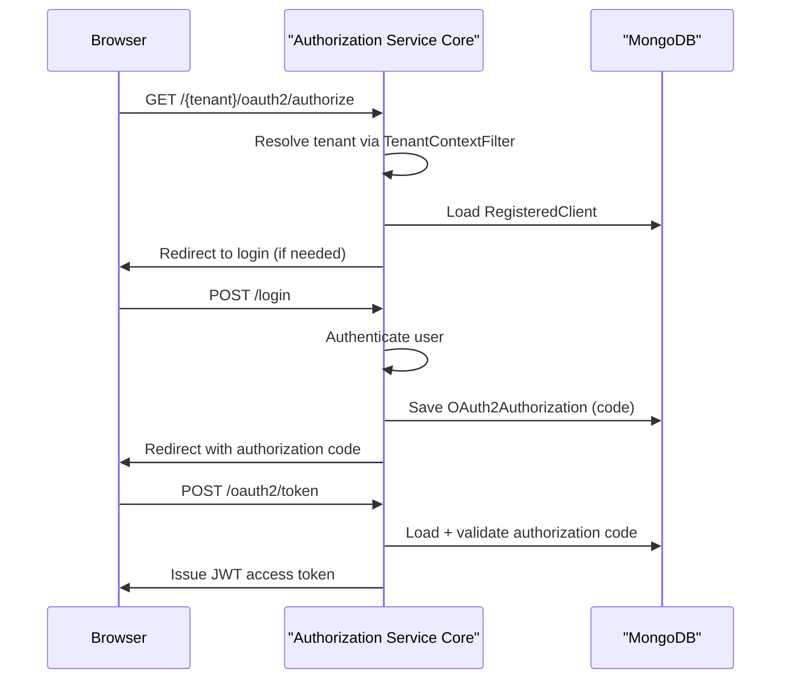
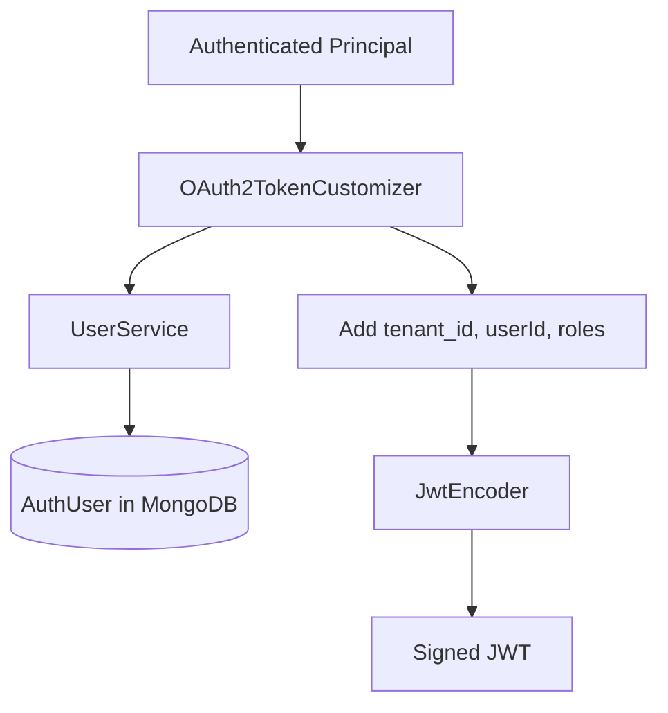

# Authorization Service Core

The **Authorization Service Core** module implements the multi-tenant OAuth2 and OpenID Connect (OIDC) authorization server for OpenFrame. It is responsible for:

- Issuing and validating OAuth2 access and refresh tokens
- Supporting OpenID Connect login flows (form-based and SSO)
- Managing tenant-aware authentication and session handling
- Persisting OAuth2 clients and authorizations in MongoDB
- Handling tenant onboarding, invitation-based registration, and password reset

This module acts as the **identity and trust anchor** of the OpenFrame platform and integrates with:

- Data persistence modules (Mongo domain and repositories)
- Gateway Service Core (JWT validation and API protection)
- API Service Core (resource server using issued tokens)

---

## Architectural Overview

At a high level, the Authorization Service Core is composed of five major areas:

1. Configuration and Security
2. Tenant Context Resolution
3. OAuth Persistence and Services
4. Controllers (Login, Registration, SSO, Discovery)
5. Registration and Utility Extensions


```mermaid
flowchart TD
    Browser["Browser or Client App"] --> AuthServer["Authorization Service Core"]
    AuthServer --> Config["Configuration and Security"]
    AuthServer --> TenantCtx["Tenant Context"]
    AuthServer --> Controllers["Controllers"]
    AuthServer --> OAuthPersistence["OAuth Persistence"]

    OAuthPersistence --> MongoDB[("MongoDB")]
    AuthServer --> Gateway["Gateway Service Core"]
    AuthServer --> ApiService["API Service Core"]

    Gateway -->|"Validates JWT"| AuthServer
    ApiService -->|"Uses JWT as Resource Server"| AuthServer
```

### Request Lifecycle (OAuth2 Authorization Code Flow)


```mermaid
sequenceDiagram
    participant Browser
    participant Auth as "Authorization Service Core"
    participant Mongo as "MongoDB"

    Browser->>Auth: GET /{tenant}/oauth2/authorize
    Auth->>Auth: Resolve tenant via TenantContextFilter
    Auth->>Mongo: Load RegisteredClient
    Auth->>Browser: Redirect to login (if needed)
    Browser->>Auth: POST /login
    Auth->>Auth: Authenticate user
    Auth->>Mongo: Save OAuth2Authorization (code)
    Auth->>Browser: Redirect with authorization code
    Browser->>Auth: POST /oauth2/token
    Auth->>Mongo: Load + validate authorization code
    Auth->>Browser: Issue JWT access token
```

---

## Sub-Modules

The following sections describe each sub-module in detail.

### 1. Configuration and Security

**Documentation:**  
[Configuration and Security](authorization-service-core/configuration-and-security.md)

This sub-module configures:

- Spring Authorization Server
- JWT encoding and decoding
- Token customization (claims such as `tenant_id`, `userId`, `roles`)
- Form login and OAuth2 login
- Microsoft multi-tenant issuer validation
- Dynamic client registration per tenant

It defines two primary security filter chains:

- **Authorization Server Filter Chain** (order 1)
- **Default Security Filter Chain** (order 2)

---

### 2. Tenant Context

**Documentation:**  
[Tenant Context](authorization-service-core/tenant-context.md)

The platform is fully multi-tenant. Tenant resolution is handled via:

- `TenantContext` (ThreadLocal-based storage)
- `TenantContextFilter` (resolves tenant from path, query param, or session)

Every request that participates in OAuth2 or OIDC flows must have a resolved tenant. This tenant ID is:

- Used to select tenant-specific keys
- Embedded into JWT tokens
- Used to load tenant-scoped users and SSO configuration

---

### 3. Controllers

**Documentation:**  
[Controllers](authorization-service-core/controllers.md)

This sub-module exposes REST and MVC endpoints for:

- Login and index views
- Invitation-based registration
- SSO-based invitation acceptance
- Password reset (request and confirm)
- Tenant discovery and email validation
- Tenant registration (manual and SSO-based)
- SSO provider discovery

These endpoints orchestrate services but delegate core logic to service-layer components.

---

### 4. OAuth Persistence and Services

**Documentation:**  
[OAuth Persistence and Services](authorization-service-core/oauth-persistence-and-services.md)

This layer persists:

- Registered OAuth2 clients
- OAuth2Authorization objects (codes, access tokens, refresh tokens, state)

Key components:

- `MongoRegisteredClientRepository`
- `MongoAuthorizationService`

MongoDB acts as the durable backing store for:

- Authorization codes
- PKCE parameters
- Access and refresh tokens

---

### 5. Registration and Utilities

**Documentation:**  
[Registration and Utilities](authorization-service-core/registration-and-utilities.md)

Provides extension points and helper utilities:

- `DefaultRegistrationProcessor` (pluggable lifecycle hooks)
- `ResetTokenUtil` (secure random reset token generation)

These components allow custom integrations without modifying core authentication logic.

---

## Multi-Tenant JWT Design

JWT access tokens include tenant-aware claims:

```text
{
  "sub": "user@example.com",
  "tenant_id": "tenant-123",
  "userId": "abc123",
  "roles": ["ADMIN", "TECH"]
}
```

### Token Customization Flow


```mermaid
flowchart TD
    Principal["Authenticated Principal"] --> TokenCustomizer["OAuth2TokenCustomizer"]
    TokenCustomizer --> UserService["UserService"]
    UserService --> MongoUser[("AuthUser in MongoDB")]
    TokenCustomizer --> Claims["Add tenant_id, userId, roles"]
    Claims --> JwtEncoder["JwtEncoder"]
    JwtEncoder --> AccessToken["Signed JWT"]
```

---

## Integration with Other Modules

The Authorization Service Core integrates closely with other platform modules:

- **Gateway Service Core** – validates JWT tokens and forwards authenticated requests.
- **API Service Core** – acts as a resource server validating tokens issued here.
- **Data Mongo Domain Model** – provides `AuthUser`, `Tenant`, and OAuth persistence documents.
- **Data Mongo Sync Repositories** – used by user, tenant, and OAuth repositories.

The Authorization Service Core is the **issuer of truth** for authentication and token validation across the entire OpenFrame ecosystem.

---

## Security Characteristics

- BCrypt password hashing
- PKCE support for Authorization Code flow
- Multi-tenant RSA key resolution
- OIDC login with dynamic per-tenant providers
- Microsoft multi-tenant issuer validation
- Secure HttpOnly cookies for SSO onboarding flows
- CSRF disabled only where appropriate for OAuth endpoints

---

## Extensibility Model

The module is intentionally extensible via:

- `RegistrationProcessor` (override default lifecycle behavior)
- Dynamic client registration service
- Tenant-specific SSO configuration
- Custom domain policies for auto-provisioning

This enables platform operators to:

- Add custom onboarding logic
- Integrate with external identity providers
- Enforce tenant-specific security policies

---

## Summary

The **Authorization Service Core** is the identity backbone of OpenFrame. It combines:

- Spring Authorization Server
- Multi-tenant tenant resolution
- Mongo-backed OAuth persistence
- SSO and form login support
- Dynamic client registration

By isolating identity and token issuance into a dedicated module, OpenFrame ensures consistent authentication semantics across gateway, API, and client services while supporting flexible multi-tenant SaaS deployments.
