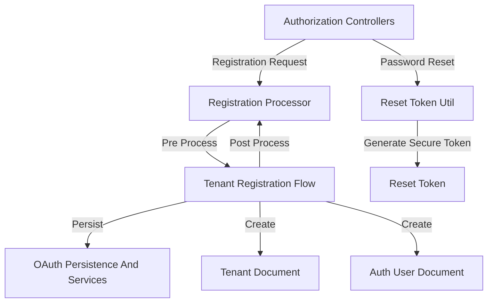
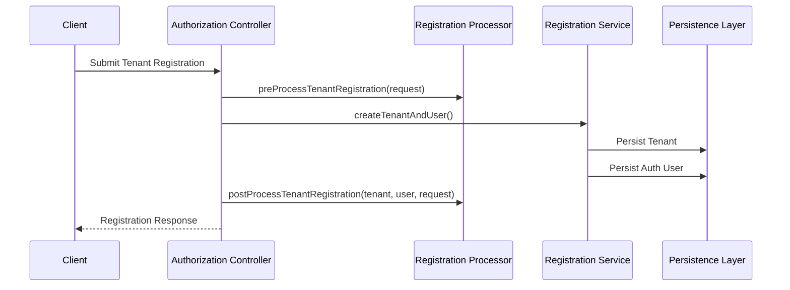
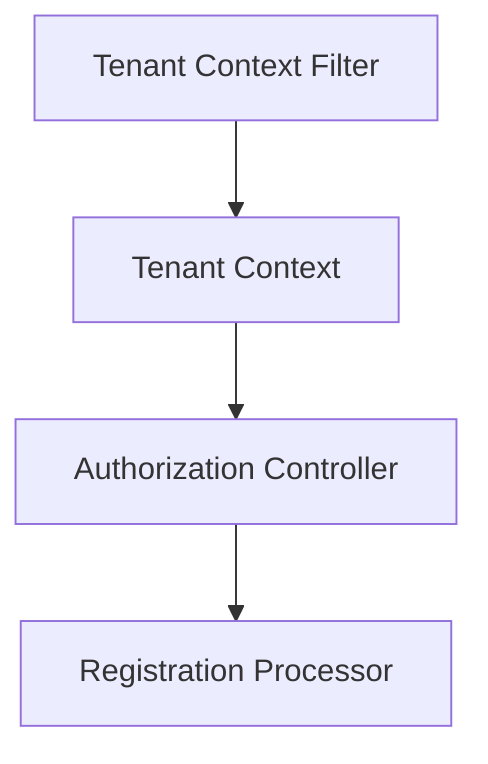
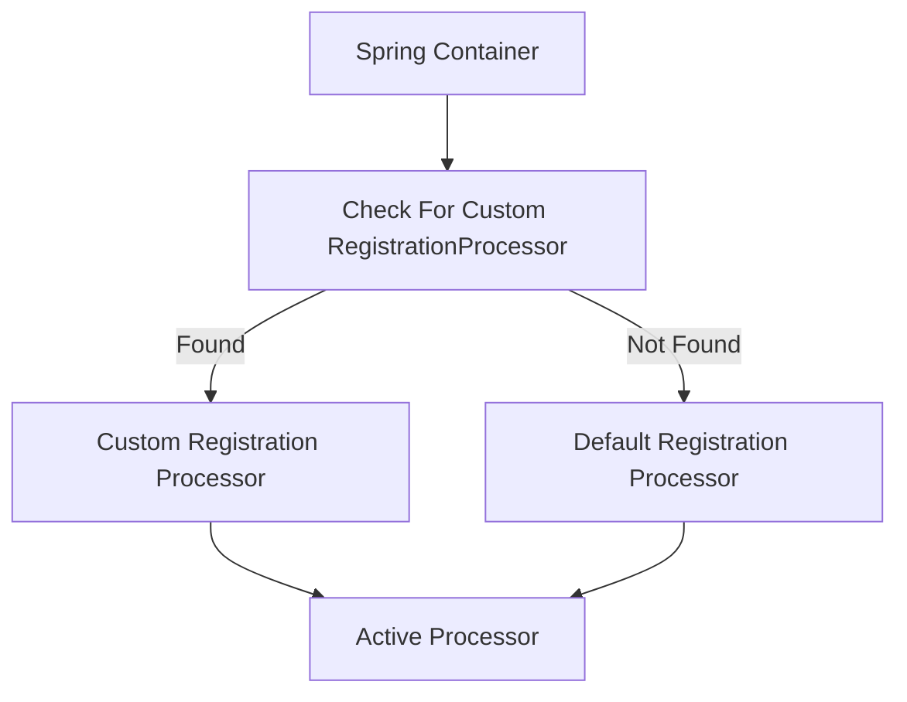

# Registration And Utilities

The **Registration And Utilities** module provides extensibility hooks and utility functions that support tenant registration, invitation-based onboarding, auto-provisioning, and secure password reset workflows within the Authorization Service Core.

This module is intentionally lightweight and focused on two responsibilities:

1. **Registration lifecycle extension points** via a pluggable `RegistrationProcessor` implementation.
2. **Secure reset token generation** for password recovery and related flows.

It integrates closely with the parent module [Authorization Service Core](../authorization-service-core.md) and collaborates with sibling modules such as:

- [Configuration And Security](../configuration-and-security/configuration-and-security.md)
- [Tenant Context](../tenant-context/tenant-context.md)
- [Controllers](../controllers/controllers.md)
- [OAuth Persistence And Services](../oauth-persistence-and-services/oauth-persistence-and-services.md)

---

## 1. Architectural Overview

The Registration And Utilities module acts as a customization and support layer inside the authorization domain.



### Key Characteristics

- **Pluggable registration processing** using Spring conditional beans.
- **Secure token generation** using cryptographically strong randomness.
- **Non-invasive design**: default implementation is no-op and safe.
- **Multi-tenant aware**: operates within the context established by the Tenant Context module.

---

## 2. Core Components

### 2.1 DefaultRegistrationProcessor

**Class:** `DefaultRegistrationProcessor`  
**Package:** `com.openframe.authz.service.processor`

This class provides the default implementation of the `RegistrationProcessor` contract.

It is annotated with:

- `@Component`
- `@ConditionalOnMissingBean(value = RegistrationProcessor.class, ignored = DefaultRegistrationProcessor.class)`

This means:

- It is automatically registered as a Spring bean.
- It is only used if no custom `RegistrationProcessor` bean is defined.

#### Provided Extension Hooks

The processor defines four lifecycle methods:

1. `preProcessTenantRegistration`
2. `postProcessTenantRegistration`
3. `postProcessInvitationRegistration`
4. `postProcessAutoProvision`

All methods are **no-op by default** and log debug messages.

#### Lifecycle Integration



#### Typical Customization Scenarios

A custom implementation may:

- Send welcome emails after registration.
- Initialize default roles or permissions.
- Trigger provisioning in external systems.
- Enforce additional validation rules.
- Audit registration events.

Because the default implementation is conditionally loaded, integrators can simply define:

```java
@Component
public class CustomRegistrationProcessor implements RegistrationProcessor {
    // Custom logic here
}
```

Spring will automatically replace the default implementation.

---

### 2.2 ResetTokenUtil

**Class:** `ResetTokenUtil`  
**Package:** `com.openframe.authz.util`

`ResetTokenUtil` is a utility class responsible for generating secure password reset tokens.

#### Design Characteristics

- Uses `SecureRandom` for cryptographic strength.
- Generates 32 random bytes.
- Encodes using URL-safe Base64 without padding.
- Stateless and thread-safe.
- Private constructor to prevent instantiation.

#### Token Generation Flow


#### Security Properties

- **High entropy**: 256 bits (32 bytes).
- **URL-safe encoding**: Safe for inclusion in links.
- **No padding**: Cleaner token representation.
- Resistant to prediction and brute force attacks.

This utility is typically used by controllers in the [Controllers](../controllers/controllers.md) module, such as password reset endpoints.

---

## 3. Interaction With Other Modules

### 3.1 With Controllers

The Registration And Utilities module is triggered by controllers such as:

- Tenant registration endpoints
- Invitation registration endpoints
- Password reset endpoints
- SSO auto-provisioning flows

Controllers delegate business lifecycle events to the `RegistrationProcessor`.

---

### 3.2 With Tenant Context

The [Tenant Context](../tenant-context/tenant-context.md) module ensures the correct tenant is resolved before registration logic executes.

Flow relationship:



This guarantees that:

- Registration occurs within the correct tenant boundary.
- Post-processing logic can rely on consistent tenant identity.

---

### 3.3 With OAuth Persistence And Services

The module collaborates with [OAuth Persistence And Services](../oauth-persistence-and-services/oauth-persistence-and-services.md) for:

- Storing OAuth clients.
- Managing authorization state.
- Persisting tokens and user credentials.

The `postProcessTenantRegistration` hook is often used to:

- Register default OAuth clients.
- Initialize tenant-specific security configurations.

---

## 4. Extension Architecture

The extension mechanism follows a **replace-by-bean** pattern.



### Benefits

- Zero configuration for default behavior.
- Simple override model.
- Clean separation of core registration logic and customization.
- Testable and mockable interface-driven design.

---

## 5. Design Principles

The Registration And Utilities module adheres to the following principles:

- **Open for extension, closed for modification**.
- **Secure by default** token generation.
- **Minimal coupling** to persistence and transport layers.
- **Framework-native integration** using Spring conditional beans.

---

## 6. Summary

The **Registration And Utilities** module provides:

- A pluggable registration lifecycle extension mechanism via `DefaultRegistrationProcessor`.
- Secure, cryptographically strong token generation through `ResetTokenUtil`.
- Seamless integration with controllers, tenant context, and OAuth persistence.

Although small in size, this module plays a critical role in:

- Tenant onboarding
- Invitation-based user registration
- SSO auto-provisioning
- Password recovery security

It acts as the strategic customization point for onboarding workflows within the Authorization Service Core.