# Configuration And Security

The Configuration And Security module is the core security backbone of the Authorization Service. It configures the OAuth2 Authorization Server, defines default Spring Security behavior, manages tenant-aware JWT signing, and enables dynamic, per-tenant SSO client resolution.

This module ensures that:

- Each tenant has isolated cryptographic keys and token issuers.
- JWT access tokens are enriched with tenant and role claims.
- Form login and OAuth2/OIDC SSO flows are securely configured.
- External identity providers (including Microsoft multi-tenant) are validated correctly.
- Client registrations are dynamically resolved per tenant.

It works closely with:

- [Tenant Context](../tenant-context/tenant-context.md) for resolving the active tenant.
- [Controllers](../controllers/controllers.md) for authentication and registration endpoints.
- [Oauth Persistence And Services](../oauth-persistence-and-services/oauth-persistence-and-services.md) for storing OAuth2 clients and authorizations.
- [Registration And Utilities](../registration-and-utilities/registration-and-utilities.md) for auto-provisioning and reset token utilities.

---

## 1. High-Level Architecture

The module is composed of three primary configuration components:

- `AuthorizationServerConfig`
- `SecurityConfig`
- `DynamicClientRegistrationRepository`

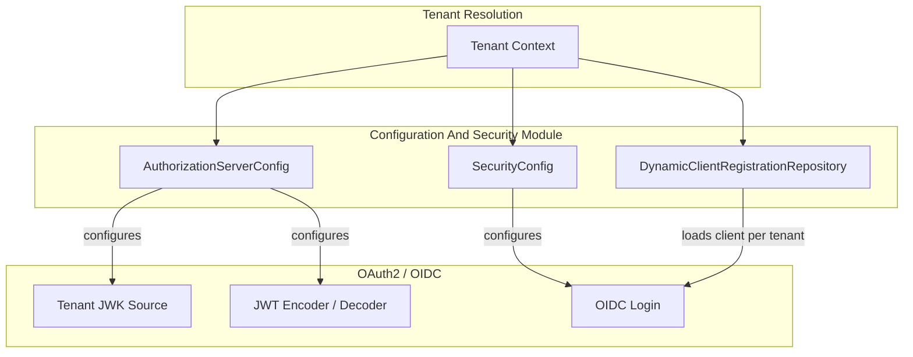

The Tenant Context is fundamental: all security decisions (keys, clients, users) are tenant-scoped.

---

## 2. Authorization Server Configuration

**Class:** `AuthorizationServerConfig`  
**Responsibility:** Configure Spring Authorization Server with tenant-aware JWT and OAuth2 behavior.

### 2.1 Security Filter Chain (Order 1)

The `authorizationServerSecurityFilterChain`:

- Applies only to OAuth2 Authorization Server endpoints.
- Enables OpenID Connect (OIDC).
- Requires authentication for all AS endpoints.
- Disables CORS and ignores CSRF for AS endpoints.
- Configures JWT-based resource server support.
- Uses `ProviderAwareAuthenticationEntryPoint` for HTML requests.

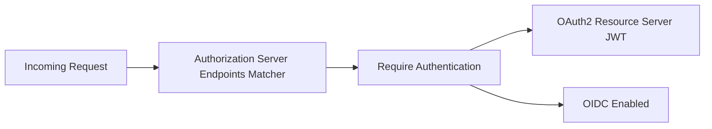

### 2.2 Multiple Issuers (Multi-Tenant Support)

```java
AuthorizationServerSettings.builder()
    .multipleIssuersAllowed(true)
    .build();
```

This allows:

- Separate issuer URLs per tenant.
- Proper token validation per tenant domain.

Issuer resolution is tied to the active tenant from Tenant Context.

---

## 3. Tenant-Aware JWK and JWT Infrastructure

### 3.1 JWK Source per Tenant

`jwkSource(TenantKeyService)`:

- Resolves the current tenant via `TenantContext.getTenantId()`.
- Fetches or creates the active RSA key for the tenant.
- Serves a tenant-specific JWK Set.

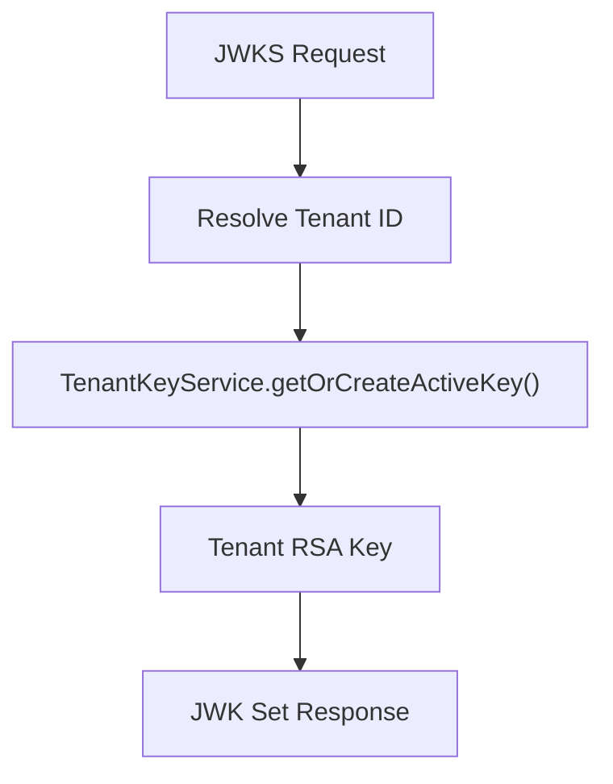

If no tenant is resolved, an exception is thrown to prevent cross-tenant key leakage.

### 3.2 JWT Encoder and Decoder

- `JwtDecoder` is created from the tenant-aware JWK source.
- `JwtEncoder` uses `NimbusJwtEncoder`.

This ensures:

- Tokens are signed with the correct tenant key.
- Validation uses the same tenant key material.

---

## 4. JWT Token Customization

**Bean:** `OAuth2TokenCustomizer<JwtEncodingContext>`

For `access_token`, the following custom claims are added:

- `tenant_id`
- `userId`
- `roles`

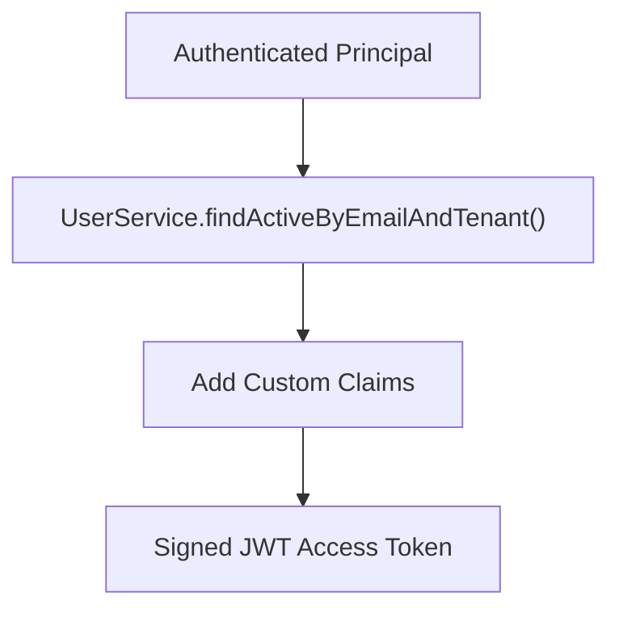

### Claims Added

```text
{
  "tenant_id": "tenant-123",
  "userId": "user-abc",
  "roles": ["ADMIN", "USER"]
}
```

Additionally:

- On refresh token grant, `lastLogin` is updated.
- Roles are derived from effective role resolution logic.

This makes downstream services (Gateway, API, Stream Processing) authorization-aware without additional lookups.

---

## 5. User Authentication Infrastructure

### 5.1 UserDetailsService

Resolves users via:

- Email (lowercased)
- Tenant ID

Builds Spring `UserDetails` with:

- `ROLE_`-prefixed authorities.
- Stored password hash.

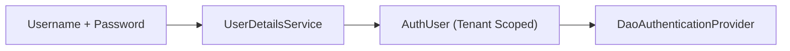

### 5.2 Password Encoder

- Uses `BCryptPasswordEncoder`.
- Ensures strong password hashing.

### 5.3 AuthenticationManager

Configured programmatically using:

- `DaoAuthenticationProvider`
- `UserDetailsService`
- `PasswordEncoder`

Used by controllers during registration or programmatic authentication flows.

---

## 6. Default Security Configuration (Non-AS Endpoints)

**Class:** `SecurityConfig`  
**Order:** 2 (applies after Authorization Server chain)

Handles:

- Form login
- OAuth2 login (OIDC SSO)
- Public endpoints
- Error redirection

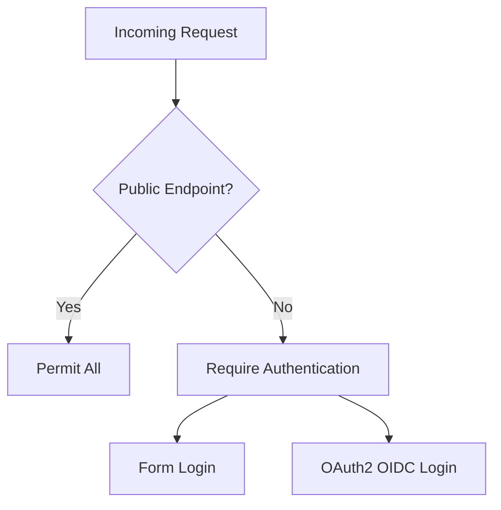

### 6.1 Public Endpoints

Examples:

- `/oauth/**`
- `/invitations/**`
- `/password-reset/**`
- `/tenant/**`
- `/.well-known/**`

All other endpoints require authentication.

---

## 7. OAuth2 / OIDC Login Flow

### 7.1 OAuth2 Login Configuration

Configured with:

- Custom login page `/login`
- `AuthSuccessHandler`
- Custom failure handler
- Custom authorization request resolver
- Custom OIDC user service

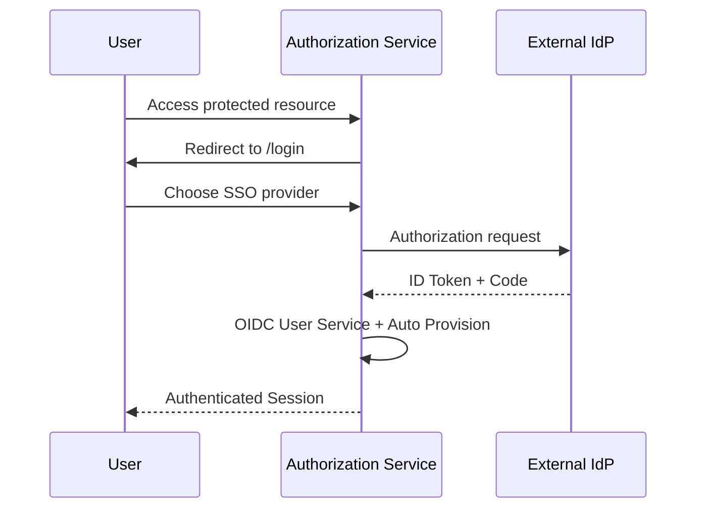

---

## 8. Microsoft Multi-Tenant JWT Validation

A custom `JwtDecoderFactory` is used for Microsoft providers.

Key aspects:

- Validates issuer against a regex pattern.
- Uses default timestamp validation.
- Combines:
  - Default validators
  - `OidcIdTokenValidator`
  - Custom issuer pattern validator

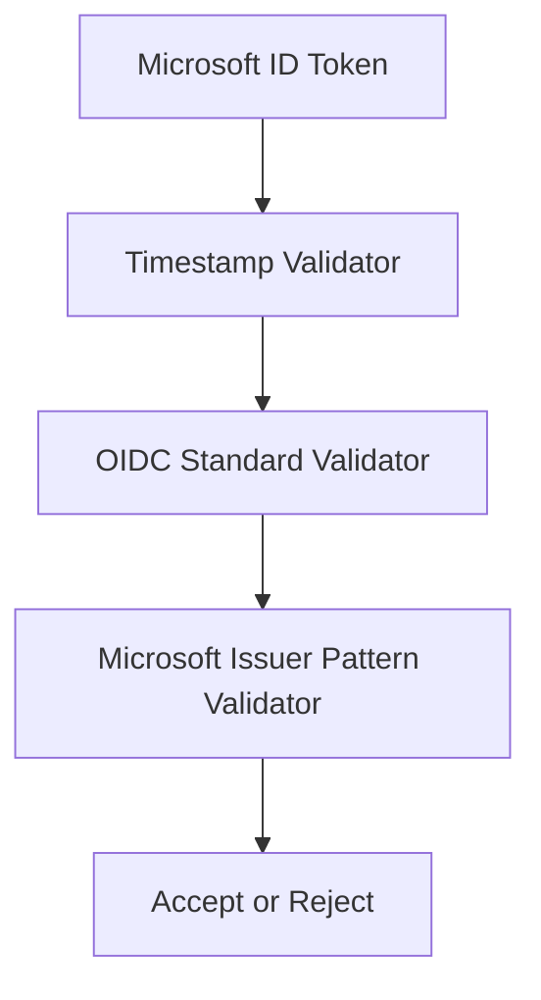

This prevents malicious issuer spoofing in multi-tenant Microsoft scenarios.

---

## 9. Automatic User Provisioning

Inside the custom `OidcUserService`:

1. Load user from IdP.
2. Resolve email and tenant.
3. Check tenant SSO configuration.
4. Validate allowed domains.
5. Register or reactivate user if allowed.
6. Post-process via `RegistrationProcessor`.

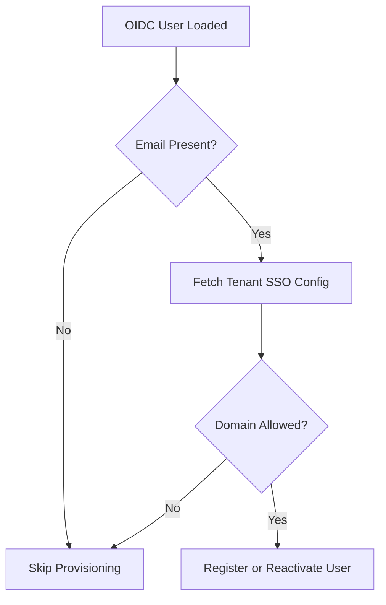

If provisioning fails for non-critical reasons, login is not blocked.

---

## 10. Dynamic Client Registration Repository

**Class:** `DynamicClientRegistrationRepository`  
**Implements:** `ClientRegistrationRepository`

### Responsibility

Resolve OAuth2 client configuration dynamically per:

- `registrationId`
- `tenantId`

### Tenant Resolution Strategy

1. From `TenantContext`.
2. From HTTP session attribute.

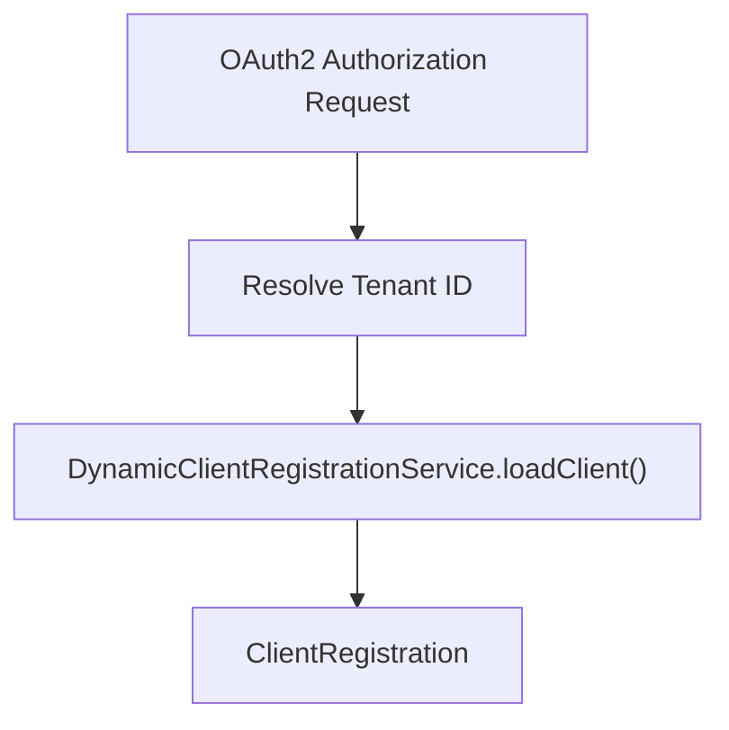

If tenant cannot be resolved:

- Logs a warning.
- Returns `null` (OAuth flow will fail safely).

This enables:

- Per-tenant SSO provider configuration.
- Dynamic onboarding of new SSO integrations.

---

## 11. Filter Ordering and Forwarded Headers

Two filters are registered with high precedence:

- `ForwardedHeaderFilter`
- `TenantForwardedPrefixFilter`

Purpose:

- Correctly handle reverse proxy headers.
- Ensure tenant resolution from forwarded paths.
- Maintain correct issuer URL generation behind proxies.

---

## 12. End-to-End Token Flow

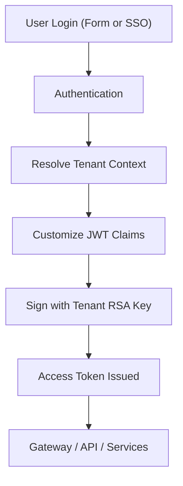

Key guarantees:

- Strong password hashing.
- Tenant-isolated key material.
- Custom role and identity claims.
- Strict issuer validation.
- Safe failure modes.

---

## 13. How It Fits Into the Overall System

Within the broader OpenFrame architecture:

- The Authorization Service issues JWT tokens.
- The Gateway validates tokens and enforces routing.
- API services rely on embedded claims (`tenant_id`, `roles`).
- Stream processing and data services trust tenant-scoped identity.

The Configuration And Security module ensures that all of this is:

- Multi-tenant safe.
- Cryptographically sound.
- Standards-compliant (OAuth2 + OIDC).
- Extensible for new identity providers.

It is the foundation that enables secure, tenant-aware operation across the entire platform.
