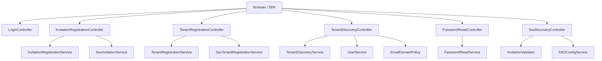
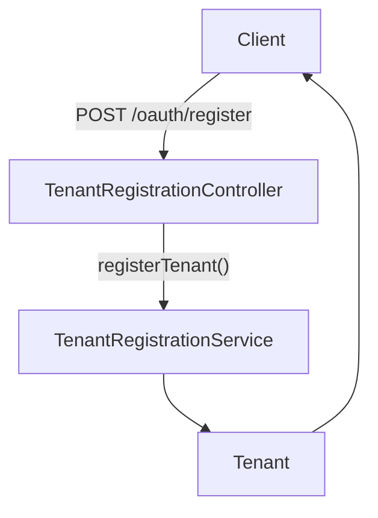
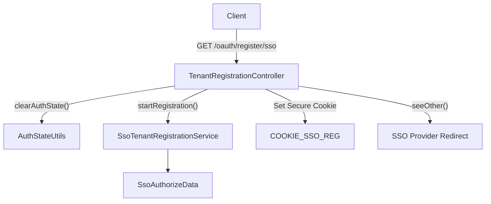
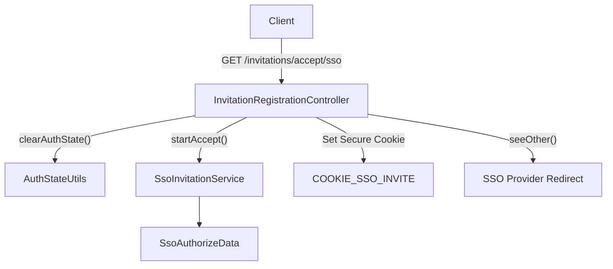
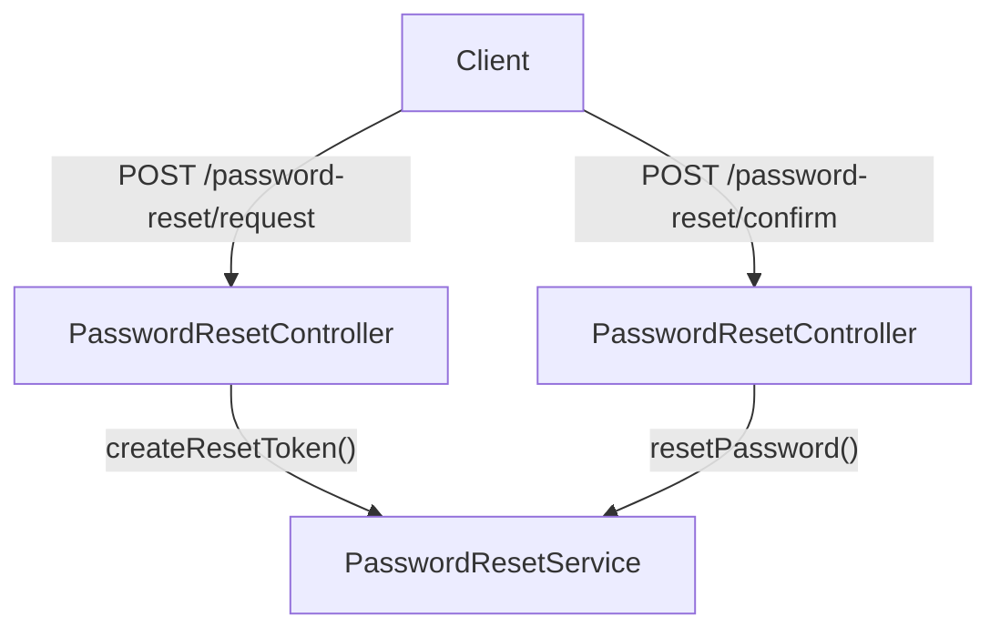
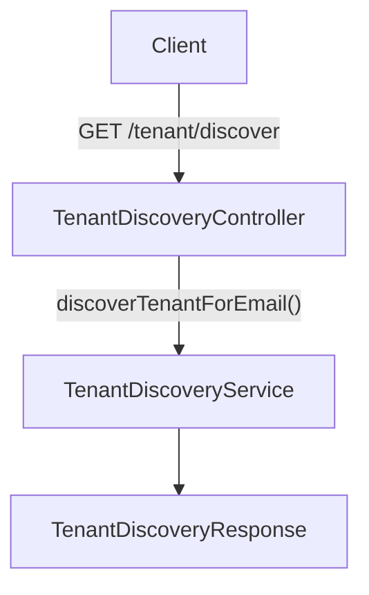
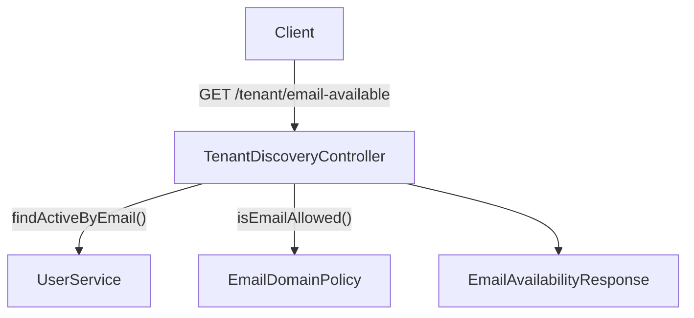
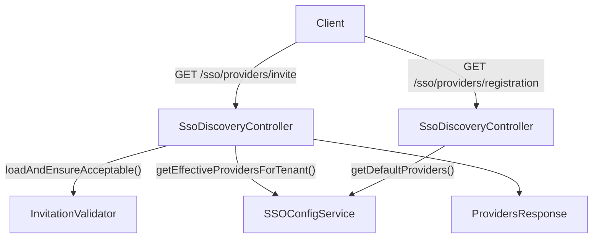
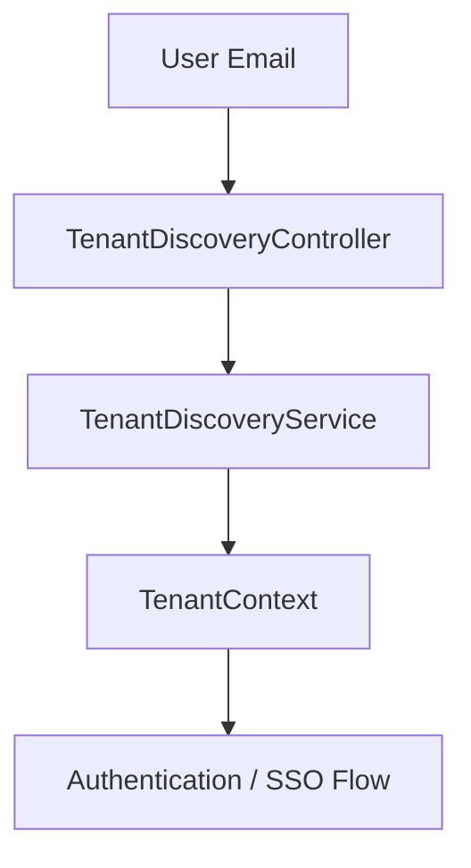

# Controllers

The Controllers module exposes the HTTP entry points for the Authorization Service Core. It implements multi-tenant authentication, tenant discovery, invitation onboarding, password reset, and SSO-driven registration flows.

These controllers sit at the boundary between external clients (browser, SPA, SSO providers) and the internal services defined in the Authorization Service Core. They coordinate validation, tenant resolution, cookie management, and redirection logic while delegating business rules to dedicated service classes.

This module is part of the **Authorization Service Core** and works closely with:

- [Configuration and Security](../configuration-and-security/configuration-and-security.md)
- [Tenant Context](../tenant-context/tenant-context.md)
- [OAuth Persistence and Services](../oauth-persistence-and-services/oauth-persistence-and-services.md)
- [Registration and Utilities](../registration-and-utilities/registration-and-utilities.md)

---

## Responsibilities

The Controllers module is responsible for:

- Exposing REST endpoints for tenant onboarding and user management
- Orchestrating SSO registration and invitation acceptance flows
- Managing secure cookies for SSO state
- Handling login view rendering
- Providing tenant discovery and email validation endpoints
- Delegating core logic to services (e.g., `TenantRegistrationService`, `PasswordResetService`)

It does **not** implement core authentication or persistence logic directly. Those responsibilities are handled by the service and repository layers.

---

## High-Level Architecture

The controllers are thin orchestration layers. All persistent operations, token generation, OAuth flows, and validation rules are delegated to services in sibling modules.

---

## Component Breakdown

### 1. LoginController

**Type:** MVC Controller (returns views)  
**Base Paths:** `/login`, `/`

#### Responsibilities

- Renders login page
- Displays error messages when authentication fails
- Injects password reset URL (if configured)
- Provides a basic index page for the authorization server

#### Key Behavior

- Reads `openframe.password-reset.page-url` from configuration
- Adds `errorMessage` to the model if `error` query parameter is present
- Returns view names (`"login"`, `"index"`)

This controller does not perform authentication itself. Actual authentication is configured in the security layer (see Configuration and Security module).

---

### 2. TenantRegistrationController

**Type:** REST Controller  
**Base Path:** `/oauth`

#### Endpoints

- `POST /oauth/register` — Direct tenant registration
- `GET /oauth/register/sso` — Initiate SSO-based tenant registration

#### Direct Registration Flow

The controller validates the request and delegates to `TenantRegistrationService`.

#### SSO Registration Flow

Key characteristics:

- Clears existing authentication state
- Generates SSO authorization data
- Sets secure, HTTP-only cookie
- Redirects to external SSO provider
- Redirects to error URL on failure

---

### 3. InvitationRegistrationController

**Type:** REST Controller  
**Base Path:** `/invitations`

#### Endpoints

- `POST /invitations/accept` — Accept invitation via direct registration
- `GET /invitations/accept/sso` — Accept invitation via SSO

#### Direct Invitation Acceptance

Delegates to `InvitationRegistrationService.registerByInvitation()` and returns `AuthUser`.

#### SSO Invitation Flow

Error handling includes:

- Logging full exception
- URL-encoding error message
- Redirecting to configured error URL

---

### 4. PasswordResetController

**Type:** REST Controller  
**Base Path:** `/password-reset`

#### Endpoints

- `POST /password-reset/request` — Initiate reset (202 Accepted)
- `POST /password-reset/confirm` — Confirm reset (204 No Content)

#### Flow

Notable details:

- Email is normalized to lowercase
- Token verification and password update are handled by the service layer

---

### 5. TenantDiscoveryController

**Type:** REST Controller  
**Base Path:** `/tenant`

#### Endpoints

- `GET /tenant/discover`
- `GET /tenant/email-available`
- `GET /tenant/email-domain-allowed`

#### Tenant Discovery Flow

#### Email Availability Logic

The controller enforces two checks:

1. User existence (via `UserService`)
2. Email domain policy (via `EmailDomainPolicy`)

This design ensures:

- No unnecessary external domain validation if user already exists
- Consistency with tenant registration rules

---

### 6. SsoDiscoveryController

**Type:** REST Controller  
**Base Path:** `/sso/providers`

#### Endpoints

- `GET /sso/providers/invite`
- `GET /sso/providers/registration`

#### Responsibilities

- Returns SSO providers available for invitation acceptance
- Returns default SSO providers for onboarding

This enables dynamic UI rendering of provider buttons depending on tenant configuration.

---

## Security and Cookie Handling

Several controllers participate in SSO flows and handle cookies securely:

- Cookies are:
  - HTTP-only
  - Secure
  - Path scoped to `/`
  - Time-limited (TTL-based)
- Existing auth state is cleared before starting SSO
- Errors are redirected to a configured error URL

Security enforcement (OAuth2 server, authentication filters, token issuance) is defined in sibling modules and not directly implemented here.

---

## Multi-Tenancy Integration

The Controllers module works with the Tenant Context module to ensure:

- Email-based tenant resolution
- Per-tenant SSO provider selection
- Proper isolation of user accounts

The flow generally follows:

Tenant resolution always occurs before authentication is finalized.

---

## Design Principles

The Controllers module follows these principles:

- **Thin Controllers**: No business logic beyond orchestration
- **Delegation to Services**: All domain logic handled in service layer
- **Explicit Validation**: Bean validation annotations on request parameters
- **Security-First Defaults**: Secure cookies, cleared auth state, safe redirects
- **Clear HTTP Semantics**: Proper status codes (200, 202, 204)

---

## How It Fits Into the System

Within the overall OpenFrame architecture:

- This module provides the external HTTP interface for identity and tenant lifecycle.
- It integrates with OAuth persistence services for token management.
- It collaborates with tenant and registration services for multi-tenant onboarding.
- It enables dynamic SSO configuration per tenant.

In short, the Controllers module is the **entry point layer** of the Authorization Service Core, translating HTTP interactions into structured service calls that power OpenFrame's multi-tenant authentication model.
