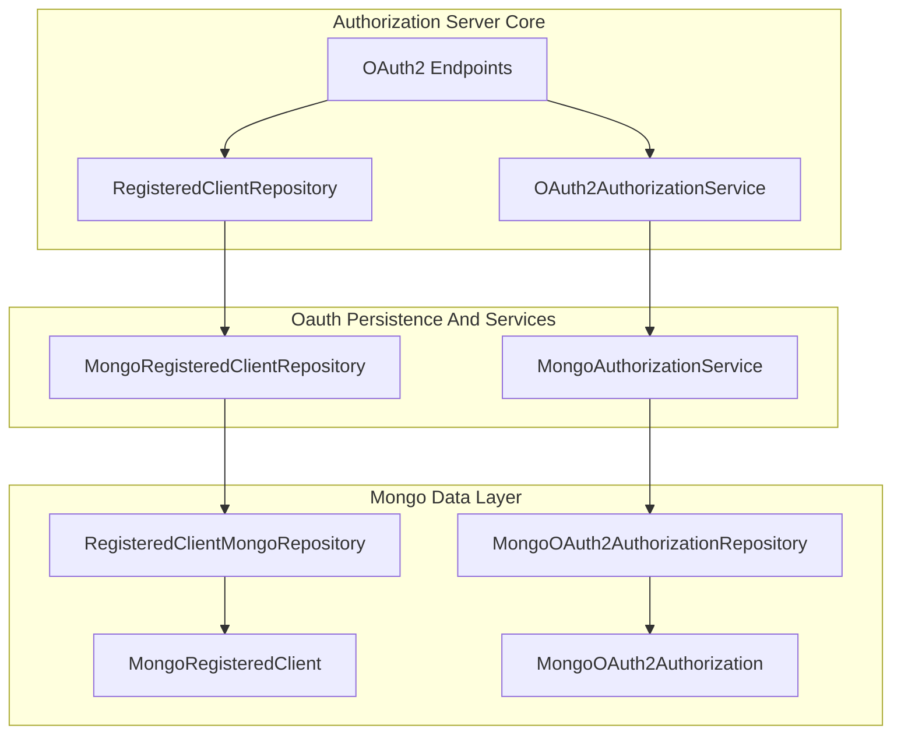
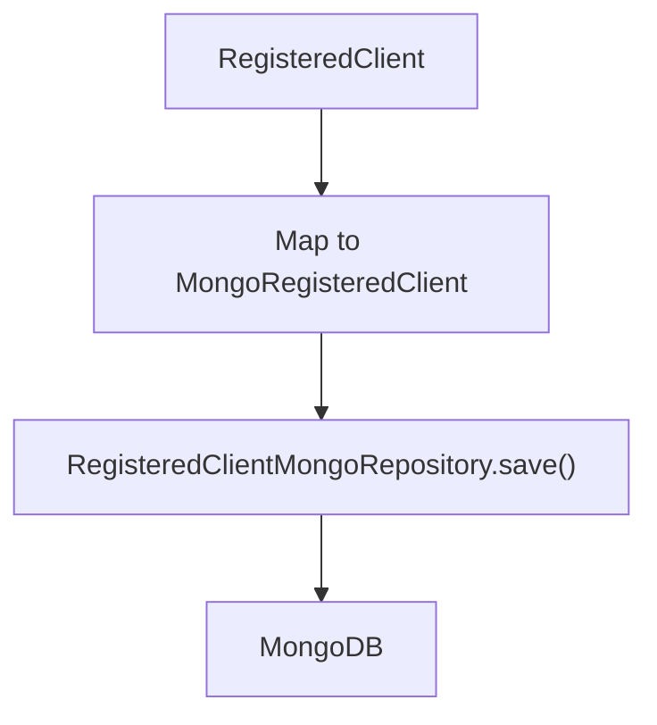
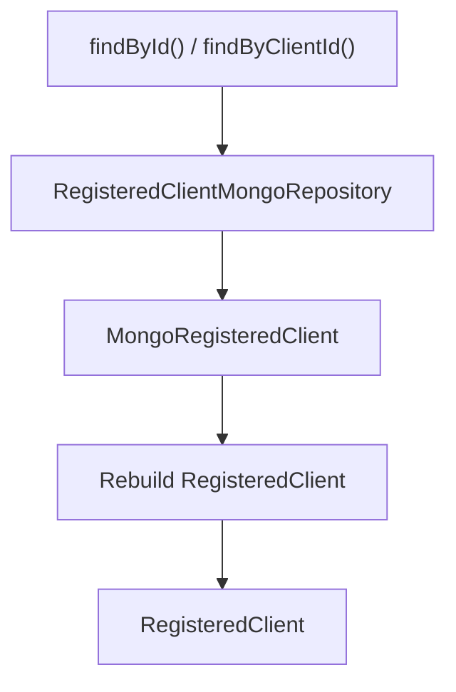
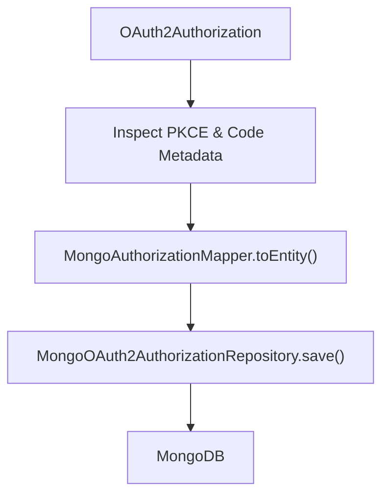
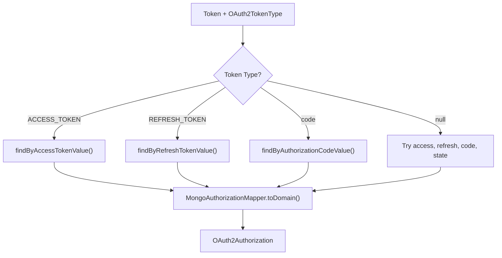
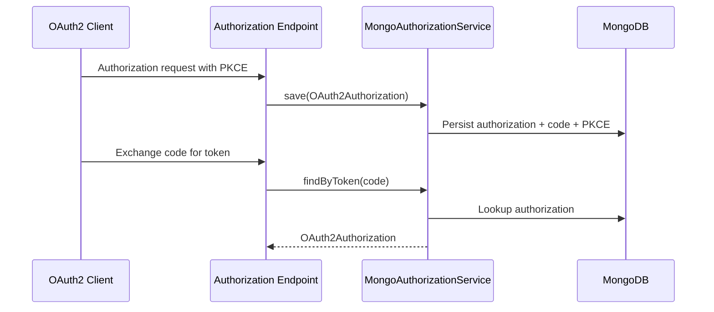

# Oauth Persistence And Services

The **Oauth Persistence And Services** module is responsible for persisting and retrieving OAuth2 clients, authorizations, and tokens within the Authorization Server. It provides MongoDB-backed implementations of Spring Authorization Server extension points, ensuring durable storage of registered clients and issued authorizations (including PKCE metadata).

This module acts as the persistence backbone for the Authorization Server and integrates closely with:

- [Authorization Service Core](../authorization-service-core.md)
- [Configuration And Security](../configuration-and-security/configuration-and-security.md)
- [Tenant Context](../tenant-context/tenant-context.md)
- [Controllers](../controllers/controllers.md)
- [Registration And Utilities](../registration-and-utilities/registration-and-utilities.md)

---

## 1. Responsibilities

The Oauth Persistence And Services module provides:

1. **Registered Client Persistence**  
   MongoDB-backed storage for OAuth2 clients via `MongoRegisteredClientRepository`.

2. **Authorization & Token Persistence**  
   Durable storage for authorization codes, access tokens, refresh tokens, state, and PKCE attributes via `MongoAuthorizationService`.

3. **Domain ↔ Persistence Mapping**  
   Conversion between Spring Authorization Server domain objects (`RegisteredClient`, `OAuth2Authorization`) and MongoDB documents.

4. **PKCE Metadata Preservation**  
   Ensures Proof Key for Code Exchange parameters are retained across persistence boundaries.

---

## 2. High-Level Architecture

This module provides concrete implementations of Spring interfaces and delegates storage to Mongo repositories defined in the data layer.

---

## 3. MongoRegisteredClientRepository

**Implements:** `RegisteredClientRepository`  
**Purpose:** Persist and retrieve OAuth2 client registrations.

### 3.1 Core Responsibilities

- Save `RegisteredClient` into MongoDB
- Reconstruct `RegisteredClient` from Mongo documents
- Translate:
  - Authentication methods
  - Authorization grant types
  - Redirect URIs
  - Scopes
  - Client settings (PKCE, consent)
  - Token settings (TTL, reuse policy)

### 3.2 Save Flow

Key transformations:

- `ClientAuthenticationMethod` → string values
- `AuthorizationGrantType` → string values
- Token TTL values → seconds
- `ClientSettings` and `TokenSettings` → flattened fields

If no ID is present, a UUID is generated before persistence.

### 3.3 Read Flow

The `toRegistered()` method reconstructs:

- `ClientSettings`
- `TokenSettings`
- Authentication methods
- Grant types
- Redirect URIs
- Scopes

This ensures full compatibility with Spring Authorization Server runtime expectations.

---

## 4. MongoAuthorizationService

**Implements:** `OAuth2AuthorizationService`  
**Purpose:** Persist and retrieve OAuth2 authorizations and tokens.

This includes:

- Authorization codes
- Access tokens
- Refresh tokens
- State parameters
- PKCE attributes and metadata

### 4.1 Save Flow

Key characteristics:

- Logs debug information for PKCE attributes before and after mapping.
- Ensures `OAuth2AuthorizationRequest` additional parameters are preserved.
- Ensures `OAuth2AuthorizationCode` metadata survives persistence.

This is critical for secure PKCE flows in public clients.

---

### 4.2 Token Lookup Flow

Behavior details:

- If `tokenType` is null, it attempts multiple lookups in order.
- Uses a constant token type for authorization codes.
- Converts Mongo entity back into domain object using the `RegisteredClientRepository`.

---

## 5. Interaction With Other Modules

### 5.1 Configuration And Security

The `AuthorizationServerConfig` and `SecurityConfig` wire this module into the Spring Security filter chain.  
They inject:

- `MongoRegisteredClientRepository`
- `MongoAuthorizationService`

See:  
[Configuration And Security](../configuration-and-security/configuration-and-security.md)

---

### 5.2 Controllers

Controllers such as:

- Login
- Tenant registration
- Password reset
- Invitation registration

Trigger OAuth2 flows that ultimately rely on this module to persist:

- Client registrations
- Authorization codes
- Access tokens
- Refresh tokens

See:  
[Controllers](../controllers/controllers.md)

---

### 5.3 Tenant Context

Although this module does not directly manage tenants, persisted authorizations operate within the tenant context established by:

[Tenant Context](../tenant-context/tenant-context.md)

Tenant isolation is typically enforced at request and repository levels.

---

### 5.4 Data Layer

This module depends on Mongo repositories and document models from the data layer:

- `MongoRegisteredClient`
- `MongoOAuth2Authorization`
- `RegisteredClientMongoRepository`
- `MongoOAuth2AuthorizationRepository`

These provide the actual MongoDB persistence mechanics.

---

## 6. End-to-End Authorization Code Flow (With Persistence)

This demonstrates how PKCE parameters and authorization codes survive between the authorization and token endpoints.

---

## 7. Security Considerations

1. **Token Confidentiality**  
   Tokens and secrets are persisted in MongoDB. Proper encryption and restricted access are essential.

2. **PKCE Integrity**  
   The module explicitly preserves PKCE parameters across serialization boundaries.

3. **Refresh Token Reuse Policy**  
   Controlled via `TokenSettings.reuseRefreshTokens` and stored per client.

4. **Client Secret Handling**  
   Secrets should be encoded before persistence (typically configured in security configuration).

---

## 8. Summary

The **Oauth Persistence And Services** module is the persistence engine of the Authorization Server. It:

- Bridges Spring Authorization Server abstractions to MongoDB
- Persists OAuth2 clients and tokens
- Preserves PKCE metadata
- Enables reliable token lookup and revocation
- Integrates with tenant and security configuration layers

Without this module, the Authorization Server would not retain client registrations or issued tokens, making secure OAuth2 flows impossible.
