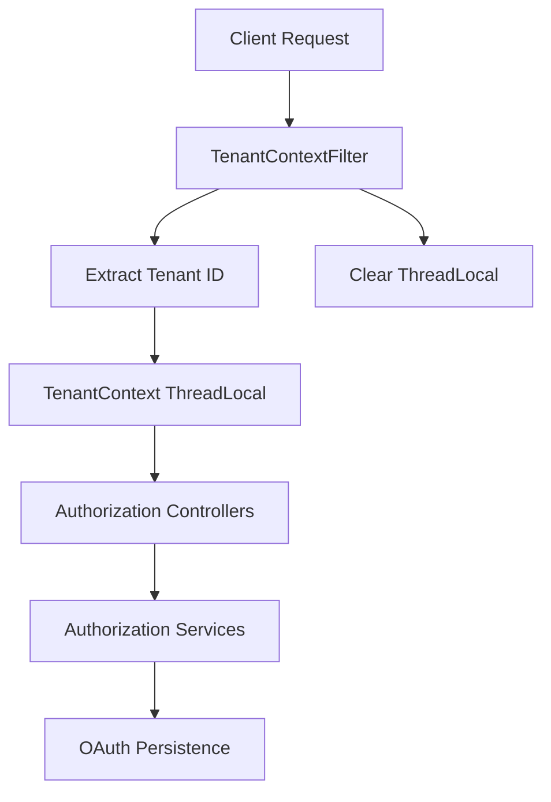
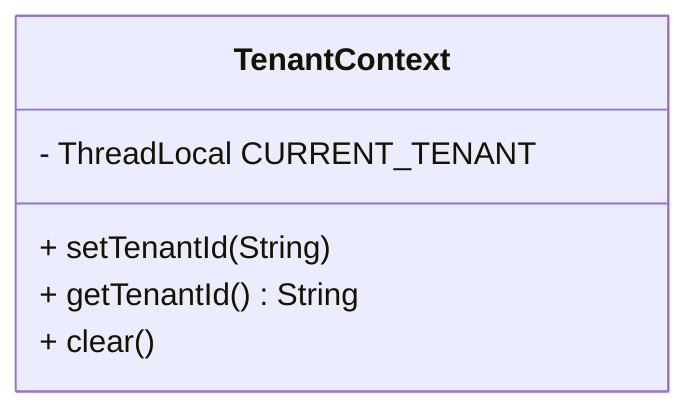
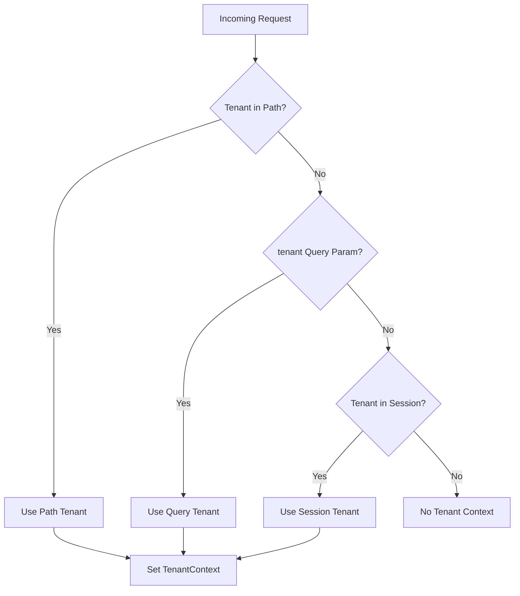
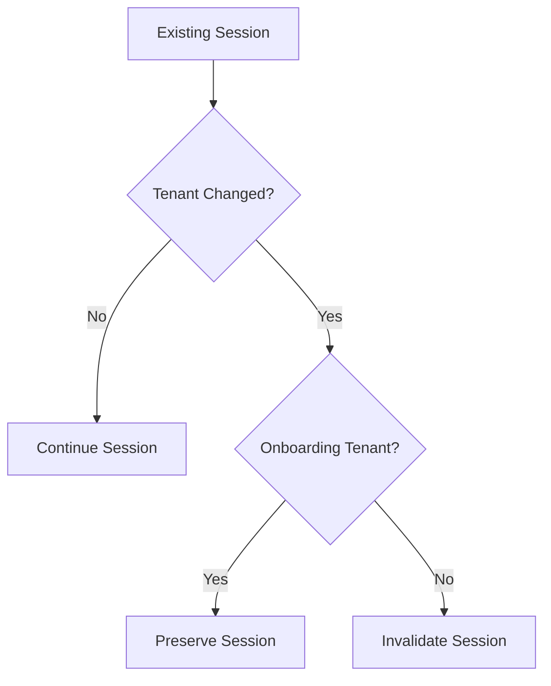
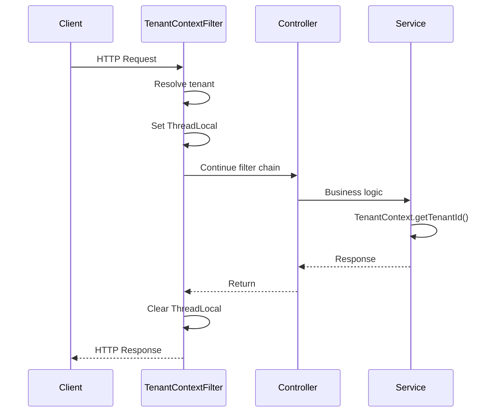

# Tenant Context

The **Tenant Context** module is the foundation of multi-tenancy in the Authorization Service Core. It ensures that every incoming HTTP request is associated with the correct tenant and that this tenant information is consistently available throughout the request lifecycle.

At its core, the module:

- Extracts the tenant identifier from incoming requests
- Stores the tenant identifier in a thread-local context
- Synchronizes tenant information with the HTTP session
- Cleans up context state after request completion

This module is a critical building block for secure OAuth2 flows, SSO onboarding, and tenant-aware authorization processing.

---

## Core Components

The Tenant Context module consists of two primary classes:

- `TenantContext` – Thread-local holder for the current tenant ID
- `TenantContextFilter` – Servlet filter that resolves and manages tenant information per request

---

## Architectural Overview



### Responsibilities

| Component | Responsibility |
|------------|---------------|
| TenantContext | Stores current tenant ID in a ThreadLocal |
| TenantContextFilter | Resolves tenant from path, query, or session |
| HTTP Session | Persists tenant ID between requests |

---

## TenantContext

`TenantContext` is a simple, static utility class built around a `ThreadLocal<String>`.

### Design Characteristics

- Uses `ThreadLocal` to isolate tenant data per request thread
- Provides static access methods
- Enforces explicit cleanup via `clear()`
- Immutable class design (private constructor)

### Internal Structure



### Lifecycle

1. `TenantContextFilter` calls `setTenantId()`
2. Controllers and services retrieve the value using `getTenantId()`
3. The filter ensures `clear()` is called in a `finally` block

This guarantees no tenant data leaks across requests.

---

## TenantContextFilter

`TenantContextFilter` extends `OncePerRequestFilter` and executes near the beginning of the filter chain.

It is annotated with:

- `@Component`
- `@Order(HIGHEST_PRECEDENCE + 10)`

This ensures it runs early enough to populate tenant data before security, OAuth2, or controller logic executes.

---

## Tenant Resolution Strategy

Tenant resolution follows a prioritized strategy:



### 1. Path-Based Resolution (Primary)

The filter inspects the request URI and extracts the first path segment when the request matches OAuth-related endpoints:

- `/oauth2/`
- `/.well-known/`
- `/connect/`
- `/login`
- `/userinfo`

Example pattern:

```
/{tenantId}/oauth2/authorize
```

Certain path segments are excluded (for example `login`, `sso`, `public`, `.well-known`).

---

### 2. Query Parameter Fallback

If no tenant is resolved from the path, the filter checks:

```
?tenant=<tenantId>
```

This supports flows where tenant context must be explicitly provided.

---

### 3. Session-Based Fallback

If both path and query parameter resolution fail, the filter checks the existing HTTP session for a stored tenant ID.

This ensures continuity across multi-step OAuth2 authorization flows.

---

## Session Management and Tenant Switching

The filter also manages session safety when tenants change.



### Special Case: Onboarding Tenant

A special onboarding tenant ID is allowed to transition to a real tenant without invalidating the session. This supports SSO onboarding flows where:

1. A tenant is temporarily created
2. Registration completes
3. Control transitions to the actual tenant

If the tenant changes for any other reason, the session is invalidated to prevent cross-tenant session contamination.

---

## Request Lifecycle Integration



This guarantees:

- Tenant isolation per request
- Proper cleanup
- No thread leakage

---

## Relationship to Other Modules

The Tenant Context module is part of the **Authorization Service Core** and directly supports:

- [Configuration and Security](../configuration-and-security/configuration-and-security.md)
- [Controllers](../controllers/controllers.md)
- [OAuth Persistence and Services](../oauth-persistence-and-services/oauth-persistence-and-services.md)
- [Registration and Utilities](../registration-and-utilities/registration-and-utilities.md)

### How It Fits

- Controllers rely on tenant context for login and registration flows
- Authorization services use tenant ID to scope OAuth2 clients and tokens
- Persistence layers store and retrieve tenant-scoped data

Without Tenant Context, multi-tenant authorization boundaries could not be enforced.

---

## Design Principles

### 1. Isolation by Thread
Using `ThreadLocal` ensures strict request isolation in servlet-based execution models.

### 2. Early Resolution
High filter precedence ensures tenant context is available before:

- Security filters
- OAuth2 authorization endpoints
- Controller invocation

### 3. Defensive Session Handling
Session invalidation on unsafe tenant switching prevents:

- Cross-tenant privilege escalation
- Session fixation across tenants

### 4. Explicit Cleanup
The `finally` block guarantees that the thread-local state is always cleared.

---

## Security Implications

The Tenant Context module is directly tied to security boundaries:

- Ensures OAuth2 endpoints operate within a specific tenant
- Prevents token issuance across tenant boundaries
- Avoids leaking tenant information between threads
- Protects against improper session reuse

Improper implementation of tenant context handling would compromise multi-tenant isolation.

---

## Summary

The **Tenant Context** module is a lightweight but critical infrastructure component within the Authorization Service Core.

It provides:

- Deterministic tenant resolution
- Thread-safe tenant storage
- Secure session-aware tenant transitions
- Clean integration with Spring Security and OAuth2 flows

By centralizing tenant resolution logic in a single high-precedence filter and using a strict ThreadLocal model, the system maintains strong multi-tenant guarantees across all authorization flows.