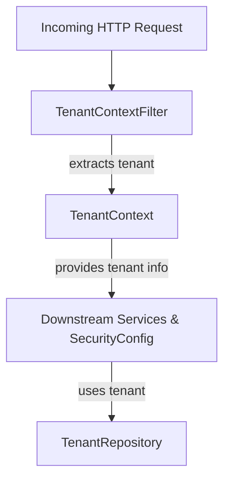
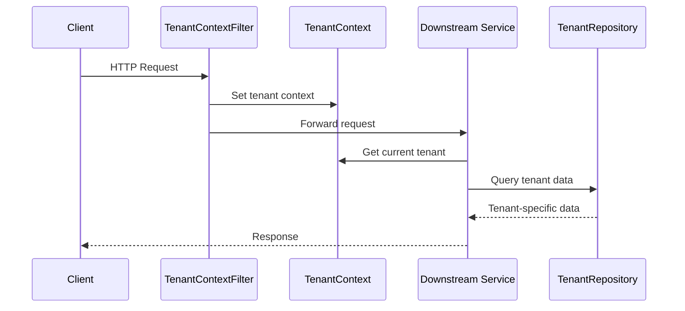

# authorization_service_core_config_tenant Module Documentation

## Introduction

The `authorization_service_core_config_tenant` module provides the foundational multi-tenancy context and request filtering for the authorization service. It is responsible for managing tenant-specific context during request processing, ensuring that all downstream components operate within the correct tenant scope. This is critical for secure, isolated, and scalable multi-tenant SaaS architectures.

This module is typically used in conjunction with the broader authorization service configuration ([authorization_service_core_config.md]), security ([authorization_service_core_security.md]), and tenant repository ([data_mongo_repository_tenant.md]) modules.

## Core Components

- **TenantContext**: Maintains the current tenant's context for the duration of a request.
- **TenantContextFilter**: Servlet filter that intercepts incoming requests, extracts tenant information, and sets up the `TenantContext` for downstream processing.

## Architecture Overview

The following diagram illustrates how the tenant context is established and propagated through the request lifecycle:

- **TenantContextFilter**: Intercepts each HTTP request, extracts the tenant identifier (e.g., from headers, subdomain, or path), and initializes the `TenantContext`.
- **TenantContext**: Holds the tenant identifier and makes it accessible to all downstream components during the request lifecycle.
- **Downstream Services**: All business logic, security checks, and data access layers retrieve the current tenant from `TenantContext`.
- **TenantRepository**: Used to validate and fetch tenant-specific data from the database. See [data_mongo_repository_tenant.md] for details.

## Component Interactions

## Data Flow

1. **Request Interception**: `TenantContextFilter` intercepts every incoming HTTP request.
2. **Tenant Extraction**: The filter extracts the tenant identifier from the request (header, subdomain, etc.).
3. **Context Initialization**: The filter initializes the `TenantContext` with the extracted tenant ID.
4. **Downstream Access**: All downstream services and repositories access the current tenant via `TenantContext`.
5. **Cleanup**: At the end of the request, the tenant context is cleared to prevent leakage between requests.

## Dependencies and Integration

- **authorization_service_core_config.SecurityConfig**: Integrates with the security configuration to enforce tenant-aware authentication and authorization. See [authorization_service_core_config.md].
- **data_mongo_repository_tenant.TenantRepository**: Used for tenant validation and data access. See [data_mongo_repository_tenant.md].
- **authorization_service_core_controller.TenantDiscoveryController**, **TenantRegistrationController**: Controllers that rely on tenant context for tenant discovery and registration. See [authorization_service_core_controller.md].

## Related Modules

- [authorization_service_core_config.md]: Core authorization server and security configuration
- [authorization_service_core_security.md]: Security constants and handlers for SSO and tenant registration
- [data_mongo_repository_tenant.md]: Tenant repository and data access
- [authorization_service_core_controller.md]: Tenant-related controllers

## Best Practices

- Always access tenant information via `TenantContext` to ensure correct scoping.
- Ensure `TenantContextFilter` is registered early in the filter chain to guarantee all downstream components operate within the correct tenant context.
- Clear the tenant context at the end of each request to avoid cross-request contamination.

## Troubleshooting

- **Tenant not found**: Ensure the tenant identifier is correctly extracted and matches an entry in the tenant repository.
- **Cross-tenant data leakage**: Verify that `TenantContext` is properly cleared after each request.
- **Security issues**: Confirm that all security checks are tenant-aware and use the current context.

---

For further details on implementation and integration, refer to the related module documentation linked above.
