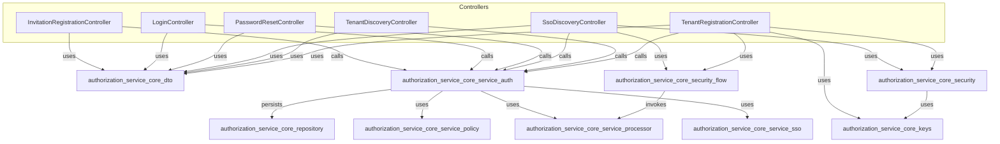
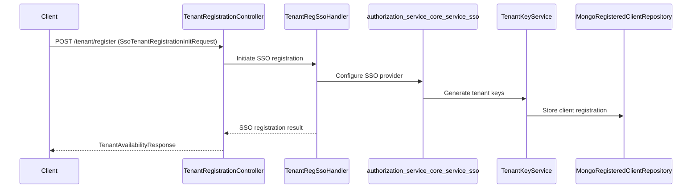

# authorization_service_core_controller Module Documentation

## Introduction

The `authorization_service_core_controller` module provides the primary REST and web controllers for handling user and tenant authentication, registration, password management, and SSO (Single Sign-On) discovery and onboarding within the authorization service. It is a central entry point for user and tenant lifecycle operations, including login, password reset, SSO flows, and multi-tenant discovery and registration. This module is essential for enabling secure, multi-tenant, and federated authentication scenarios in the platform.

## Core Components

- **InvitationRegistrationController**: Handles invitation-based user registration, including SSO invitation acceptance.
- **LoginController**: Manages user login, authentication, and session management.
- **PasswordResetController**: Provides endpoints for initiating and completing password reset flows.
- **SsoDiscoveryController**: Supports SSO provider discovery and SSO onboarding flows.
- **TenantDiscoveryController**: Enables discovery of available tenants and their authentication endpoints.
- **TenantRegistrationController**: Manages tenant registration, including SSO-based tenant onboarding.

## High-Level Architecture

The controllers in this module interact with service, repository, and utility layers to orchestrate authentication and registration flows. They rely on DTOs (from `authorization_service_core_dto`), security handlers (from `authorization_service_core_security` and `authorization_service_core_security_flow`), and key management utilities (from `authorization_service_core_keys`).

## Component Responsibilities and Interactions

### InvitationRegistrationController
- Handles user registration via invitation links, including SSO invitation acceptance.
- Accepts requests such as `InvitationRegistrationRequest` and `SsoInvitationAcceptRequest` ([authorization_service_core_dto.md]).
- Delegates registration logic to service and processor layers.

### LoginController
- Manages user login, authentication, and session creation.
- Interacts with `MongoAuthorizationService` ([authorization_service_core_service_auth.md]) for credential validation.
- Issues tokens or session cookies as appropriate.

### PasswordResetController
- Initiates and completes password reset flows.
- Accepts and validates `PasswordResetDtos` ([authorization_service_core_dto.md]).
- Utilizes `ResetTokenUtil` ([authorization_service_core_util.md]) for secure token management.

### SsoDiscoveryController
- Provides endpoints for SSO provider discovery and onboarding.
- Uses SSO configuration and flow handlers from `authorization_service_core_security` and `authorization_service_core_security_flow` ([authorization_service_core_security.md], [authorization_service_core_security_flow.md]).
- Supports dynamic SSO provider registration and metadata discovery.

### TenantDiscoveryController
- Enables clients to discover available tenants and their authentication endpoints.
- Returns `TenantDiscoveryResponse` ([authorization_service_core_dto.md]).

### TenantRegistrationController
- Handles tenant registration, including SSO-based onboarding.
- Accepts `TenantRegistrationRequest` and `SsoTenantRegistrationInitRequest` ([authorization_service_core_dto.md]).
- Coordinates with key management (`authorization_service_core_keys.md`) and SSO configuration services.

## Data Flow Example: SSO Tenant Registration

## Module Relationships

- **DTOs**: All controllers use DTOs from [authorization_service_core_dto.md] for request/response payloads.
- **Service Layer**: Business logic is delegated to services in [authorization_service_core_service_auth.md], [authorization_service_core_service_auth_strategy.md], [authorization_service_core_service_policy.md], [authorization_service_core_service_processor.md], and [authorization_service_core_service_sso.md].
- **Security and SSO**: SSO and security flows are handled via [authorization_service_core_security.md] and [authorization_service_core_security_flow.md].
- **Key Management**: Tenant and SSO key management is handled by [authorization_service_core_keys.md].
- **Repository**: Persistence is managed via [authorization_service_core_repository.md].

## Integration with the Overall System

The `authorization_service_core_controller` module is the main entry point for authentication and registration in a multi-tenant, SSO-enabled environment. It works closely with:
- **Config modules** ([authorization_service_core_config.md], [authorization_service_core_config_tenant.md]) for security and tenant context.
- **Service and processor modules** for business logic and SSO orchestration.
- **Repository modules** for persistence of user, tenant, and client registration data.
- **Utility modules** for token and user management.

For more details on related modules, see:
- [authorization_service_core_dto.md]
- [authorization_service_core_service_auth.md]
- [authorization_service_core_service_auth_strategy.md]
- [authorization_service_core_service_policy.md]
- [authorization_service_core_service_processor.md]
- [authorization_service_core_service_sso.md]
- [authorization_service_core_security.md]
- [authorization_service_core_security_flow.md]
- [authorization_service_core_keys.md]
- [authorization_service_core_repository.md]

## Summary

The `authorization_service_core_controller` module is a foundational component for secure, multi-tenant authentication and registration, supporting both traditional and SSO-based flows. It orchestrates complex onboarding and authentication scenarios by integrating with service, security, and persistence layers, and is designed for extensibility and robust security in modern SaaS platforms.
