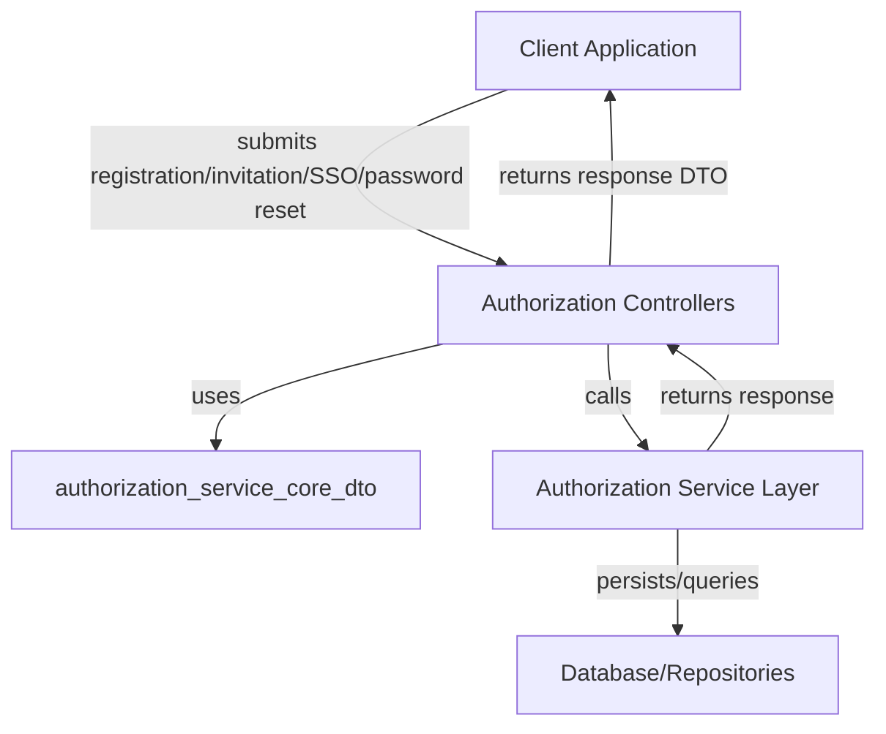
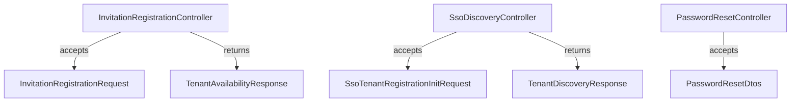
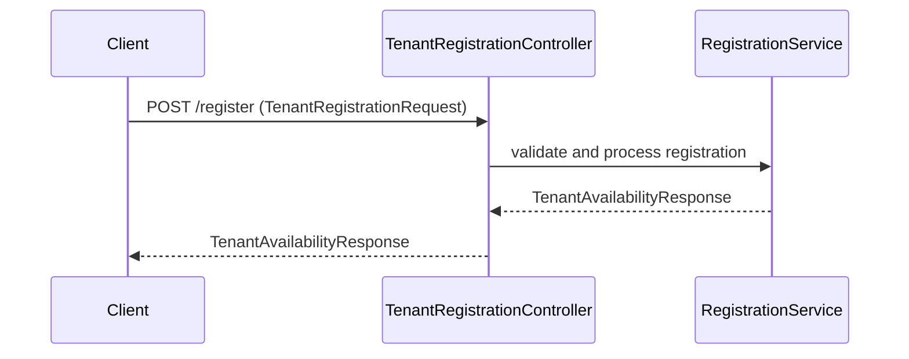
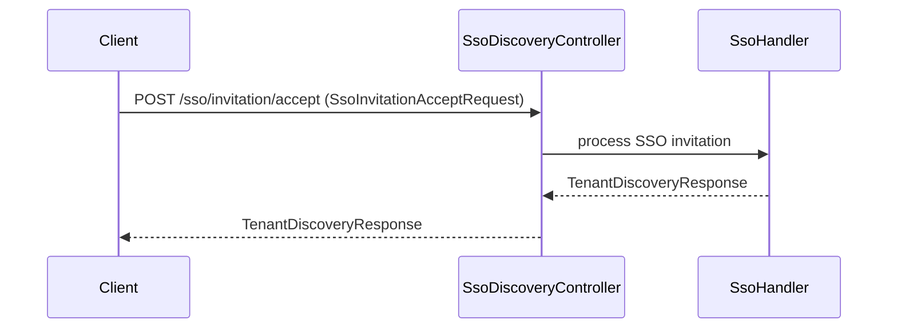

# authorization_service_core_dto

## Introduction

The `authorization_service_core_dto` module defines the core Data Transfer Objects (DTOs) used by the authorization service for handling multi-tenant registration, SSO (Single Sign-On) invitation and registration flows, password reset, and tenant discovery. These DTOs are essential for structuring API requests and responses between clients and the authorization service, ensuring type safety, validation, and clear contract definitions across the authentication and tenant management processes.

This module is a foundational part of the authorization service, supporting controllers, service layers, and integration points with other modules such as `authorization_service_core_controller`, `authorization_service_core_service_auth`, and `authorization_service_core_config`.

## Core Functionality

The DTOs in this module serve the following primary purposes:

- **Tenant Registration and Discovery**: Facilitate onboarding of new tenants, checking tenant availability, and initializing tenant registration flows.
- **SSO Invitation and Registration**: Support SSO-based onboarding, including invitation acceptance and SSO-initiated tenant registration.
- **Password Reset**: Provide request/response structures for password reset flows.

## Core Components

- **InvitationRegistrationRequest**: DTO for handling invitation-based registration requests.
- **PasswordResetDtos**: DTOs for password reset request and response payloads.
- **SsoInvitationAcceptRequest**: DTO for accepting SSO invitations.
- **SsoTenantRegistrationInitRequest**: DTO for initializing SSO-based tenant registration.
- **TenantAvailabilityResponse**: Response DTO indicating tenant availability status.
- **TenantDiscoveryResponse**: Response DTO for tenant discovery operations.
- **TenantRegistrationRequest**: DTO for tenant registration requests.

## Architecture and Component Relationships

The DTOs in this module are used by controllers in the `authorization_service_core_controller` module, such as `InvitationRegistrationController`, `LoginController`, `PasswordResetController`, `SsoDiscoveryController`, `TenantDiscoveryController`, and `TenantRegistrationController`. These controllers orchestrate authentication, registration, and SSO flows, relying on the DTOs for request validation and response formatting.

The DTOs are also consumed by service layers in modules like `authorization_service_core_service_auth` and `authorization_service_core_service_processor`, which implement the business logic for registration, SSO, and password management.

### High-Level Data Flow

### Component Interaction Example

## Integration with Other Modules

- **Controllers**: See [authorization_service_core_controller.md](authorization_service_core_controller.md) for details on how these DTOs are used in API endpoints.
- **Authentication and SSO Services**: See [authorization_service_core_service_auth.md](authorization_service_core_service_auth.md) and [authorization_service_core_service_processor.md](authorization_service_core_service_processor.md) for business logic utilizing these DTOs.
- **Configuration**: See [authorization_service_core_config.md](authorization_service_core_config.md) for security and multi-tenant configuration impacting DTO usage.

## Process Flows

### Tenant Registration Flow

### SSO Invitation Acceptance Flow

## References

- [authorization_service_core_controller.md](authorization_service_core_controller.md)
- [authorization_service_core_service_auth.md](authorization_service_core_service_auth.md)
- [authorization_service_core_service_processor.md](authorization_service_core_service_processor.md)
- [authorization_service_core_config.md](authorization_service_core_config.md)

## Summary

The `authorization_service_core_dto` module is central to the authorization service's API contract, enabling robust, type-safe, and maintainable flows for tenant registration, SSO onboarding, invitation handling, and password management. Its DTOs are tightly integrated with controllers and service layers, forming the backbone of the system's authentication and multi-tenancy features.
