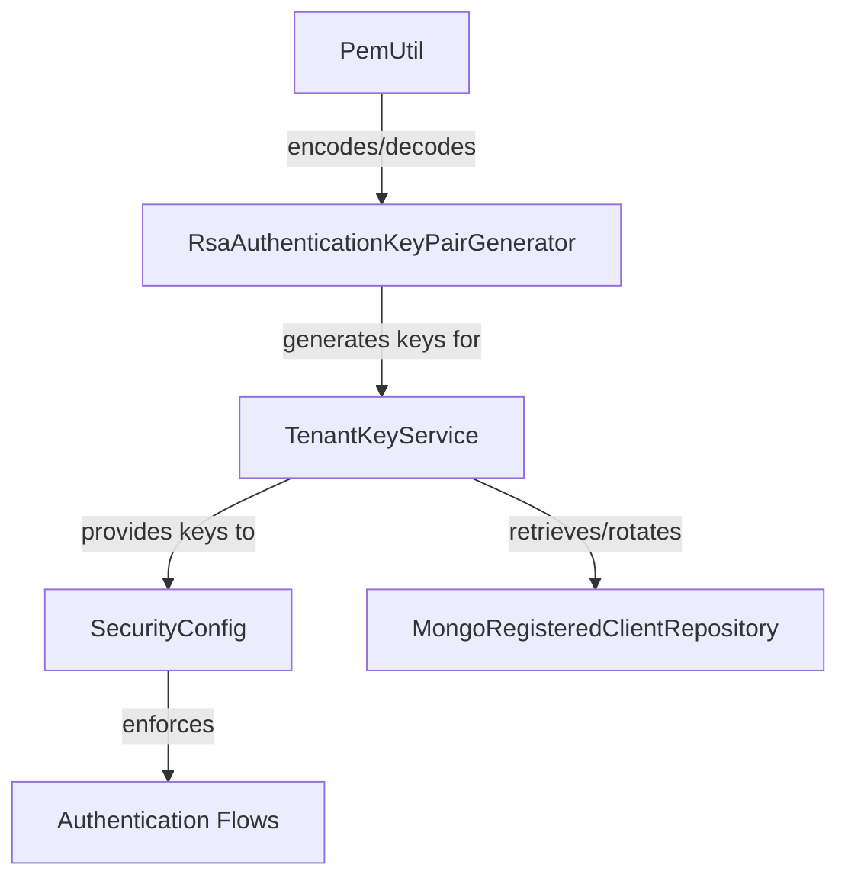
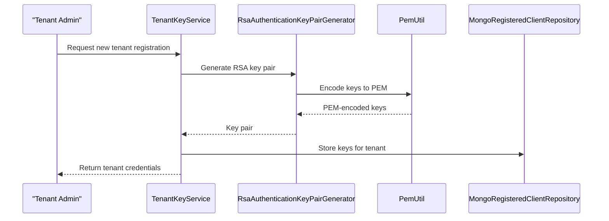

# authorization_service_core_keys Module Documentation

## Introduction

The `authorization_service_core_keys` module is responsible for the management, generation, and handling of cryptographic keys within the authorization service. It provides the foundational utilities and services required for secure authentication, tenant isolation, and key lifecycle management in a multi-tenant authorization server environment.

This module is critical for ensuring the security and integrity of authentication flows, especially in scenarios involving dynamic client registration, tenant-specific key management, and secure communication between services.

## Core Components

- **PemUtil**: Utility class for handling PEM (Privacy Enhanced Mail) encoding and decoding of cryptographic keys and certificates.
- **RsaAuthenticationKeyPairGenerator**: Service for generating RSA key pairs used in authentication and signing operations.
- **TenantKeyService**: Service responsible for managing cryptographic keys on a per-tenant basis, supporting key retrieval, rotation, and storage.

## Architecture Overview

The following diagram illustrates the high-level architecture and component relationships within the `authorization_service_core_keys` module:

- **PemUtil** provides encoding/decoding utilities to the key pair generator.
- **RsaAuthenticationKeyPairGenerator** uses these utilities to generate and format RSA key pairs.
- **TenantKeyService** manages the lifecycle of these keys for each tenant, interacting with persistent storage (e.g., [MongoRegisteredClientRepository](authorization_service_core_repository.md)).
- **SecurityConfig** (see [authorization_service_core_config.md](authorization_service_core_config.md)) consumes tenant keys for enforcing authentication and authorization policies.

## Component Details

### PemUtil
- **Purpose**: Handles conversion between Java key/certificate objects and PEM-encoded strings.
- **Responsibilities**:
  - Encode private/public keys and certificates to PEM format
  - Decode PEM strings to key/certificate objects
- **Usage**: Used by key generators and services that need to persist or transmit keys securely.

### RsaAuthenticationKeyPairGenerator
- **Purpose**: Generates RSA key pairs for authentication and signing.
- **Responsibilities**:
  - Create new RSA key pairs
  - Format keys using `PemUtil`
  - Support key size configuration
- **Usage**: Invoked by `TenantKeyService` during key creation or rotation events.

### TenantKeyService
- **Purpose**: Manages cryptographic keys for each tenant in a multi-tenant environment.
- **Responsibilities**:
  - Retrieve current tenant keys
  - Rotate keys as needed
  - Store and fetch keys from persistent storage (e.g., MongoDB)
  - Interface with other services for key provisioning
- **Usage**: Called by authentication and registration flows to obtain tenant-specific keys.

## Data Flow and Process

The following diagram illustrates the key management process for a new tenant registration:

## Dependencies and Integration

- **Persistent Storage**: Relies on [MongoRegisteredClientRepository](authorization_service_core_repository.md) for storing and retrieving tenant keys.
- **Security Configuration**: Integrates with [SecurityConfig](authorization_service_core_config.md) to supply keys for authentication flows.
- **Tenant Context**: Works with [TenantContext](authorization_service_core_config_tenant.md) to ensure tenant isolation and correct key usage.

## Related Modules

- [authorization_service_core_config.md](authorization_service_core_config.md): Security and authentication configuration.
- [authorization_service_core_repository.md](authorization_service_core_repository.md): MongoDB repositories for key and client storage.
- [authorization_service_core_config_tenant.md](authorization_service_core_config_tenant.md): Tenant context and isolation utilities.

## Summary

The `authorization_service_core_keys` module is a foundational part of the authorization service, enabling secure, tenant-aware key management and supporting robust authentication mechanisms. Its integration with configuration, repository, and tenant context modules ensures a secure and scalable multi-tenant authorization platform.
