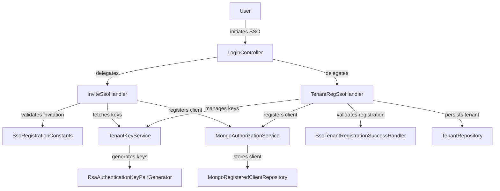
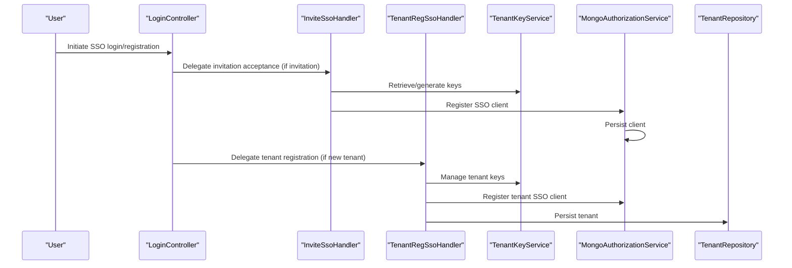
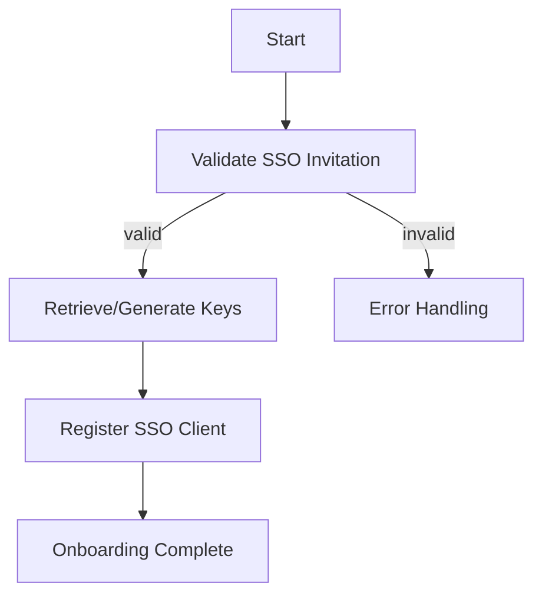
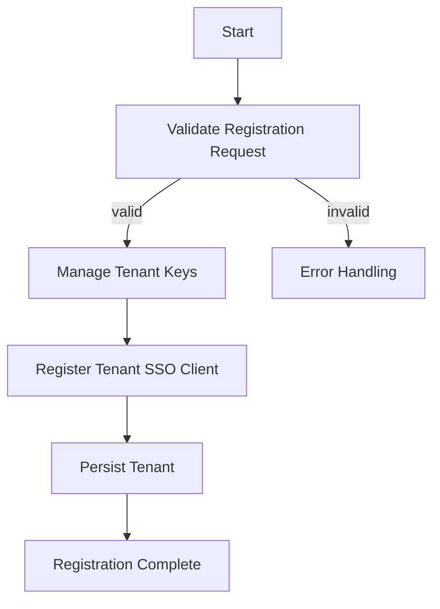

# authorization_service_core_security_flow Module Documentation

## Introduction

The `authorization_service_core_security_flow` module is responsible for orchestrating the core security flows related to Single Sign-On (SSO) registration and tenant onboarding within the authorization service. It provides handler components that manage the lifecycle and business logic for SSO-based invitation acceptance and tenant registration, ensuring secure and seamless integration with external identity providers.

This module is a critical part of the multi-tenant authorization infrastructure, enabling secure onboarding and SSO flows for organizations and users. It interacts closely with other modules such as `authorization_service_core_security`, `authorization_service_core_service_auth`, and `authorization_service_core_keys` to provide a robust and extensible security foundation.

## Core Components

- **InviteSsoHandler**: Handles the SSO invitation acceptance flow, validating invitations and managing user onboarding via SSO.
- **TenantRegSsoHandler**: Manages the SSO-based tenant registration process, including validation, key management, and integration with external identity providers.

## Architecture Overview

The following diagram illustrates the high-level architecture and component interactions for the SSO security flows managed by this module:

## Component Responsibilities

### InviteSsoHandler
- Validates SSO invitations using constants and policies from [authorization_service_core_security.md].
- Retrieves or generates cryptographic keys via [authorization_service_core_keys.md].
- Registers new SSO clients using [authorization_service_core_service_auth.md].
- Handles error cases and ensures secure onboarding.

### TenantRegSsoHandler
- Orchestrates the SSO-based tenant registration process.
- Validates registration requests and handles success via [authorization_service_core_security.md].
- Manages tenant-specific key pairs using [authorization_service_core_keys.md].
- Registers new tenants and their SSO clients in the system using [authorization_service_core_service_auth.md] and [authorization_service_core_repository.md].

## Data Flow

The following diagram shows the typical data flow for an SSO invitation acceptance and tenant registration:

## Dependencies and Integration Points

- **[authorization_service_core_security.md]**: Provides SSO registration constants and success handlers.
- **[authorization_service_core_keys.md]**: Supplies key management and cryptographic utilities.
- **[authorization_service_core_service_auth.md]**: Handles SSO client registration and authorization logic.
- **[authorization_service_core_repository.md]**: Manages persistence of registered clients and tenants.
- **[authorization_service_core_controller.md]**: Exposes endpoints for login, invitation registration, and tenant registration.

Refer to the respective module documentation for detailed information on these dependencies.

## Process Flow: SSO Invitation Acceptance

## Process Flow: SSO Tenant Registration

## How This Module Fits Into the System

The `authorization_service_core_security_flow` module acts as the central orchestrator for SSO-related onboarding and registration flows. It ensures that all security, validation, and key management steps are performed in a coordinated and secure manner, leveraging specialized services and repositories from other modules. This design enables:

- Secure, multi-tenant SSO onboarding
- Extensible integration with various identity providers
- Centralized management of cryptographic keys and client registrations
- Clear separation of concerns between controllers, handlers, and persistence layers

For further details on related modules, see:
- [authorization_service_core_security.md]
- [authorization_service_core_keys.md]
- [authorization_service_core_service_auth.md]
- [authorization_service_core_repository.md]
- [authorization_service_core_controller.md]

---

*This documentation was generated to provide a comprehensive overview of the `authorization_service_core_security_flow` module, its architecture, and its role within the broader authorization service ecosystem.*
