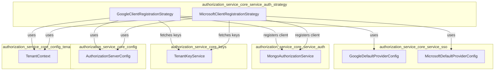
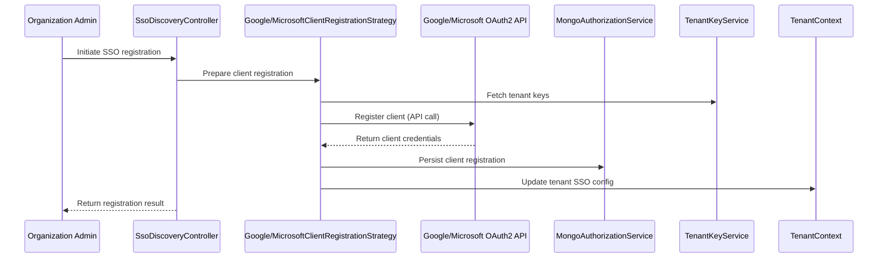

# authorization_service_core_service_auth_strategy

## Introduction

The `authorization_service_core_service_auth_strategy` module provides the core strategies for dynamic OAuth2 client registration with external identity providers, specifically Google and Microsoft. These strategies are essential for supporting Single Sign-On (SSO) and federated authentication in a multi-tenant authorization server context. The module is a key part of the broader authorization service, enabling organizations to register and manage their own OAuth2 clients for SSO integration.

## Core Components

- **GoogleClientRegistrationStrategy**: Handles dynamic client registration and configuration for Google as an OAuth2/OpenID Connect provider.
- **MicrosoftClientRegistrationStrategy**: Handles dynamic client registration and configuration for Microsoft (Azure AD) as an OAuth2/OpenID Connect provider.

## Purpose and Functionality

This module abstracts the provider-specific logic required to register, update, and manage OAuth2 clients for SSO. It enables the system to support multiple identity providers, each with their own registration requirements and configuration flows. The strategies encapsulate the details of interacting with provider APIs, mapping tenant-specific settings, and ensuring secure client management.

## Architecture Overview

The `authorization_service_core_service_auth_strategy` module is part of the authorization service's SSO subsystem. It interacts with other modules responsible for SSO configuration, tenant management, and client key management.

## Component Relationships and Data Flow

- **GoogleClientRegistrationStrategy** and **MicrosoftClientRegistrationStrategy**:
  - Receive SSO registration requests (typically via SSO registration processors/controllers).
  - Use provider-specific configuration from [authorization_service_core_service_sso.md].
  - Interact with [authorization_service_core_service_auth.md] to persist and manage registered OAuth2 clients.
  - Retrieve tenant-specific cryptographic keys from [authorization_service_core_keys.md].
  - Use global and tenant-specific configuration from [authorization_service_core_config.md] and [authorization_service_core_config_tenant.md].

### SSO Client Registration Flow

## Integration with the Authorization System

The strategies in this module are invoked by SSO registration processors and controllers, such as those in [authorization_service_core_controller.md] and [authorization_service_core_service_processor.md]. They are responsible for the provider-specific steps in the SSO onboarding process, ensuring that each tenant can securely and independently configure SSO with their chosen identity provider.

## Extensibility

The strategy pattern used in this module allows for easy extension to support additional identity providers in the future. New strategies can be implemented by following the same interface and integration points.

## Related Modules

- [authorization_service_core_service_sso.md]: Default provider configurations for SSO
- [authorization_service_core_service_auth.md]: Persistence and management of registered OAuth2 clients
- [authorization_service_core_keys.md]: Tenant key management
- [authorization_service_core_config.md]: Authorization server configuration
- [authorization_service_core_config_tenant.md]: Tenant context and configuration
- [authorization_service_core_controller.md]: SSO and tenant registration controllers
- [authorization_service_core_service_processor.md]: SSO registration processors

## Summary

The `authorization_service_core_service_auth_strategy` module is a critical part of the system's SSO and federated authentication capabilities. By encapsulating provider-specific client registration logic, it enables secure, scalable, and tenant-aware SSO integration with major identity providers like Google and Microsoft. For more details on related components, refer to the linked module documentation.
