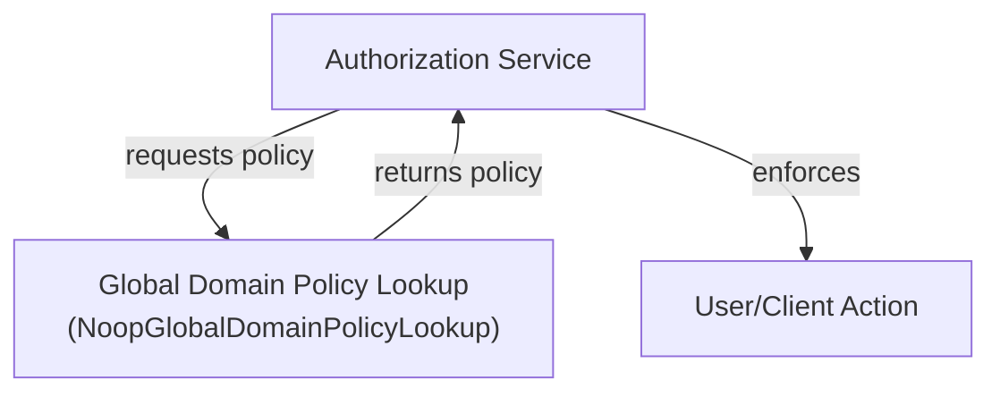
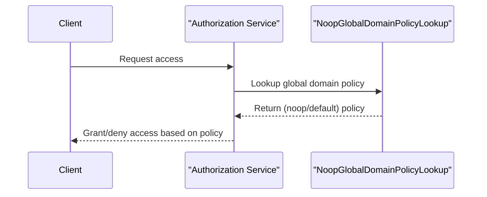

# authorization_service_core_service_policy Module Documentation

## Introduction

The `authorization_service_core_service_policy` module is a foundational part of the authorization service, responsible for providing domain policy lookup functionality within the system. Its primary role is to define and implement mechanisms for retrieving and applying global domain policies that govern authorization and access control across tenants and clients. This module is designed to be extensible, allowing for the integration of more complex policy lookup strategies as the system evolves.

### Core Component
- **NoopGlobalDomainPolicyLookup**: A no-operation (noop) implementation of the global domain policy lookup interface. It serves as a default or placeholder policy lookup, returning no policies or default behaviors. This is useful in scenarios where policy enforcement is optional, under development, or delegated to other modules.

## Module Purpose and Core Functionality

The main purpose of the `authorization_service_core_service_policy` module is to abstract the process of retrieving global domain policies that affect authorization decisions. By encapsulating policy lookup logic, it enables the authorization service to:

- Centralize policy management and enforcement
- Support multi-tenant and multi-client environments
- Allow for future extension with custom or dynamic policy sources
- Provide a default (noop) implementation for environments where no global policies are required

## Architecture and Component Relationships

The `authorization_service_core_service_policy` module is typically invoked by higher-level authorization services and processors that require policy information to make access control decisions. It interacts with other modules in the following ways:

- **authorization_service_core_service_auth**: Modules such as `MongoAuthorizationService` may depend on policy lookup to enforce or check global policies during authorization flows. See [authorization_service_core_service_auth.md](authorization_service_core_service_auth.md).
- **authorization_service_core_service_processor**: Registration and user deactivation processors may consult policy lookup to determine allowed actions. See [authorization_service_core_service_processor.md](authorization_service_core_service_processor.md).
- **authorization_service_core_config**: Security configuration may reference policy lookup to determine system-wide enforcement strategies. See [authorization_service_core_config.md](authorization_service_core_config.md).

### High-Level Architecture Diagram

### Component Interaction Flow

## Data Flow

- **Input**: Authorization requests from clients or users
- **Process**: Authorization service queries the policy lookup for applicable global domain policies
- **Output**: Policy information (or default/no policy) is used to make access control decisions

## Extensibility

The current implementation provides a no-operation policy lookup. To support more advanced scenarios, this module can be extended to:
- Integrate with external policy engines (e.g., OPA, custom rule engines)
- Support dynamic, tenant-specific, or client-specific policies
- Cache or audit policy lookups for compliance

## Dependencies

This module is designed to be loosely coupled. It may be referenced by:
- [authorization_service_core_service_auth.md](authorization_service_core_service_auth.md)
- [authorization_service_core_service_processor.md](authorization_service_core_service_processor.md)
- [authorization_service_core_config.md](authorization_service_core_config.md)

## Related Modules

- [authorization_service_core_service_auth.md](authorization_service_core_service_auth.md): Handles core authorization logic and may invoke policy lookup.
- [authorization_service_core_service_processor.md](authorization_service_core_service_processor.md): Processes registration and user deactivation, potentially consulting policies.
- [authorization_service_core_config.md](authorization_service_core_config.md): System security configuration, may reference policy lookup.

## Summary

The `authorization_service_core_service_policy` module provides a pluggable mechanism for global domain policy lookup within the authorization service. Its default noop implementation ensures system flexibility and paves the way for future enhancements in policy management and enforcement.
