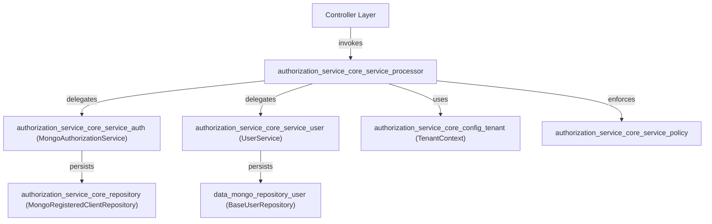
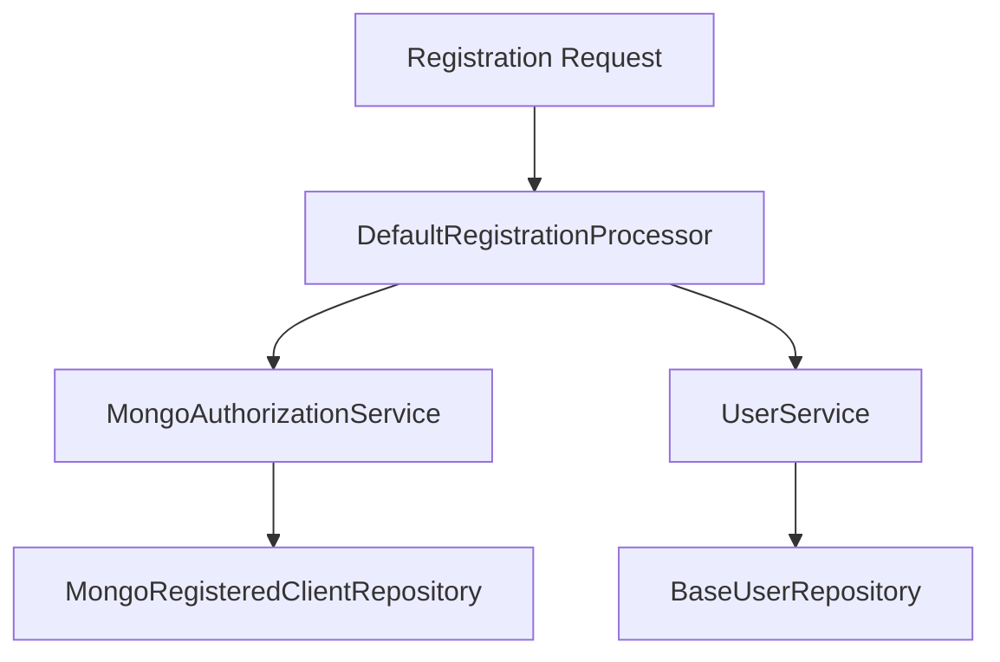

# authorization_service_core_service_processor Module Documentation

## Introduction

The `authorization_service_core_service_processor` module is a core part of the authorization service, responsible for handling key processing logic related to user registration and deactivation within a multi-tenant, SSO-enabled authorization system. It provides the main processors that orchestrate registration flows and user lifecycle management, integrating with authentication, tenant, and user management subsystems.

## Core Components

- **DefaultRegistrationProcessor**: Handles the registration process for new users or tenants, including SSO and invitation-based flows.
- **DefaultUserDeactivationProcessor**: Manages the deactivation of users, ensuring proper cleanup and policy enforcement.

## Architecture Overview

The processors in this module act as orchestrators, coordinating between controllers, service layers, and repositories. They ensure that registration and deactivation flows are consistent, secure, and compliant with organizational policies.

## Component Interactions

### Registration Flow
1. **Controller** receives a registration request (e.g., from [InvitationRegistrationController](authorization_service_core_controller.md)).
2. **DefaultRegistrationProcessor** validates the request, applies business logic, and coordinates with:
    - **MongoAuthorizationService** for authorization data
    - **UserService** for user record creation
    - **TenantContext** for multi-tenancy context
    - **Policy** for domain/global policy checks
3. Data is persisted via the appropriate repositories.

### User Deactivation Flow
1. **Controller** triggers a deactivation (e.g., via [UserController](api_service_core_controller.md)).
2. **DefaultUserDeactivationProcessor** ensures user is deactivated, cleans up related authorization, and enforces policies.

## Data Flow Diagram

## Dependencies

- [authorization_service_core_service_auth](authorization_service_core_service_auth.md): Authorization logic and persistence
- [authorization_service_core_service_user](authorization_service_core_service_user.md): User management
- [authorization_service_core_config_tenant](authorization_service_core_config_tenant.md): Tenant context and filtering
- [authorization_service_core_service_policy](authorization_service_core_service_policy.md): Policy enforcement
- [authorization_service_core_repository](authorization_service_core_repository.md): MongoDB repositories for registered clients
- [data_mongo_repository_user](data_mongo_repository_user.md): User data persistence

## Related Modules

- [authorization_service_core_controller](authorization_service_core_controller.md): Exposes registration and deactivation endpoints
- [authorization_service_core_service_sso](authorization_service_core_service_sso.md): SSO provider configuration
- [authorization_service_core_keys](authorization_service_core_keys.md): Key management for authentication

## Summary

The `authorization_service_core_service_processor` module is central to the secure and policy-compliant management of user and tenant registration and deactivation. It acts as the bridge between API endpoints, business logic, and data persistence, ensuring that all flows are handled consistently and securely in a multi-tenant environment.
