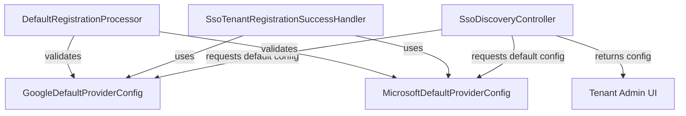
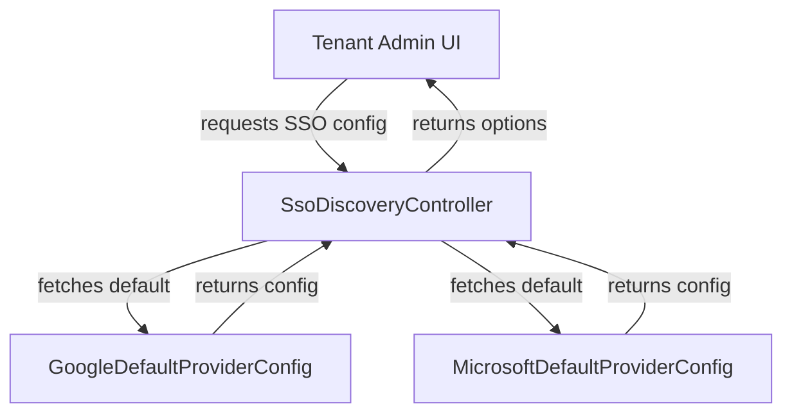
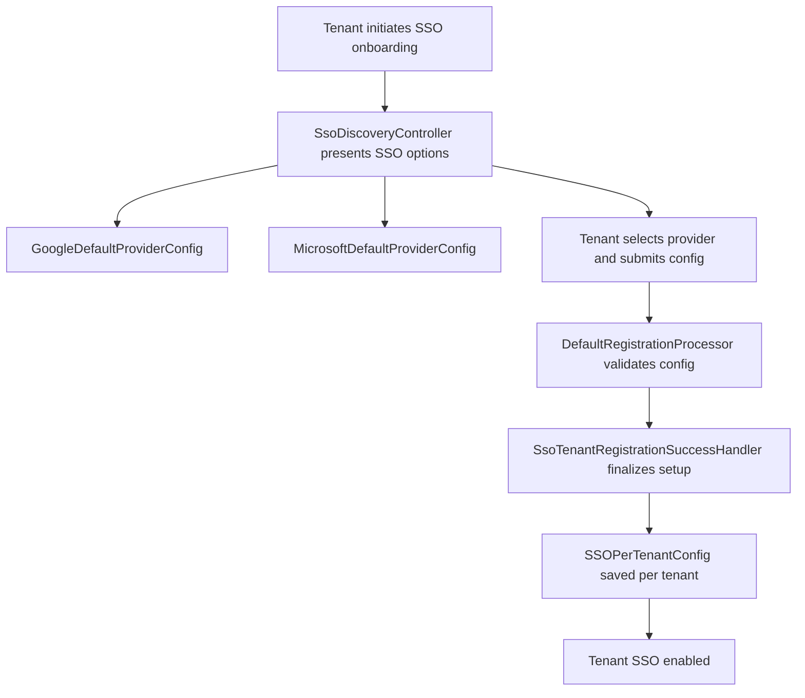

# authorization_service_core_service_sso Module Documentation

## Introduction

The `authorization_service_core_service_sso` module provides default configuration objects for Single Sign-On (SSO) integrations with major identity providers, specifically Google and Microsoft. These configurations are foundational for enabling SSO flows within the broader authorization service, supporting multi-tenant environments and dynamic client registration. The module is a key part of the SSO onboarding and authentication process, ensuring that tenants can leverage external identity providers securely and efficiently.

## Core Components

- **GoogleDefaultProviderConfig**: Supplies default configuration values for Google SSO integration, such as endpoints, scopes, and client metadata.
- **MicrosoftDefaultProviderConfig**: Supplies default configuration values for Microsoft SSO integration, including endpoints, scopes, and client metadata.

These components are typically used by SSO registration and discovery handlers, as well as SSO configuration processors, to bootstrap and validate SSO provider settings for new or existing tenants.

## Architecture Overview

The SSO configuration process in the authorization service involves several modules and components, with `authorization_service_core_service_sso` providing the default provider configurations. The following diagram illustrates the high-level architecture and data flow:

## Component Relationships and Dependencies

- **Controllers**: The [SsoDiscoveryController](authorization_service_core_controller.md) queries the default provider configs to present SSO options to tenant administrators during onboarding or SSO setup.
- **Security Handlers**: The [SsoTenantRegistrationSuccessHandler](authorization_service_core_security.md) and SSO registration flow handlers utilize these configs to finalize SSO setup and ensure correct provider metadata is used.
- **Processors**: The [DefaultRegistrationProcessor](authorization_service_core_service_processor.md) leverages the default configs to validate and initialize tenant-specific SSO settings.
- **Tenant Configuration**: The resulting SSO configuration is stored per tenant (see [SSOPerTenantConfig](data_mongo_document_tenant.md)), enabling multi-tenant SSO support.

## Data Flow: SSO Provider Configuration

## Integration with the Authorization Service

The `authorization_service_core_service_sso` module is not a standalone SSO engine, but a provider of default configuration objects. It is tightly integrated with the following modules:

- [authorization_service_core_controller](authorization_service_core_controller.md): Handles SSO discovery, registration, and tenant onboarding endpoints.
- [authorization_service_core_security](authorization_service_core_security.md): Manages SSO registration flow and success handling.
- [authorization_service_core_service_processor](authorization_service_core_service_processor.md): Processes registration and validation logic for SSO onboarding.
- [data_mongo_document_tenant](data_mongo_document_tenant.md): Stores per-tenant SSO configuration.

## Process Flow: SSO Onboarding

## Summary

The `authorization_service_core_service_sso` module is a foundational building block for SSO support in the authorization service. By centralizing default provider configurations, it enables secure, consistent, and scalable SSO onboarding for tenants across Google and Microsoft identity providers. For details on SSO registration flows, tenant configuration storage, and security handling, refer to the linked module documentation above.
