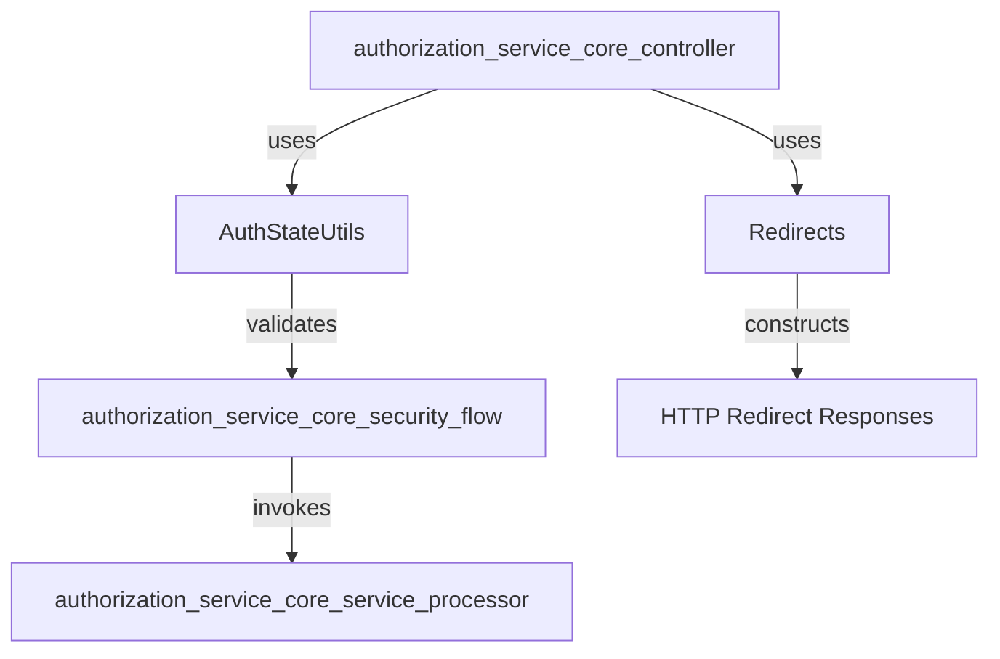
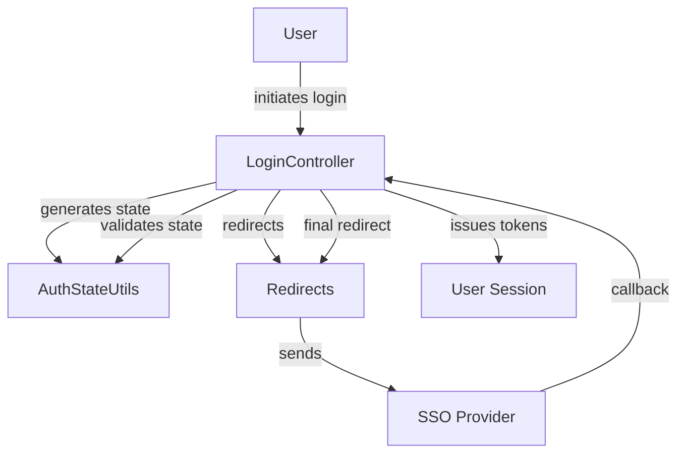
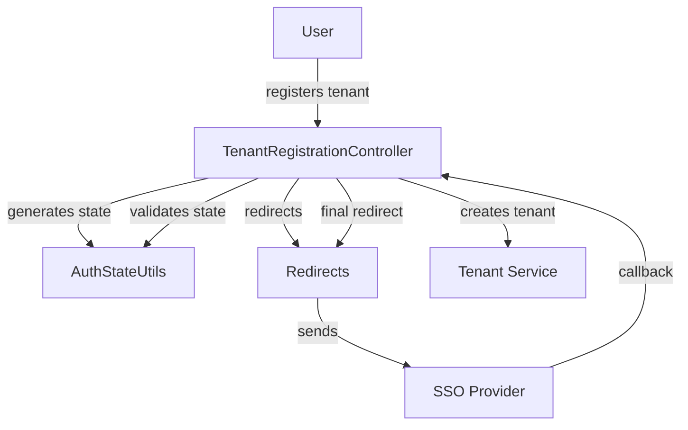

# authorization_service_core_web Module Documentation

## Introduction

The `authorization_service_core_web` module provides essential web-layer utilities and helpers for the authorization service within a multi-tenant, SSO-enabled authentication system. It primarily focuses on managing authentication state and handling web-based redirects, supporting the broader authorization and SSO registration flows. This module is a foundational part of the authorization service, ensuring seamless user experience and robust state management during authentication and registration processes.

## Core Functionality

The module exposes two main components:

- **AuthStateUtils**: Utilities for managing and validating authentication state, especially during SSO and multi-tenant flows.
- **Redirects**: Helpers for constructing and managing HTTP redirects, particularly for login, registration, and error handling scenarios.

These utilities are used by the module's controllers (see [authorization_service_core_controller.md]) and are integral to the SSO and tenant registration flows (see [authorization_service_core_security_flow.md]).

## Architecture Overview

The `authorization_service_core_web` module is positioned as a utility layer within the authorization service. It interacts with controllers, security handlers, and SSO processors, providing reusable logic for state and redirect management.

## Component Details

### AuthStateUtils

- **Purpose**: Provides methods to generate, validate, and parse authentication state parameters, which are critical for preventing CSRF attacks and maintaining context during SSO and OAuth flows.
- **Usage**: Utilized by login, SSO discovery, and tenant registration controllers to ensure the integrity of authentication requests.
- **Interactions**:
  - Works closely with SSO handlers (see [authorization_service_core_security_flow.md]) and registration processors ([authorization_service_core_service_processor.md]).
  - May interact with tenant context utilities ([authorization_service_core_config_tenant.md]) to ensure state is tenant-aware.

### Redirects

- **Purpose**: Centralizes logic for constructing HTTP redirects, including success, error, and intermediate redirects during authentication and registration.
- **Usage**: Used by controllers to direct users to appropriate endpoints (e.g., login, registration, error pages) based on authentication outcomes.
- **Interactions**:
  - Consumed by controllers ([authorization_service_core_controller.md]) and SSO handlers ([authorization_service_core_security_flow.md]).
  - Ensures consistent redirect patterns across the authorization service.

## Data Flow and Process Diagrams

### SSO Login Flow (Simplified)

### Tenant Registration Flow (Simplified)

## Module Dependencies and Integration

- **Controllers**: The module is tightly integrated with controllers such as `LoginController`, `TenantRegistrationController`, and `SsoDiscoveryController` ([authorization_service_core_controller.md]).
- **Security Flows**: Works with SSO and tenant registration handlers ([authorization_service_core_security_flow.md]).
- **Tenant Context**: May utilize tenant context utilities ([authorization_service_core_config_tenant.md]) to ensure multi-tenancy support.
- **Processors**: Supports registration and user deactivation processors ([authorization_service_core_service_processor.md]).

## Related Modules

- [authorization_service_core_controller.md]: Controllers for login, registration, SSO, and tenant management
- [authorization_service_core_security_flow.md]: SSO and tenant registration flow handlers
- [authorization_service_core_config_tenant.md]: Tenant context and filtering utilities
- [authorization_service_core_service_processor.md]: Registration and user deactivation processors

## Summary

The `authorization_service_core_web` module is a foundational utility layer for the authorization service, providing robust state management and redirect handling for authentication and registration flows. Its utilities are critical for secure, consistent, and user-friendly SSO and multi-tenant experiences.
