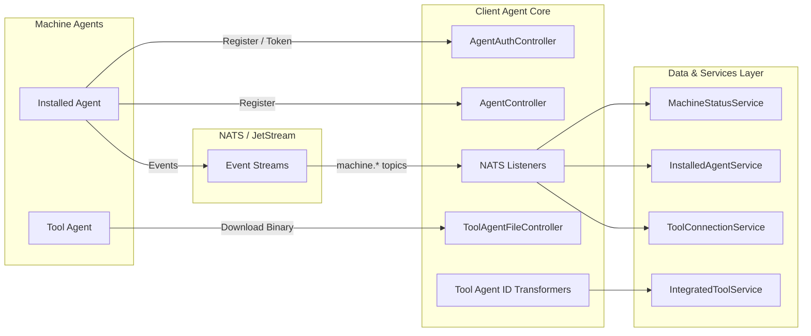
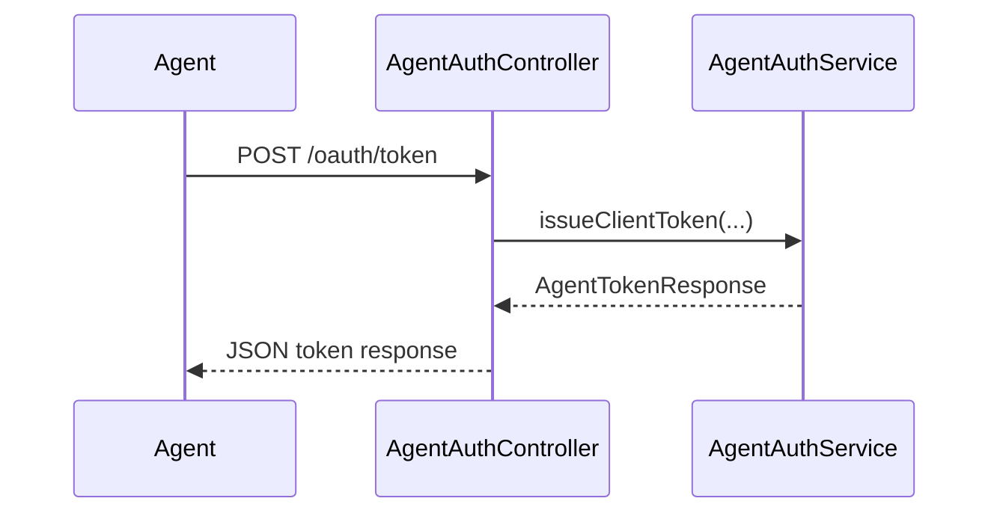
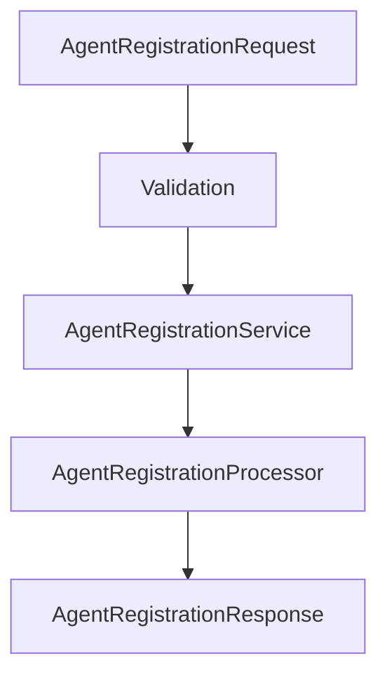
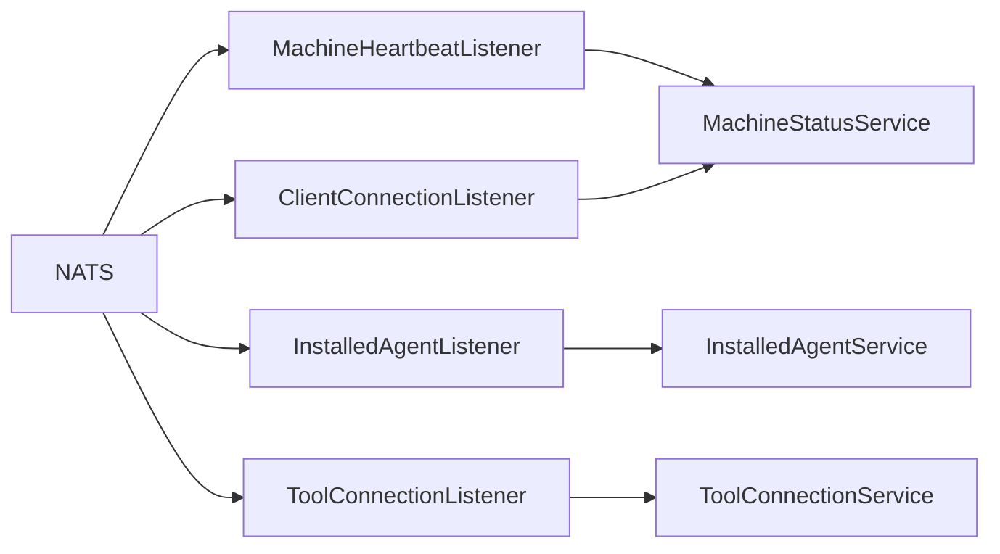
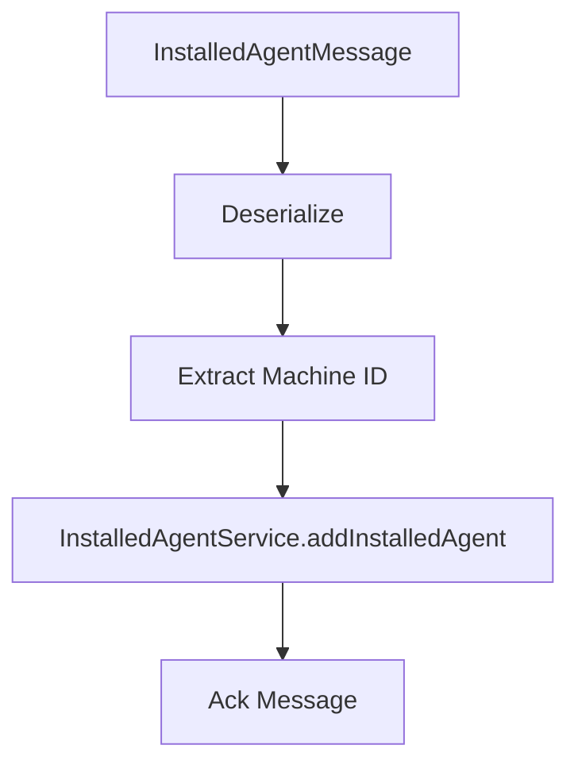
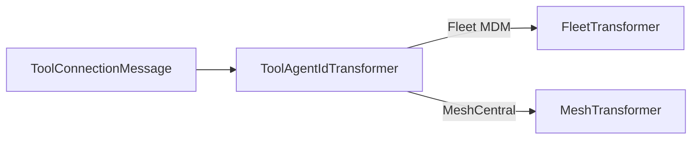
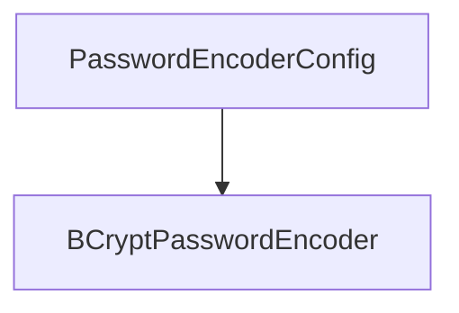

# Client Agent Core

The **Client Agent Core** module is responsible for managing machine-level agents within the OpenFrame platform. It provides:

- Agent registration and authentication
- Machine lifecycle tracking (online, offline, heartbeat)
- Tool connection and installed agent processing
- Tool-specific agent ID transformation
- Lightweight artifact delivery for tool agents

This module acts as the bridge between deployed machine agents and the broader OpenFrame backend ecosystem, integrating with messaging (NATS/JetStream), data services, and integrated tool providers.

---

## Architectural Overview

The Client Agent Core sits between machine agents and the rest of the OpenFrame platform.



### Key Responsibilities

1. **Authentication & Token Issuance** – Provides OAuth-style token endpoint for agents.
2. **Agent Registration** – Registers new machines into the system.
3. **Machine State Tracking** – Processes heartbeats and connection events.
4. **Tool Lifecycle Tracking** – Tracks tool installations and connections.
5. **Tool-Specific Identity Normalization** – Transforms tool-native identifiers into platform identifiers.
6. **Binary Distribution (Temporary)** – Serves tool agent artifacts.

---

## HTTP Layer

### 1. AgentAuthController

**Endpoint:** `POST /oauth/token`

Handles client credential and refresh token flows for machine agents.

**Core Behavior:**
- Delegates to `AgentAuthService`
- Returns `AgentTokenResponse`
- Handles invalid grant types and authentication failures



---

### 2. AgentController

**Endpoint:** `POST /api/agents/register`

Registers a machine using:
- `X-Initial-Key` header
- `AgentRegistrationRequest` payload

The request includes:
- Hostname and organization
- Network identifiers (IP, MAC, OS UUID)
- Hardware metadata
- OS metadata
- Agent version and status



The `DefaultAgentRegistrationProcessor` provides a no-op extension hook and can be overridden to inject custom post-processing logic.

---

### 3. ToolAgentFileController

**Endpoint:** `GET /tool-agent/{assetId}?os={os}`

Currently provides temporary, hardcoded binary resolution logic.

- Selects binary based on `os`
- Loads artifact from classpath
- Throws errors for unknown OS or missing resources

> Note: Marked for removal once artifact delivery is implemented via GitHub or external distribution.

---

## Event-Driven Architecture (NATS / JetStream)

Client Agent Core consumes events from NATS subjects to maintain real-time machine and tool state.

### Event Subjects

- `machine.*.heartbeat`
- `machine.*.installed-agent`
- `machine.*.tool-connection`
- `machine connected/disconnected`



---

## Listeners

### 1. MachineHeartbeatListener

- Subscribes to `machine.*.heartbeat`
- Extracts machine ID from subject
- Updates machine online timestamp
- Uses `MachineStatusService`

This ensures machine liveness detection.

---

### 2. ClientConnectionListener

Processes:
- Machine connected
- Machine disconnected

Uses `ClientConnectionEvent` to:
- Mark machines online/offline
- Persist event timestamps

---

### 3. InstalledAgentListener (JetStream)

Consumes from stream: `INSTALLED_AGENTS`

Features:
- Durable consumer
- Explicit ACK
- Retry up to 50 deliveries
- Dead-letter style fallback via `lastAttempt`



If processing fails:
- Message is not acknowledged
- JetStream retries until max delivery

---

### 4. ToolConnectionListener (JetStream)

Consumes from stream: `TOOL_CONNECTIONS`

Handles:
- Tool type
- Agent tool ID
- Delivery count awareness

Delegates to `ToolConnectionService`.

Explicit acknowledgment ensures reliable processing.

---

## Tool Agent ID Transformation

The module provides a pluggable transformation strategy per tool type.



### FleetMdmAgentIdTransformer

Responsibilities:
- Fetch integrated tool configuration
- Retrieve API URL and credentials
- Query Fleet MDM via SDK
- Map UUID → Fleet host ID

Behavior:
- If exact match found → return Fleet host ID
- If no match and last attempt → return original UUID
- Otherwise → throw exception (forces retry)

This ensures consistency between OpenFrame and Fleet MDM host identity.

---

### MeshCentralAgentIdTransformer

Simple transformation strategy:

```text
Original ID: abc123
Transformed: node//abc123
```

Adds required MeshCentral prefix to normalize identifiers.

---

## Security Configuration

### PasswordEncoderConfig

Defines:



Provides a `PasswordEncoder` bean using BCrypt for secure credential hashing.

---

## Metrics Support

### MetricsMessage

Represents machine metrics payload:

- `machineId`
- `cpu`
- `memory`
- `timestamp`

Designed for ingestion into analytics or stream processing modules.

---

## Extension Points

Client Agent Core is designed for extensibility:

1. **AgentRegistrationProcessor** – Override default post-processing.
2. **ToolAgentIdTransformer** – Add new tool integration logic.
3. **Messaging Configuration** – Replace or enhance NATS consumers.
4. **Artifact Distribution** – Replace temporary file controller.

---

## Reliability Characteristics

- Explicit JetStream acknowledgment
- Configurable retry behavior
- Delivery-group-based consumer isolation
- Graceful shutdown via dispatcher draining
- Separation of HTTP and event-driven concerns

---

## How It Fits into the OpenFrame Ecosystem

Client Agent Core works alongside:

- Data modules for persistence
- Authorization services for OAuth flows
- Management services for tool configuration
- Stream processing for analytics

It is the **machine-facing execution boundary** of the OpenFrame platform, ensuring secure onboarding, consistent identity management, and real-time operational visibility of managed devices.

---

# Summary

The **Client Agent Core** module provides:

- Secure machine authentication
- Agent registration lifecycle
- Real-time connection and heartbeat tracking
- Reliable tool installation and connection processing
- Tool-specific identity normalization

It is a critical runtime component that transforms distributed machine events into consistent, actionable platform state within OpenFrame.
