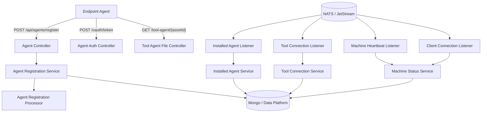
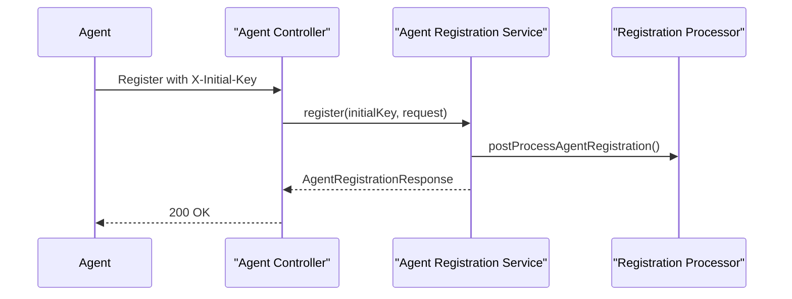
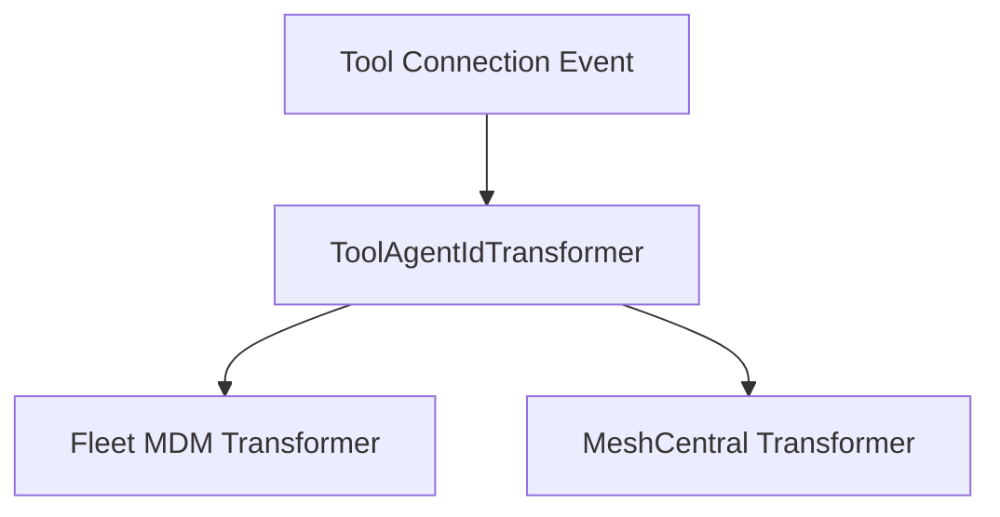

# Client Agent Service Core

The **Client Agent Service Core** module is responsible for managing machine agents, tool agents, and client authentication within the OpenFrame platform. It acts as the bridge between endpoint machines (clients), integrated tools (such as Fleet MDM and MeshCentral), and the broader OpenFrame backend ecosystem.

This module provides:

- Agent registration and lifecycle handling
- OAuth-based client authentication
- Tool agent file delivery
- Real-time event processing via NATS and JetStream
- Agent and tool ID transformation logic
- Extension points for custom registration workflows

It plays a critical role in ensuring that machines and integrated tools are correctly identified, authenticated, and synchronized with the rest of the platform.

---

## Architectural Overview

The Client Agent Service Core sits between endpoint agents and the internal data and messaging layers.



### Key Responsibilities

1. **Inbound HTTP APIs** for agent registration and OAuth token issuance.
2. **Event-driven processing** of machine and tool lifecycle updates via NATS.
3. **Agent identity normalization** for external integrated tools.
4. **Machine status tracking** through heartbeat and connection events.
5. **Extensibility hooks** for custom registration post-processing.

---

# HTTP Layer

## Agent Authentication

### AgentAuthController

`/oauth/token`

The `AgentAuthController` exposes an OAuth-style token endpoint for client agents.

Supported request parameters:

- `grant_type`
- `refresh_token`
- `client_id`
- `client_secret`

It delegates authentication and token issuance to `AgentAuthService` and returns an `AgentTokenResponse`.

Error handling behavior:

- `IllegalArgumentException` → HTTP 401
- Any other exception → HTTP 400 with `server_error`

This endpoint allows agents to securely authenticate before interacting with other platform services.

---

## Agent Registration

### AgentController

`POST /api/agents/register`

Handles initial agent registration.



The request body (`AgentRegistrationRequest`) contains:

- Core identification (hostname, organizationId)
- Network information (IP, MAC, OS UUID)
- Agent version and status
- Hardware details
- OS metadata

Registration is protected by the `X-Initial-Key` header to ensure controlled onboarding.

---

## Tool Agent File Delivery

### ToolAgentFileController

`GET /tool-agent/{assetId}?os={os}`

Provides binary artifacts for tool agents.

Current behavior:

- Returns classpath resources
- Applies OS-specific filename logic
- Throws `IllegalArgumentException` for unsupported OS

This controller is marked as temporary and intended to be replaced by a proper artifact distribution mechanism.

---

# Event-Driven Architecture (NATS + JetStream)

The Client Agent Service Core consumes multiple event streams to maintain real-time state.

## Machine Heartbeats

### MachineHeartbeatListener

Subject pattern:

```text
machine.*.heartbeat
```

Behavior:

- Extracts machine ID from subject
- Generates service-side timestamp
- Calls `MachineStatusService.processHeartbeat()`

This ensures near real-time liveness tracking.

---

## Client Connection Events

### ClientConnectionListener

Handles:

- Machine connected
- Machine disconnected

Consumes JSON payloads (`ClientConnectionEvent`) and updates machine state via `MachineStatusService`.

Fallback logic exists for cases where NATS is unavailable.

---

## Installed Agent Events (JetStream)

### InstalledAgentListener

Stream: `INSTALLED_AGENTS`  
Subject: `machine.*.installed-agent`

Uses durable JetStream consumers with:

- Explicit acknowledgments
- Configurable `ackWait`
- `maxDeliver` retry logic
- Delivery groups for horizontal scaling


If processing fails:

- Message is not acknowledged
- JetStream retries until `maxDeliver` is reached

The `lastAttempt` flag allows fallback logic when retries are exhausted.

---

## Tool Connection Events (JetStream)

### ToolConnectionListener

Stream: `TOOL_CONNECTIONS`  
Subject: `machine.*.tool-connection`

Responsibilities:

- Extract machine ID
- Deserialize `ToolConnectionMessage`
- Invoke `ToolConnectionService.addToolConnection()`
- Explicit acknowledgment

This enables dynamic synchronization between machines and integrated tools.

---

# Agent Registration Processing

## DefaultAgentRegistrationProcessor

The module defines an extension interface `AgentRegistrationProcessor`.

`DefaultAgentRegistrationProcessor`:

- Is conditionally loaded
- Provides a no-op implementation
- Allows custom implementations to override post-registration behavior

This pattern enables:

- Custom validation
- Additional metadata enrichment
- Third-party integrations

---

# Tool Agent ID Transformation

Some integrated tools use identifiers that do not match OpenFrame internal IDs. This module provides transformation strategies.



## FleetMdmAgentIdTransformer

- Tool type: `FLEET_MDM`
- Retrieves tool configuration via `IntegratedToolService`
- Calls Fleet MDM API using `FleetMdmClient`
- Searches hosts by UUID
- Transforms UUID → Fleet host ID

Behavior:

- Filters hosts by exact UUID
- Ensures OS data exists
- Uses fallback behavior if `lastAttempt` is true

This ensures consistent mapping between Fleet-managed devices and OpenFrame machines.

---

## MeshCentralAgentIdTransformer

- Tool type: `MESHCENTRAL`
- Prefixes ID with `node//`

Example transformation:

```text
originalId → node//originalId
```

This ensures compatibility with MeshCentral’s expected identifier format.

---

# Security & Password Encoding

## PasswordEncoderConfig

Defines a Spring `PasswordEncoder` bean using `BCryptPasswordEncoder`.

```text
PasswordEncoder → BCryptPasswordEncoder
```

This ensures secure hashing of sensitive credentials within the client authentication workflow.

---

# Reliability & Resilience Patterns

The Client Agent Service Core implements several reliability strategies:

- **Explicit JetStream acknowledgments**
- **Durable consumers**
- **Delivery groups for horizontal scaling**
- **Max delivery retry limits**
- **Graceful shutdown via dispatcher draining**
- **Last-attempt fallback logic for ID transformation**

These patterns ensure that:

- Events are not lost
- Processing is idempotent
- Transient failures are retried
- Manual intervention remains possible when automated transformation fails

---

# How This Module Fits in the Overall System

The Client Agent Service Core is the runtime boundary for endpoint machine interaction.

It integrates with:

- Data persistence layers (Mongo, Cassandra, Pinot)
- Messaging layers (NATS, JetStream, Kafka indirectly)
- Integrated tool services
- Authentication and authorization infrastructure

It acts as:

- The **ingress point** for machine registration
- The **synchronization engine** for tool installations
- The **liveness tracker** for machines
- The **identity normalization layer** for third-party integrations

Without this module, machines could not securely register, report status, or integrate with external tooling.

---

# Summary

The **Client Agent Service Core** module provides:

- Secure OAuth-based client authentication
- Controlled machine onboarding
- Real-time machine lifecycle management
- Tool connection synchronization
- External tool identity normalization
- Extensible registration processing

It is a foundational component in the OpenFrame platform, enabling reliable, secure, and scalable machine-agent orchestration.