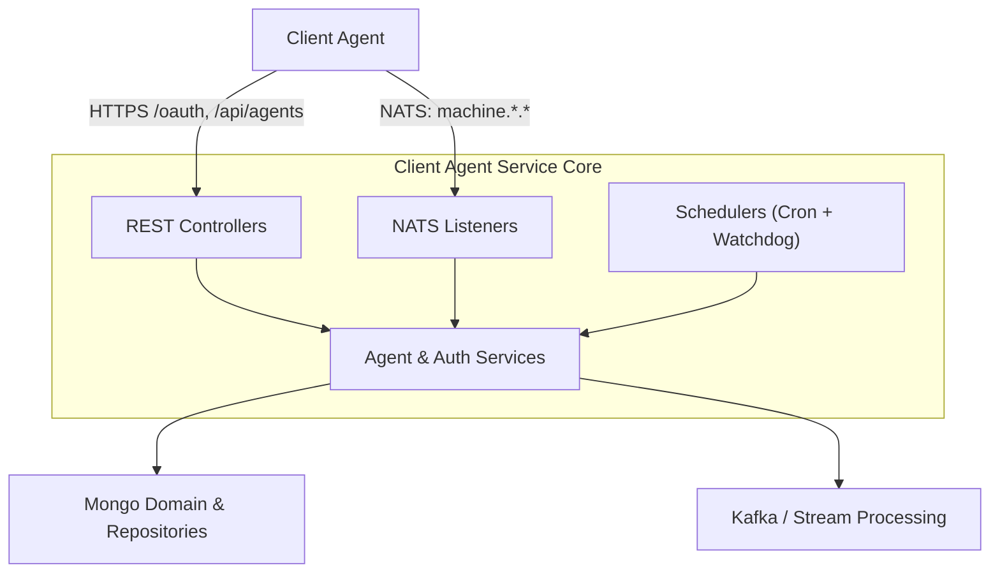
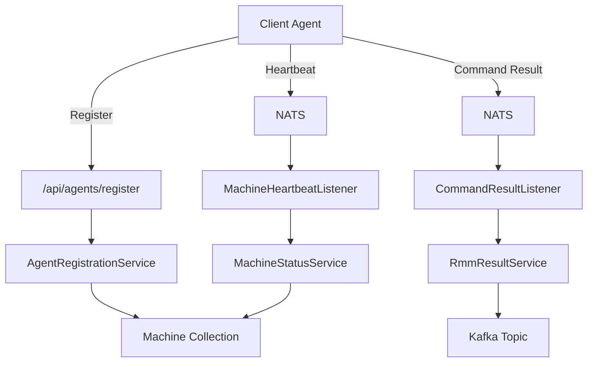

# Client Agent Service Core

## Overview

The **Client Agent Service Core** module is responsible for managing the lifecycle, connectivity, and execution feedback of OpenFrame client agents. It acts as the primary backend entry point for:

- Agent registration and reinstallation
- Agent authentication (OAuth client credentials / refresh flow)
- Machine connectivity and heartbeat tracking
- Command and script result ingestion
- Tool connection tracking via JetStream
- Time-driven RMM script scheduling and watchdog enforcement

This module integrates with the data layer (Mongo domain + repositories), stream-processing services (Kafka), and messaging infrastructure (NATS / JetStream).

---

## High-Level Architecture

```mermaid
flowchart TD
    Agent["Client Agent"] -->|"HTTPS /oauth, /api/agents"| Controllers["REST Controllers"]
    Agent -->|"NATS: machine.*.*"| Listeners["NATS Listeners"]

    Controllers --> Services["Agent & Auth Services"]
    Listeners --> Services

    Services --> Mongo["Mongo Domain & Repositories"]
    Services --> Kafka["Kafka / Stream Processing"]

    Schedulers["Schedulers (Cron + Watchdog)"] --> Services

    subgraph client_agent_service_core["Client Agent Service Core"]
        Controllers
        Listeners
        Schedulers
        Services
    end
```

The module is internally organized into the following sub-modules:

- [Configuration](client-agent-service-core/configuration/configuration.md)
- [REST Controllers](client-agent-service-core/rest_controllers/rest_controllers.md)
- [NATS Listeners](client-agent-service-core/nats_listeners/nats_listeners.md)
- [Schedulers](client-agent-service-core/schedulers/schedulers.md)
- [Agent Registration Processor](client-agent-service-core/agent_registration_processor/agent_registration_processor.md)

Each sub-module encapsulates a distinct concern and can be extended or replaced via Spring configuration.

---

## Core Responsibilities

### 1. Agent Authentication

The module exposes an OAuth-compatible token endpoint for agents. It delegates credential validation and token issuance to the internal authentication service layer.

- Endpoint: `POST /oauth/token`
- Supports `grant_type`, `client_id`, `client_secret`, and `refresh_token`

This ensures that agents can securely authenticate before interacting with other platform services.

---

### 2. Agent Registration & Reinstallation

The service provides endpoints for:

- Initial agent registration (using `X-Initial-Key`)
- Agent reinstallation (validated with `X-Machine-Id` and `X-Client-Secret`)

Registration flows integrate with:

- Machine persistence (Mongo domain model)
- Custom post-processing hooks via the Agent Registration Processor

---

### 3. Real-Time Messaging via NATS

The module consumes agent-emitted messages over NATS and JetStream:

- `machine.*.heartbeat`
- `machine.*.command-execution.result`
- `machine.*.script-execution.result`
- `machine.*.tool-connection`

Processing results may:

- Update machine status
- Persist execution results
- Relay enriched events to Kafka

---

### 4. RMM Scheduling & Execution Safety

Two time-based processes are provided:

1. **Schedule Runner** – Executes due script schedules on a half-hour UTC grid.
2. **Execution Watchdog** – Detects and marks stuck executions.

Distributed locking is enforced via ShedLock to prevent duplicate dispatch across replicas.

---

## End-to-End Flow Example

```mermaid
flowchart TD
    Agent["Client Agent"] -->|"Register"| RegisterAPI["/api/agents/register"]
    RegisterAPI --> RegService["AgentRegistrationService"]
    RegService --> Mongo["Machine Collection"]

    Agent -->|"Heartbeat"| NATS["NATS"]
    NATS --> HeartbeatListener["MachineHeartbeatListener"]
    HeartbeatListener --> StatusService["MachineStatusService"]
    StatusService --> Mongo

    Agent -->|"Command Result"| NATS2["NATS"]
    NATS2 --> CmdListener["CommandResultListener"]
    CmdListener --> RmmService["RmmResultService"]
    RmmService --> Kafka["Kafka Topic"]
```

---

## Integration Points

The Client Agent Service Core integrates with:

- **Mongo Domain Model & Sync Repositories** – For Machine, ScriptExecution, CommandExecution, Tool connections
- **Stream Processing Core** – For Kafka publishing and enrichment
- **Authorization Service Core** – For OAuth flows and secure client validation
- **Gateway Service Core** – For upstream routing and API key enforcement

To avoid duplication, refer to the respective module documentation for persistence, stream processing, and authorization internals.

---

## Design Principles

- **Event-driven ingestion** using NATS (core + JetStream)
- **Separation of transport and business logic** (listeners delegate to services)
- **Extensibility via Spring conditional beans**
- **Distributed safety** via ShedLock
- **Fail-safe processing** (explicit ACK, max redelivery for tool events)

---

## Summary

The Client Agent Service Core is the operational backbone of the OpenFrame agent ecosystem. It bridges agent-side execution and central platform intelligence by combining REST APIs, NATS ingestion, Kafka relays, scheduled execution, and machine lifecycle management into a cohesive, extensible service layer.
