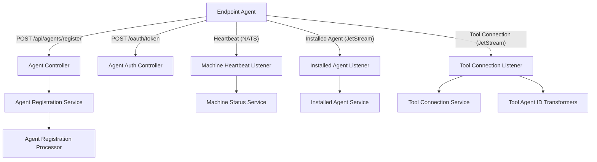
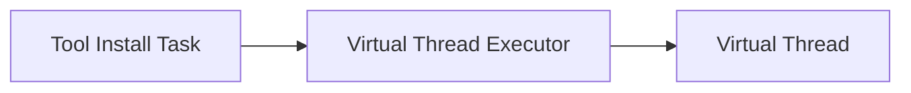
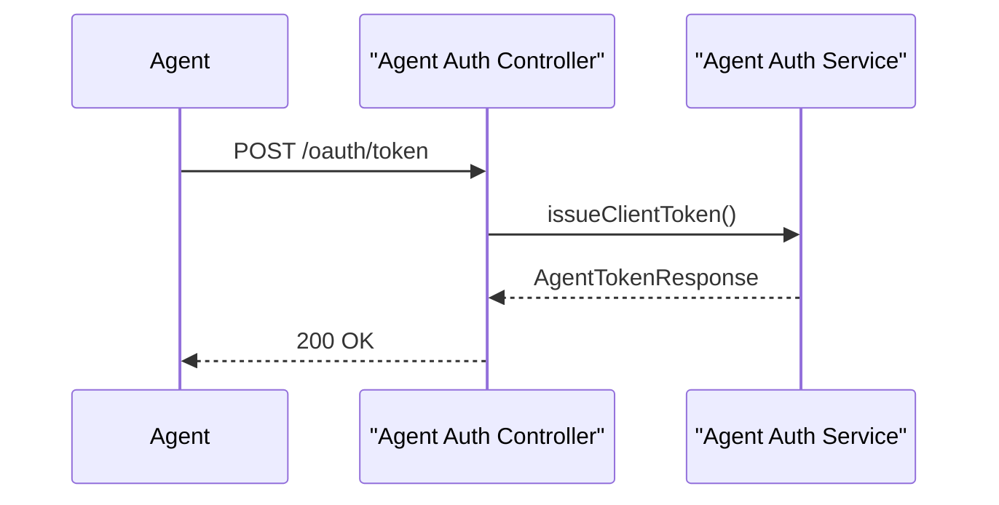
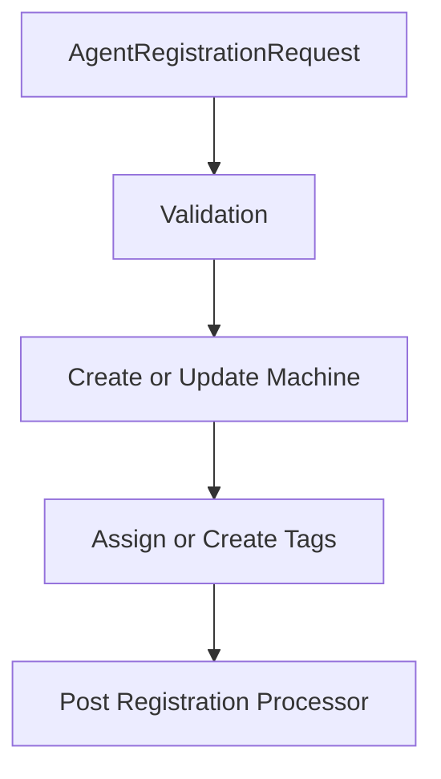
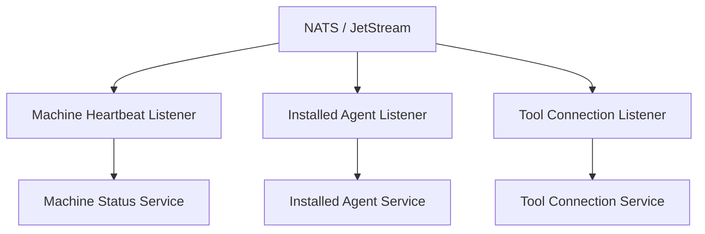
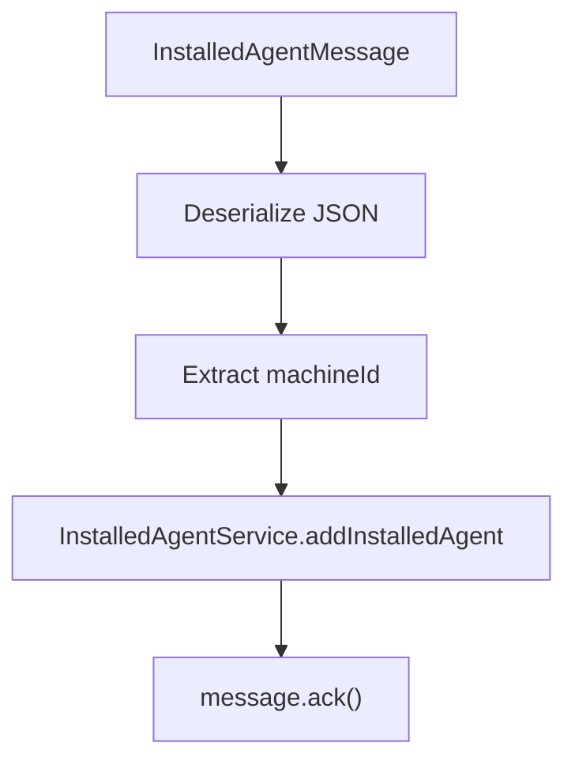

# Client Core Agent Ingress

## Overview

The **Client Core Agent Ingress** module is the primary entry point for endpoint agents and tool agents into the OpenFrame platform. It is responsible for:

- Agent registration and reinstallation
- OAuth-based client token issuance
- Tool agent binary delivery (temporary stub implementation)
- Processing real-time machine lifecycle and tool events from NATS
- Transforming external tool-specific identifiers into OpenFrame-compatible identifiers
- Asynchronous processing of tool installations

This module acts as the **ingress boundary between edge devices (agents) and the OpenFrame backend**, translating HTTP and messaging inputs into domain-level operations.

---

## High-Level Responsibilities

1. **Agent Onboarding** – Register and reinstall endpoint agents.
2. **Authentication** – Issue OAuth tokens for agents.
3. **Machine State Tracking** – Process heartbeats and connection events.
4. **Tool Integration Mapping** – Normalize external tool agent identifiers.
5. **Event-Driven Updates** – Consume NATS JetStream and Core NATS subjects.
6. **Async Execution** – Run installation-related tasks using virtual threads.

---

## Architecture Overview

The module exposes HTTP endpoints and subscribes to messaging streams. It bridges incoming traffic into internal services and data models.

---

# Configuration Layer

## Async Configuration

**Component:** `AsyncConfig`

- Enables Spring asynchronous execution.
- Defines `toolInstallExecutor` using `Executors.newVirtualThreadPerTaskExecutor()`.

### Why Virtual Threads?

- Lightweight concurrency
- High parallelism for tool installation tasks
- Reduced thread contention under heavy load

---

## Password Encoding

**Component:** `PasswordEncoderConfig`

- Provides a `BCryptPasswordEncoder` bean.
- Used for secure credential handling (e.g., client secrets).

---

# HTTP API Layer

## 1. Agent Authentication

**Controller:** `AgentAuthController`

### Endpoint

`POST /oauth/token`

### Supported Inputs

- `grant_type`
- `refresh_token`
- `client_id`
- `client_secret`

### Behavior

- Delegates to `AgentAuthService.issueClientToken(...)`
- Returns:
  - 200 with `AgentTokenResponse`
  - 401 for invalid credentials
  - 400 for server errors

---

## 2. Agent Registration

**Controller:** `AgentController`

### Endpoints

- `POST /api/agents/register`
- `POST /api/agents/reinstall`

### Required Headers

- `X-Initial-Key`
- `X-Machine-Id` (reinstall only)
- `X-Client-Secret` (reinstall only)

### Request Body

`AgentRegistrationRequest`

Includes:

- Core identity (hostname, organizationId)
- Network info (IP, MAC, UUID)
- OS and hardware metadata
- Tags (`AgentRegistrationTagInput`)

### Tag Auto-Creation

If a tag key does not exist in the organization, it is auto-created as a CUSTOM tag.

---

## 3. Tool Agent File Delivery (Temporary)

**Controller:** `ToolAgentFileController`

Endpoint:

`GET /tool-agent/{assetId}?os=mac|windows`

Current behavior:

- Returns static classpath resources.
- Throws error for unsupported OS or missing assets.
- Intended to be replaced by GitHub artifact-based distribution.

---

# DTO Layer

## AgentRegistrationRequest

Defines all metadata required to register a machine.

Key fields:

- `hostname`
- `organizationId`
- `agentVersion`
- `DeviceType`
- `DeviceStatus`
- `tags`

Ensures strong validation with `@NotBlank` and nested `@Valid`.

---

## AgentRegistrationTagInput

Used during registration to:

- Create tag if missing
- Assign multiple values

---

## CreateClientRequest

Defines OAuth client creation properties:

- `grantTypes`
- `scopes`

---

## MetricsMessage

Represents machine metrics:

- `machineId`
- `cpu`
- `memory`
- `timestamp`

Used for telemetry ingestion pipelines.

---

# Event-Driven Architecture

The module subscribes to NATS subjects and JetStream streams.

---

## 1. MachineHeartbeatListener

Subject:

`machine.*.heartbeat`

Behavior:

- Extracts machineId from subject
- Generates server-side timestamp
- Calls `MachineStatusService.processHeartbeat(...)`

Characteristics:

- Uses NATS dispatcher threads
- Graceful drain on shutdown

---

## 2. ClientConnectionListener

Handles:

- Machine connected
- Machine disconnected

Updates machine online/offline state via `MachineStatusService`.

---

## 3. InstalledAgentListener (JetStream)

Stream: `INSTALLED_AGENTS`

Subject pattern:

`machine.*.installed-agent`

Features:

- Durable consumer
- Explicit ACK policy
- Redelivery up to 50 attempts
- Last-attempt detection

Processing flow:

If processing fails:

- Message is not acknowledged
- JetStream redelivers

---

## 4. ToolConnectionListener (JetStream)

Stream: `TOOL_CONNECTIONS`

Subject pattern:

`machine.*.tool-connection`

Responsibilities:

- Deserialize `ToolConnectionMessage`
- Transform agent tool ID
- Delegate to `ToolConnectionService`
- Explicit ACK on success

---

# Tool Agent ID Transformation

The module provides pluggable `ToolAgentIdTransformer` implementations.

## FleetMdmAgentIdTransformer

Purpose:

- Converts Fleet MDM UUID into numeric host ID.

Steps:

1. Fetch tool configuration via `IntegratedToolService`.
2. Resolve API URL via `ToolUrlService`.
3. Query Fleet MDM using `FleetMdmClient`.
4. Select best matching host.
5. Return numeric host ID.

Fallback behavior:

- Retry until max delivery reached.
- On last attempt, fallback to original UUID.

---

## MeshCentralAgentIdTransformer

Purpose:

- Normalize MeshCentral node IDs.

Modes:

- Legacy: `node//{id}`
- Tenant-scoped: `node/{tenantId}/{id}`

Configuration-driven behavior:

- `openframe.cluster-id`
- `openframe.client.meshcentral.tenant-scoped-node-id`

---

# Extension Points

## AgentRegistrationProcessor

`DefaultAgentRegistrationProcessor` provides a no-op implementation.

Custom implementations can:

- Enrich machine metadata
- Trigger additional provisioning logic
- Integrate with external systems

Spring will use a custom bean if provided.

---

# Concurrency & Reliability

## Concurrency

- Virtual thread executor for installation tasks
- NATS dispatcher-managed threads

## Reliability

- JetStream durable consumers
- Explicit acknowledgment
- Max delivery tracking
- Graceful shutdown (`@PreDestroy` cleanup)

---

# Integration with the Wider System

The Client Core Agent Ingress module integrates with:

- Data models (Machine, Device, Tool documents)
- Tool services (Fleet MDM, MeshCentral)
- NATS messaging infrastructure
- Machine status and registration services

It forms the **first processing boundary** for all endpoint-originated traffic before data flows deeper into domain services, persistence, analytics, and automation layers.

---

# Summary

The **Client Core Agent Ingress** module is a hybrid HTTP + messaging ingress service responsible for:

- Secure agent onboarding
- Real-time lifecycle tracking
- Tool integration normalization
- Reliable event processing
- Async installation handling

It ensures that edge devices are consistently authenticated, registered, tracked, and integrated into the broader OpenFrame ecosystem with high reliability and extensibility.