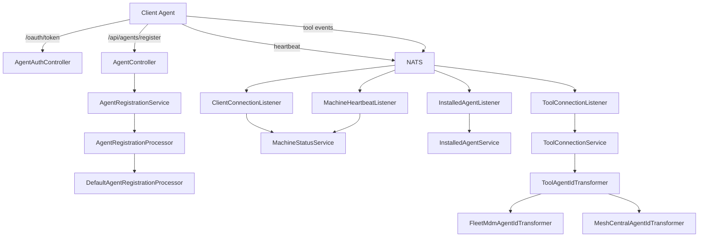
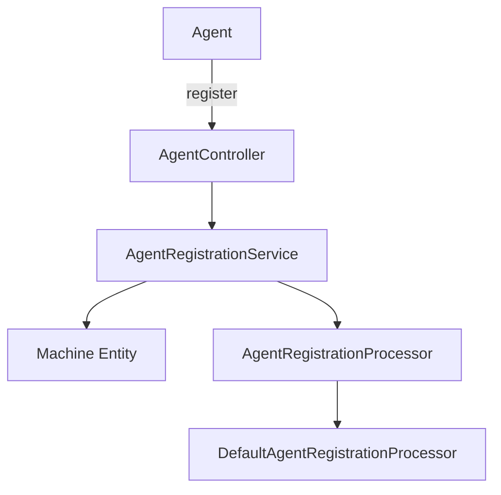
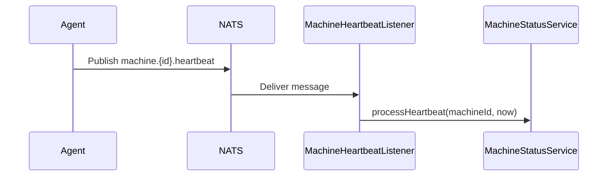
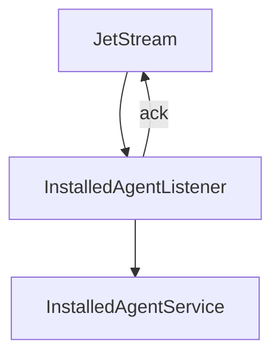
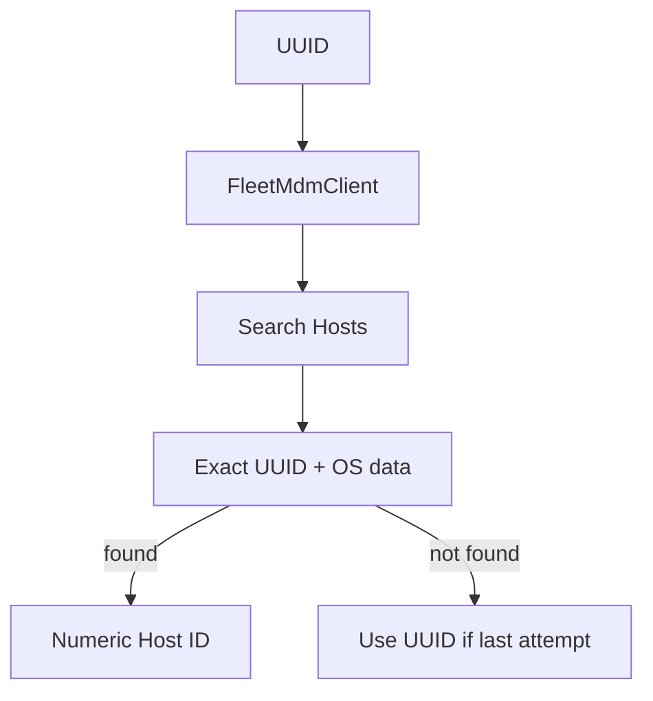

# Client Service Core

## Overview

The **Client Service Core** module is responsible for managing client machines (agents) within the OpenFrame platform. It provides:

- Agent authentication and token issuance
- Agent registration and lifecycle handling
- Tool agent file delivery
- Real-time machine connectivity tracking (heartbeat, connect/disconnect)
- Installed tool and tool-connection processing via NATS JetStream
- Agent tool ID transformation for integrated tools (Fleet MDM, MeshCentral)

This module acts as the bridge between:

- Edge agents running on client machines
- Messaging infrastructure (NATS / JetStream)
- Tool integrations (Fleet MDM, MeshCentral)
- Core data services and persistence layers

It is a critical component of the machine lifecycle pipeline across the OpenFrame ecosystem.

---

## High-Level Architecture



---

## Core Responsibilities

### 1. Agent Authentication

**Primary Component:**
- `AgentAuthController`

Endpoint:

```text
POST /oauth/token
```

Supports OAuth-style parameters:

- `grant_type`
- `refresh_token`
- `client_id`
- `client_secret`

The controller delegates to `AgentAuthService` to issue an `AgentTokenResponse`.

Error handling:
- `IllegalArgumentException` → 401 Unauthorized
- Unexpected errors → 400 server_error

This enables agents to securely obtain access tokens for API access.

---

### 2. Agent Registration

**Primary Components:**
- `AgentController`
- `AgentRegistrationRequest`
- `DefaultAgentRegistrationProcessor`

Endpoint:

```text
POST /api/agents/register
Header: X-Initial-Key
Body: AgentRegistrationRequest
```

#### Registration Data Model

`AgentRegistrationRequest` includes:

- Core identity: hostname, organizationId
- Network data: ip, macAddress, osUuid
- Versioning: agentVersion
- Hardware: serialNumber, manufacturer, model
- OS metadata: type, osType, osVersion, osBuild, timezone

#### Registration Flow



`DefaultAgentRegistrationProcessor` is a no-op implementation activated when no custom processor is defined. It allows:

- Tenant-specific overrides
- Tool-specific enrichment
- Post-registration hooks

This design supports extension without modifying core registration logic.

---

### 3. Machine Connectivity & Status Tracking

Connectivity is handled via NATS subjects.

#### 3.1 Client Connection Events

**Component:** `ClientConnectionListener`

Subjects:

```text
machine.*.connected
machine.*.disconnected
```

Processes `ClientConnectionEvent` and updates machine status via:

- `updateToOnline(machineId, timestamp)`
- `updateToOffline(machineId, timestamp)`

#### 3.2 Machine Heartbeats

**Component:** `MachineHeartbeatListener`

Subject:

```text
machine.*.heartbeat
```

On each heartbeat:

- Extract machine ID from subject
- Generate server-side timestamp
- Call `machineStatusService.processHeartbeat(machineId, timestamp)`



This ensures near real-time machine availability tracking.

---

### 4. Installed Agent Processing (JetStream)

**Component:** `InstalledAgentListener`

Stream:

```text
Stream: INSTALLED_AGENTS
Subject: machine.*.installed-agent
Consumer: installed-agent-processor-v1
```

Key characteristics:

- Durable consumer
- Explicit acknowledgment
- `maxDeliver = 50`
- `ackWait = 30 seconds`

Processing flow:



Behavior:

- Extract machine ID from subject
- Deserialize `InstalledAgentMessage`
- Invoke `installedAgentService.addInstalledAgent(...)`
- Acknowledge on success
- Leave unacked on failure for redelivery

This ensures resilient processing with retry semantics.

---

### 5. Tool Connection Processing (JetStream)

**Component:** `ToolConnectionListener`

Stream:

```text
Stream: TOOL_CONNECTIONS
Subject: machine.*.tool-connection
Consumer: tool-connection-processor-v2
```

Processes `ToolConnectionMessage` and delegates to:

- `toolConnectionService.addToolConnection(...)`

Includes:

- Durable consumer
- Delivery group
- Explicit ack policy
- Redelivery protection

---

### 6. Tool Agent ID Transformation

Different integrated tools use different agent identifiers. The module normalizes these using `ToolAgentIdTransformer` implementations.

#### 6.1 Fleet MDM Transformer

**Component:** `FleetMdmAgentIdTransformer`

Responsibilities:

- Resolve Fleet MDM host UUID to numeric host ID
- Query Fleet MDM via `FleetMdmClient`
- Use tool configuration from:
  - `IntegratedToolService`
  - `ToolUrlService`

Transformation logic:



If no valid host is found:

- Retry until `maxDeliver`
- On final attempt → fallback to original UUID

#### 6.2 MeshCentral Transformer

**Component:** `MeshCentralAgentIdTransformer`

Simple transformation:

```text
agentToolId → "node//" + agentToolId
```

This normalizes MeshCentral IDs for consistent internal processing.

---

### 7. Tool Agent File Delivery

**Component:** `ToolAgentFileController`

Endpoint:

```text
GET /tool-agent/{assetId}?os={mac|windows}
```

Current behavior:

- Returns classpath resource
- Appends `.exe` for Windows
- Throws on unsupported OS

Note: Marked as temporary until GitHub artifact-based delivery is implemented.

---

### 8. Security Configuration

**Component:** `PasswordEncoderConfig`

Provides:

```java
@Bean
public PasswordEncoder passwordEncoder() {
    return new BCryptPasswordEncoder();
}
```

Ensures consistent BCrypt-based password hashing across client-related authentication flows.

---

## Integration with Other Modules

The Client Service Core collaborates with:

- Data persistence layer (Mongo documents and repositories)
- Messaging foundation (NATS / Kafka infrastructure)
- Tool integrations (Fleet MDM SDK, Tactical RMM SDK)
- Security core for JWT and OAuth enforcement

For broader platform context, see sibling modules such as:

- `data-mongo-domain-and-repos`
- `data-kafka-foundation`
- `security-core-and-oauth-bff`
- `stream-processing-core`

---

## Design Principles

1. **Event-Driven Architecture** – Machine state is driven by NATS events.
2. **Extensibility** – Processor and transformer interfaces allow tenant-specific overrides.
3. **Resilience** – JetStream durable consumers with redelivery support.
4. **Separation of Concerns** – Controllers handle HTTP, listeners handle messaging, services handle business logic.
5. **Tool-Agnostic Normalization** – Unified internal IDs regardless of external tool semantics.

---

## Summary

The **Client Service Core** module is the operational backbone for machine and agent lifecycle management within OpenFrame. It:

- Authenticates agents
- Registers machines
- Tracks connectivity in real time
- Processes installed tools and connections
- Normalizes external tool identifiers

By combining REST APIs, event-driven messaging, and integration adapters, it enables scalable and resilient device management across distributed client environments.