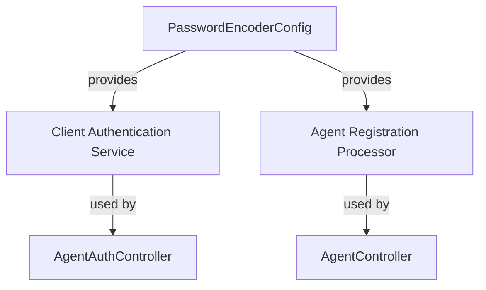
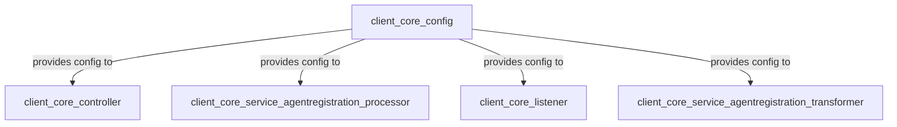
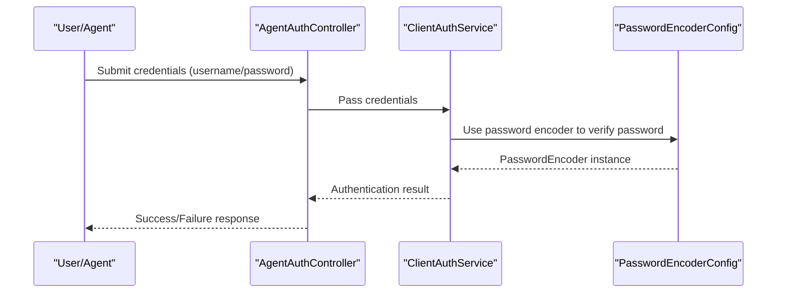

# client_core_config Module Documentation

## Introduction

The `client_core_config` module is responsible for providing core configuration components for the client-side of the system. Its primary role is to define and initialize configuration beans and settings that are essential for the secure and correct operation of client services, particularly in the context of authentication and password management.

This module is foundational for the client-side authentication infrastructure and is typically used by other modules such as controllers, services, and listeners within the `client_core_*` namespace.

## Core Component: PasswordEncoderConfig

### Purpose

The `PasswordEncoderConfig` component is responsible for configuring the password encoding mechanism used throughout the client application. It ensures that all password operations (such as hashing and verification) adhere to a secure, consistent standard, typically leveraging industry best practices (e.g., BCrypt).

### Key Responsibilities
- Define the password encoder bean for dependency injection
- Centralize password encoding strategy for all client authentication flows
- Facilitate secure password storage and verification

### Typical Usage
- Injected into authentication services and controllers that handle user or agent credentials
- Used by registration processors and authentication endpoints to hash and verify passwords

## Architecture and Component Relationships

The `client_core_config` module is a low-level configuration module. It is typically loaded at application startup and provides beans and configuration objects to higher-level modules. Its main dependency is on the cryptographic libraries provided by the Java/Spring ecosystem (e.g., `org.springframework.security.crypto.password.PasswordEncoder`).

### High-Level Architecture

- **PasswordEncoderConfig**: Provides the password encoder bean
- **Client Authentication Service**: Uses the encoder for login and credential verification
- **Agent Registration Processor**: Uses the encoder for agent registration and password hashing
- **AgentAuthController/AgentController**: Expose endpoints that rely on secure password handling

### Module Dependency Overview

- See [client_core_controller.md], [client_core_service_agentregistration_processor.md], [client_core_listener.md], and [client_core_service_agentregistration_transformer.md] for details on how these modules utilize the configuration.

## Data Flow: Password Encoding

## Integration with the Overall System

The `client_core_config` module is a foundational building block for the client-side authentication and registration flows. It is not intended to be used directly by end-users or external systems, but rather by internal components that require secure password handling.

- **Controllers** (see [client_core_controller.md]) rely on the configuration for secure endpoint operations.
- **Processors** (see [client_core_service_agentregistration_processor.md]) use the encoder for agent registration and updates.
- **Listeners** (see [client_core_listener.md]) may use the configuration for event-driven authentication or registration flows.

## References
- [client_core_controller.md]
- [client_core_service_agentregistration_processor.md]
- [client_core_listener.md]
- [client_core_service_agentregistration_transformer.md]

For system-wide configuration patterns, see also [api_service_core_config.md].
