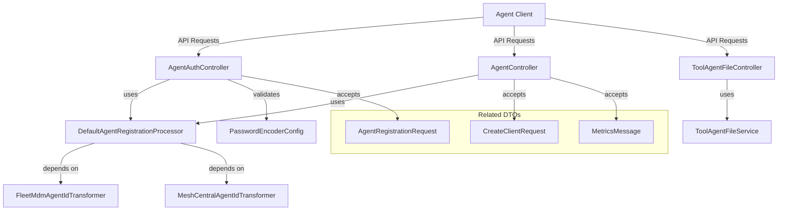
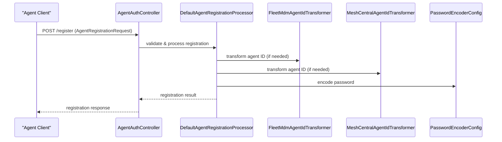
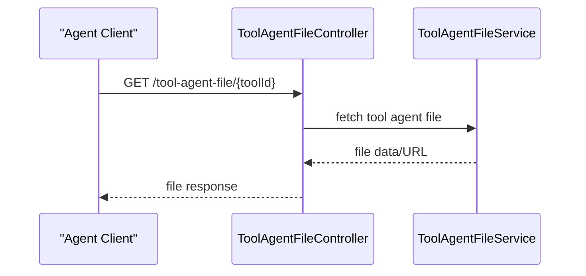

# client_core_controller Module Documentation

## Introduction

The `client_core_controller` module is a central part of the client-side backend responsible for managing agent authentication, agent lifecycle operations, and tool agent file interactions. It exposes RESTful endpoints that allow agents to register, authenticate, and interact with the system, as well as provides mechanisms for managing tool agent files. This module is essential for secure agent onboarding, ongoing agent management, and facilitating communication between agents and the broader platform.

**Core Components:**
- `AgentAuthController`
- `AgentController`
- `ToolAgentFileController`

## Module Purpose and Core Functionality

The `client_core_controller` module provides the following key functionalities:

- **Agent Authentication:** Handles secure authentication and registration of agents, ensuring only authorized agents can interact with the system.
- **Agent Management:** Supports agent lifecycle operations such as registration, status updates, and removal.
- **Tool Agent File Management:** Manages the distribution and retrieval of tool agent files required for agent operation.

These controllers serve as the main entry points for agent-related API requests from client devices or services.

## Architecture Overview

The `client_core_controller` module is designed to interact with several other modules and services within the system. It acts as a bridge between external agent clients and the internal services responsible for agent registration, authentication, and tool management.

### High-Level Architecture

### Component Relationships

- **AgentAuthController**: Handles agent authentication and registration. Relies on `DefaultAgentRegistrationProcessor` for processing registration logic and uses `PasswordEncoderConfig` for secure password handling.
- **AgentController**: Manages agent lifecycle and status. Utilizes `DefaultAgentRegistrationProcessor` and accepts requests such as `CreateClientRequest` and `MetricsMessage`.
- **ToolAgentFileController**: Manages tool agent file operations, interacting with a service (e.g., `ToolAgentFileService`) for file distribution and retrieval.

## Data Flow and Process Flows

### Agent Registration Flow

### Tool Agent File Retrieval Flow

## Dependencies and Integration

The `client_core_controller` module depends on several other modules for its operation:

- **[client_core_service_agentregistration_processor.md]**: Provides the `DefaultAgentRegistrationProcessor` for agent registration logic.
- **[client_core_service_agentregistration_transformer.md]**: Supplies agent ID transformers for different agent types.
- **[client_core_config.md]**: Contains configuration for password encoding and security.
- **[client_core_dto_agent.md]**: Defines the `AgentRegistrationRequest` DTO.
- **[client_core_dto_client.md]**: Defines the `CreateClientRequest` DTO.
- **[client_core_dto_metrics.md]**: Defines the `MetricsMessage` DTO.

For more details on these dependencies, refer to their respective documentation files.

## How This Module Fits Into the Overall System

The `client_core_controller` module is a key part of the agent management subsystem. It provides the main API endpoints for agent clients to interact with the backend, ensuring secure registration, authentication, and access to necessary tool files. It works closely with service and configuration modules to enforce security, process business logic, and maintain system integrity.

It also acts as a bridge between the client-side agents and the internal processing and storage layers, ensuring that agent operations are handled efficiently and securely.

## References

- [client_core_service_agentregistration_processor.md]
- [client_core_service_agentregistration_transformer.md]
- [client_core_config.md]
- [client_core_dto_agent.md]
- [client_core_dto_client.md]
- [client_core_dto_metrics.md]

---

*For further details on the implementation of each controller or DTO, please refer to the linked module documentation files.*
