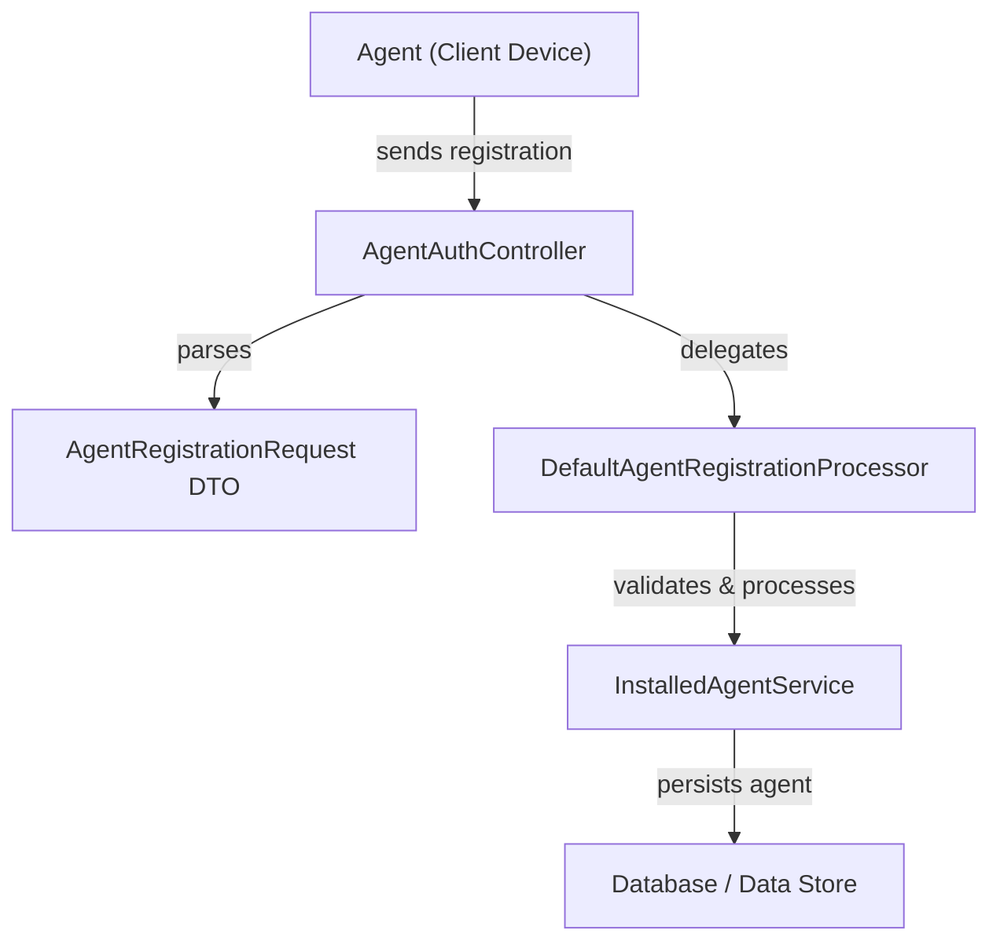
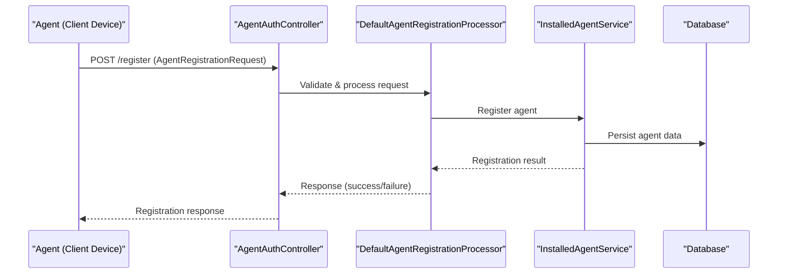

# client_core_dto_agent Module Documentation

## Introduction

The `client_core_dto_agent` module defines the core Data Transfer Object (DTO) for agent registration within the client core of the system. This module is essential for encapsulating the data required when a new agent (such as a device or software client) registers with the backend services. It provides a structured contract for agent registration requests, ensuring consistency and validation across the system.

## Core Component

### AgentRegistrationRequest

The primary component of this module is the `AgentRegistrationRequest` DTO. This object is used by client agents to submit their registration details to the backend via the appropriate controller endpoints (see [AgentAuthController](client_core_controller.md)).

**Typical fields in AgentRegistrationRequest may include:**
- Agent identifier (e.g., unique ID or serial number)
- Agent type (e.g., device, integration, software client)
- Organization or tenant information
- Authentication or registration secret
- Metadata (e.g., version, platform, tags)

> **Note:** The exact fields and validation rules are defined in the codebase. This DTO is designed to be extensible to support various agent types and registration flows.

## Architecture and Data Flow

The `client_core_dto_agent` module is a foundational part of the agent registration workflow. It interacts with several other modules and components, as illustrated below.

### Component Relationships
- **Agent (Client Device):** Initiates the registration process by sending a request.
- **AgentAuthController:** Receives and parses the registration request, mapping it to the `AgentRegistrationRequest` DTO.
- **DefaultAgentRegistrationProcessor:** Handles the business logic for agent registration, including validation and transformation.
- **InstalledAgentService:** Responsible for persisting the registered agent's information.
- **Data Store:** The final destination for agent data.

## Dependencies and Integration

- **Controller Integration:** The DTO is primarily consumed by the [AgentAuthController](client_core_controller.md) and [AgentController](client_core_controller.md) for agent registration endpoints.
- **Service Layer:** The registration request is processed by the [DefaultAgentRegistrationProcessor](client_core_service_agentregistration_processor.md), which may use transformers such as [FleetMdmAgentIdTransformer](client_core_service_agentregistration_transformer.md) or [MeshCentralAgentIdTransformer](client_core_service_agentregistration_transformer.md) for ID normalization.
- **Persistence:** The [InstalledAgentService](api_lib_service.md) manages the persistence of agent data.
- **Related DTOs:** For organization, device, or tool-specific registration flows, see related DTOs in [api_lib_dto_device.md], [api_lib_dto_organization.md], and [api_lib_dto_tool.md].

## Process Flow: Agent Registration

## How It Fits Into the Overall System

The `client_core_dto_agent` module is a key part of the onboarding and lifecycle management of agents within the system. It ensures that all agent registration data is structured, validated, and processed consistently, enabling secure and reliable integration of new agents.

- **Security:** By encapsulating registration secrets and metadata, the DTO supports secure agent onboarding.
- **Extensibility:** The DTO can be extended to support new agent types or registration requirements as the system evolves.
- **Interoperability:** Works in conjunction with other DTOs and services to provide a seamless registration experience.

## References
- [client_core_controller.md] — For controller endpoints handling agent registration
- [client_core_service_agentregistration_processor.md] — For registration processing logic
- [client_core_service_agentregistration_transformer.md] — For agent ID transformation utilities
- [api_lib_service.md] — For agent persistence services
- [api_lib_dto_device.md], [api_lib_dto_organization.md], [api_lib_dto_tool.md] — For related DTOs

---
*This documentation is auto-generated to provide a comprehensive overview of the `client_core_dto_agent` module and its role in the system.*
