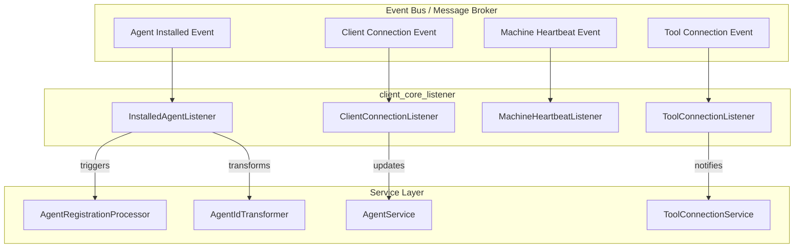
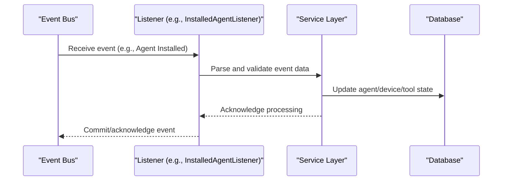

# client_core_listener Module Documentation

## Introduction

The `client_core_listener` module is responsible for handling and reacting to various client-side events within the system. It acts as a bridge between the event-driven infrastructure (such as message brokers or event buses) and the core business logic related to client connections, agent installations, machine heartbeats, and tool connections. By listening to these events, the module ensures that the system remains synchronized with the state of connected clients, installed agents, and tool integrations.

## Core Components

- **ClientConnectionListener**: Handles events related to client connections and disconnections.
- **InstalledAgentListener**: Listens for events about agent installations, updates, and removals on client machines.
- **MachineHeartbeatListener**: Monitors heartbeat signals from client machines to track their online/offline status.
- **ToolConnectionListener**: Manages events related to the connection and disconnection of integrated tools.

## High-Level Architecture

The `client_core_listener` module is a key part of the event-driven architecture. It subscribes to event streams (e.g., Kafka, NATS) and delegates event handling to the appropriate business logic or service layer. The listeners typically interact with service modules (such as those in `client_core_service_agentregistration_processor` and `client_core_service_agentregistration_transformer`) to process events and update the system state.

## Component Responsibilities and Interactions

### ClientConnectionListener
- **Purpose**: Listens for client connection and disconnection events.
- **Interactions**: Updates the system's record of active clients, may trigger notifications or audits.
- **Dependencies**: Utilizes service components for updating client status and possibly interacts with [api_lib_dto_device.md] and [data_model_nats.md] for event payloads.

### InstalledAgentListener
- **Purpose**: Handles events related to the installation, update, or removal of agents on client machines.
- **Interactions**: Coordinates with agent registration processors and ID transformers (see [client_core_service_agentregistration_processor.md] and [client_core_service_agentregistration_transformer.md]) to ensure agent state is consistent.
- **Dependencies**: May use DTOs from [client_core_dto_agent.md] and event models from [data_model_nats.md].

### MachineHeartbeatListener
- **Purpose**: Monitors heartbeat events from client machines to determine their health and connectivity.
- **Interactions**: Updates machine status, triggers alerts or recovery actions if heartbeats are missed.
- **Dependencies**: Works with device services and may interact with [api_lib_dto_device.md] and [data_model_nats.md].

### ToolConnectionListener
- **Purpose**: Listens for events about tool connections and disconnections.
- **Interactions**: Notifies the tool connection service ([api_lib_service.md]) to update the state of tool integrations.
- **Dependencies**: Uses tool connection DTOs and event models from [data_model_nats.md].

## Data Flow and Event Processing

The following diagram illustrates the typical data flow for an event handled by this module:

## Integration with Other Modules

- **Service Layer**: The listeners delegate business logic to service modules such as [client_core_service_agentregistration_processor.md], [client_core_service_agentregistration_transformer.md], and [api_lib_service.md].
- **DTOs and Event Models**: Event payloads are defined in DTO modules like [client_core_dto_agent.md], [data_model_nats.md], and [api_lib_dto_device.md].
- **Controllers**: While listeners are reactive, controllers in [client_core_controller.md] provide RESTful APIs for direct client interaction.

## Extensibility and Maintenance

- **Adding New Listeners**: To support new event types, implement a new listener class and register it with the event bus.
- **Updating Event Handling**: Modify the relevant listener and service logic to accommodate new business requirements.
- **Testing**: Listeners should be tested with simulated event payloads to ensure correct processing and error handling.

## References

- [client_core_service_agentregistration_processor.md]
- [client_core_service_agentregistration_transformer.md]
- [api_lib_service.md]
- [client_core_dto_agent.md]
- [data_model_nats.md]
- [api_lib_dto_device.md]
- [client_core_controller.md]

---

*This documentation provides a high-level overview of the `client_core_listener` module. For implementation details, refer to the respective component and service documentation files.*
