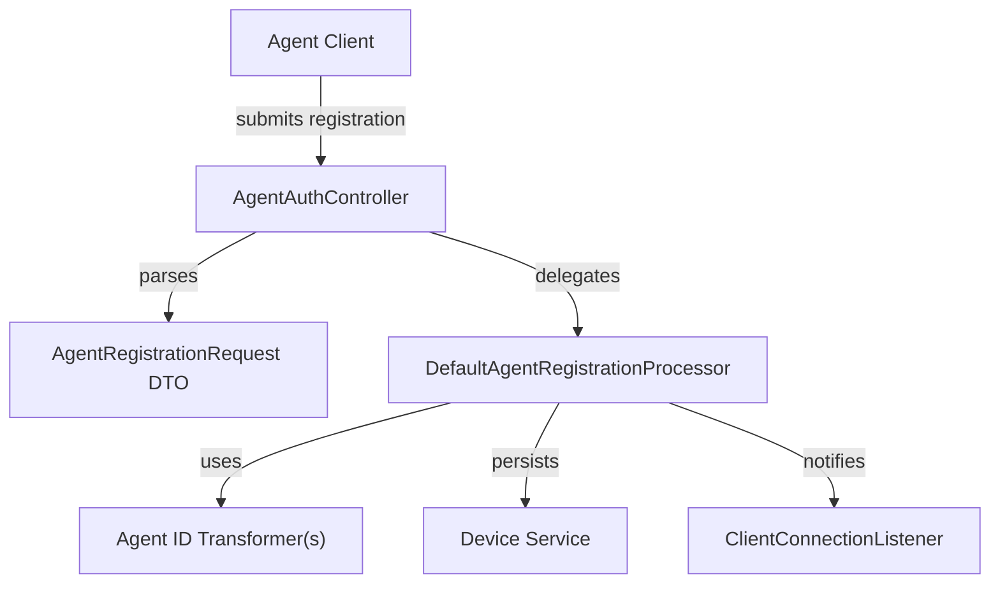
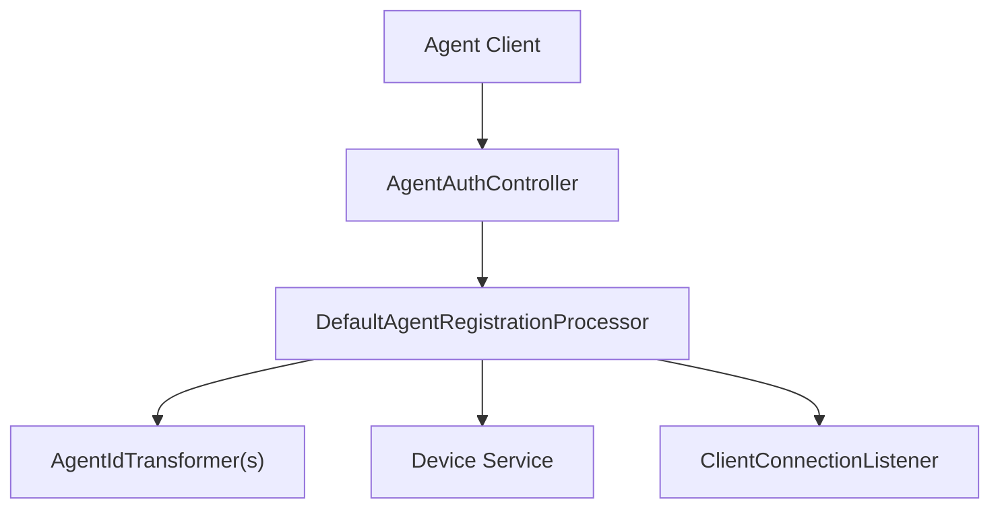

# client_core_service_agentregistration_processor

## Introduction

The `client_core_service_agentregistration_processor` module is responsible for handling the core logic of agent registration within the client core service. It provides the main processing component for registering agents, validating registration requests, and integrating with supporting services and transformers. This module is essential for onboarding new agents into the system, ensuring that agent registration is secure, consistent, and extensible for different agent types and registration flows.

## Core Component

- **DefaultAgentRegistrationProcessor**: The primary processor that implements the agent registration workflow, including validation, transformation, and persistence of agent registration data.

## Architecture Overview

The agent registration process involves several key modules and components:

- **Controllers**: [client_core_controller.md] handles incoming HTTP requests for agent registration.
- **DTOs**: [client_core_dto_agent.md] defines the structure of agent registration requests.
- **Transformers**: [client_core_service_agentregistration_transformer.md] provides ID transformation logic for different agent types.
- **Listeners**: [client_core_listener.md] may react to registration events (e.g., for logging or metrics).
- **Supporting Services**: Integration with device, organization, and tool services as needed.

### High-Level Architecture

## Component Interactions

### Registration Flow

1. **Agent Client** submits a registration request to the API endpoint.
2. **AgentAuthController** receives the request and maps it to an `AgentRegistrationRequest` DTO.
3. The controller delegates the registration logic to `DefaultAgentRegistrationProcessor`.
4. The processor:
    - Validates the registration request.
    - Applies any necessary ID transformations using transformers (e.g., for FleetMDM or MeshCentral agents).
    - Persists the agent/device information using the Device Service.
    - Notifies listeners or triggers post-registration events.
5. The result is returned to the client, indicating success or failure.

### Data Flow Diagram

## Dependencies

- **[client_core_controller.md]**: Exposes the registration endpoint and delegates to the processor.
- **[client_core_dto_agent.md]**: Defines the `AgentRegistrationRequest` data structure.
- **[client_core_service_agentregistration_transformer.md]**: Provides agent ID transformation strategies.
- **[client_core_listener.md]**: Handles events triggered by agent registration.
- **Device Service**: Persists agent/device data (see [api_lib_service.md] for related services).

## Extensibility

The processor is designed to support multiple agent types and registration flows by:
- Using pluggable transformers for agent ID normalization.
- Integrating with listeners for event-driven extensions (e.g., metrics, audit logging).
- Supporting validation and enrichment via DTOs and service calls.

## Related Modules

- [client_core_controller.md]: API endpoints for agent operations
- [client_core_dto_agent.md]: Agent registration request/response structures
- [client_core_service_agentregistration_transformer.md]: Agent ID transformation logic
- [client_core_listener.md]: Event listeners for agent lifecycle events
- [api_lib_service.md]: Device and tool service integration

## Summary

The `client_core_service_agentregistration_processor` module is a central part of the agent onboarding pipeline, orchestrating the validation, transformation, and persistence of agent registration data. It is designed for extensibility and integrates closely with controllers, DTOs, transformers, listeners, and device services to provide a robust and secure registration process.
