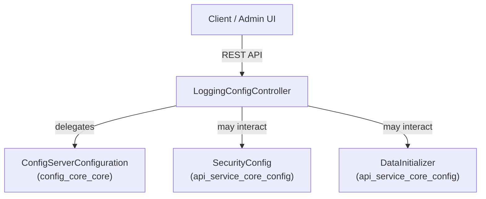
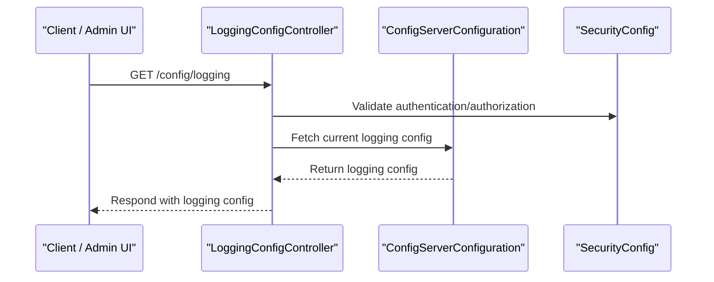

# config_core_controller Module Documentation

## Introduction

The `config_core_controller` module is responsible for exposing configuration-related endpoints, primarily focused on logging configuration management within the system. It acts as a bridge between the configuration core and external consumers (such as admin UIs or other services) that need to query or update logging settings. This module is designed to be extensible for future configuration controllers as the platform evolves.

**Core Component:**
- `LoggingConfigController`

## Purpose and Core Functionality

The main purpose of the `config_core_controller` module is to provide RESTful APIs for managing and retrieving configuration data, with an initial focus on logging configuration. This enables centralized and dynamic management of logging settings, which is critical for observability, debugging, and compliance.

### Key Responsibilities
- Expose endpoints to retrieve current logging configuration.
- Allow updates to logging configuration (if supported).
- Serve as an integration point for configuration management UIs or automation tools.
- Ensure secure and auditable access to configuration changes.

## Architecture Overview

The `config_core_controller` module is a thin controller layer that interacts with the configuration core and, if necessary, with other service modules. It is designed to be stateless and delegates business logic to the core configuration service layer.

### High-Level Architecture



- **Client / Admin UI**: Consumes the configuration endpoints.
- **LoggingConfigController**: Exposes REST endpoints for logging configuration.
- **ConfigServerConfiguration**: Provides the actual configuration logic and data (see [config_core_core.md]).
- **SecurityConfig**: Ensures endpoints are protected (see [api_service_core_config.md]).
- **DataInitializer**: May be used for initial configuration seeding (see [api_service_core_config.md]).

## Component Relationships and Data Flow

### Component Interaction



- **Authentication & Authorization**: All requests are validated via the security configuration.
- **Configuration Fetch**: The controller delegates to the configuration core for actual data.

## Dependencies

- **config_core_core**: Provides the `ConfigServerConfiguration` class, which contains the logic for managing configuration data. See [config_core_core.md].
- **api_service_core_config**: Supplies security and initialization services. See [api_service_core_config.md].

## Extensibility

While currently focused on logging configuration, the module is designed to be extended for other configuration domains (e.g., feature flags, system parameters) by adding new controllers following the same pattern.

## Example Usage

```bash
# Fetch current logging configuration
curl -H "Authorization: Bearer <token>" https://<host>/api/config/logging
```

## Related Modules

- [config_core_core.md]: Core configuration logic and data providers
- [api_service_core_config.md]: Security and application configuration

## Summary

The `config_core_controller` module is a focused, secure, and extensible entry point for configuration management APIs, starting with logging configuration. It is a key part of the system's observability and operational flexibility, and is designed to integrate seamlessly with the broader configuration and security infrastructure.
